# cursor

Свойство **`cursor`** устанавливает форму курсора, когда он находится в пределах элемента.

Вид курсора зависит от операционной системы и установленных параметров.

??? info "Интерфейс"

    <div class="col3" markdown="1">

    - [appearance](appearance.md)
    - [box-sizing](box-sizing.md)
    - [caret-color](caret-color.md)
    - **cursor**
    - [outline](outline.md)
    - [outline-width](outline-width.md)
    - [outline-style](outline-style.md)
    - [outline-color](outline-color.md)
    - [outline-offset](outline-offset.md)
    - [resize](resize.md)
    - [text-overflow](text-overflow.md)
    - [user-select](user-select.md)

    </div>

## Синтаксис

```css
/* Keyword value only */
cursor: pointer;
cursor: auto;

/* Using URL and coordinates */
cursor: url('cursor1.png') 4 12, auto;
cursor: url('cursor2.png') 2 2, pointer;

/* Global values */
cursor: inherit;
cursor: initial;
cursor: unset;
```

## Значения

`url`
: Позволяет установить свой собственный курсор, для этого нужно указать путь к файлу с курсором.

`auto`
: Вид курсора по умолчанию для текущего элемента.

`none`
: Отключает отображение курсора.

Остальные допустимые значения приведены в табл. 1.

<table markdown="1">
<caption> Табл. 1. Вид курсора</caption>
<thead>
<tr><th>Вид</th><th>Значение</th><th>Тест</th><th>Пример</th></tr>
</thead>
<tbody>
<tr><td>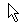</td><td>default</td><td style="CURSOR: default"></td><td>P {cursor: default}</td></tr>
<tr><td></td><td>context-menu</td><td style="CURSOR: context-menu"></td><td>P {cursor: context-menu}</td></tr>
<tr><td>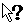</td><td>help</td><td style="CURSOR: help"></td><td>P {cursor: help}</td></tr>
<tr><td>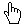</td><td>pointer</td><td style="CURSOR: pointer"></td><td>P {cursor: pointer}</td></tr>
<tr><td>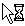</td><td>progress</td><td style="CURSOR: progress"></td><td>P {cursor: progress}</td></tr>
<tr><td>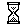</td><td>wait</td><td style="CURSOR: wait"></td><td>P {cursor: wait}</td></tr>
<tr><td>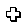</td><td>cell</td><td style="CURSOR: cell"></td><td>P {cursor: cell}</td></tr>
<tr><td>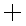</td><td>crosshair</td><td style="CURSOR: crosshair"></td><td>P {cursor: crosshair}</td></tr>
<tr><td>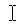</td><td>text</td><td style="CURSOR: text"></td><td>P {cursor: text}</td></tr>
<tr><td>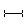</td><td>vertical-text</td><td style="CURSOR: vertical-text"></td><td>P {cursor: vertical-text}</td></tr>
<tr><td></td><td>alias</td><td style="CURSOR: alias"></td><td>P {cursor: alias}</td></tr>
<tr><td></td><td>copy</td><td style="CURSOR: copy"></td><td>P {cursor: copy}</td></tr>
<tr><td>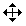</td><td>move</td><td style="CURSOR: move"></td><td>P {cursor: move}</td></tr>
<tr><td>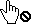</td><td>no-drop</td><td style="CURSOR: no-drop"></td><td>P {cursor: no-drop}</td></tr>
<tr><td></td><td>not-allowed</td><td style="CURSOR: not-allowed"></td><td>P {cursor: not-allowed}</td></tr>
<tr><td>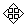</td><td>all-scroll</td><td style="CURSOR: all-scroll"></td><td>P {cursor: all-scroll}</td></tr>
<tr><td>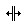</td><td>col-resize</td><td style="CURSOR: col-resize"></td><td>P {cursor: col-resize}</td></tr>
<tr><td>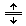</td><td>row-resize</td><td style="CURSOR: row-resize"></td><td>P {cursor: row-resize}</td></tr>
<tr><td>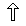</td><td>n-resize</td><td style="CURSOR: n-resize"></td><td>P {cursor: n-resize}</td></tr>
<tr><td>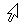</td><td>ne-resize</td><td style="CURSOR: ne-resize"></td><td>P {cursor: ne-resize}</td></tr>
<tr><td>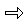</td><td>e-resize</td><td style="CURSOR:e-resize"></td><td>P {cursor: e-resize}</td></tr>
<tr><td>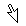</td><td>se-resize</td><td style="CURSOR: se-resize"></td><td>P {cursor: se-resize}</td></tr>
<tr><td>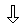</td><td>s-resize</td><td style="CURSOR: s-resize"></td><td>P {cursor: s-resize}</td></tr>
<tr><td></td><td>sw-resize</td><td style="CURSOR: sw-resize"></td><td>P {cursor: sw-resize}</td></tr>
<tr><td>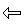</td><td>w-resize</td><td style="CURSOR: w-resize"></td><td>P {cursor: w-resize}</td></tr>
<tr><td></td><td>nw-resize</td><td style="CURSOR: nw-resize"></td><td>P {cursor: nw-resize}</td></tr>
<tr><td>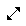</td><td>nesw-resize</td><td style="CURSOR: nesw-resize"></td><td>P {cursor: nesw-resize}</td></tr>
<tr><td></td><td>nwse-resize</td><td style="CURSOR: nwse-resize"></td><td>P {cursor: nwse-resize}</td></tr>
<tr><td>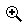</td><td>zoom-in</td><td style="CURSOR: zoom-in"></td><td>P {cursor: zoom-in}</td></tr>
<tr><td>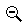</td><td>zoom-out</td><td style="CURSOR: zoom-out"></td><td>P {cursor: zoom-out}</td></tr>
<tr><td>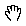</td><td>grab</td><td style="CURSOR: grab;cursor:-webkit-grab"></td><td>P {cursor: grab}</td></tr>
<tr><td></td><td>grabbing</td><td style="CURSOR: grabbing;cursor:-webkit-grabbing"></td><td>P {cursor: grabbing}</td></tr>
</tbody>
</table>

В зависимости от операционной системы и её настроек вид курсора может отличаться от приведённых в таблице.

При добавлении курсора из файла синтаксис несколько видоизменится.

```
cursor: url('путь к курсору1'), url('путь к курсору2'), ..., <курсор>
```

Через запятую допускается указывать несколько значений `url`, в этом случае браузер попытается открыть первый файл с курсором и если это по каким-либо причинам не получится, перейдёт к следующему файлу. Список обязательно заканчивается ключевым словом, например, `auto` или `pointer`, допустимые значения перечислены выше.

### Примечание

Internet Explorer в качестве формата файла курсора поддерживает CUR и ANI. Firefox, Chrome, Safari поддерживают форматы CUR, PNG, GIF, JPG.

Chrome до версии 36, Opera до версии 24 и Safari до версии 9 поддерживают значения `-webkit-zoom-in` и `-webkit-zoom-out`.

Firefox до версии 24 поддерживает значения `-moz-zoom-in` и `-moz-zoom-out`.

Chrome до версии 22, Opera до версии 24 и Safari до версии 9 поддерживают значения `-webkit-grab` и `-webkit-grabbing`.

Firefox до версии 27 поддерживает значения `-moz-grab` и `-moz-grabbing`.

Браузеры на мобильных устройствах не поддерживают свойство `cursor`.

Значение по-умолчанию:

```css
cursor: auto;
```

Применяется ко всем элементам

## Спецификации

- [CSS Basic User Interface Module Level 3](http://dev.w3.org/csswg/css3-ui/#cursor)
- [CSS Level 2 (Revision 1)](http://www.w3.org/TR/CSS2/ui.html#cursor-propsy)

## Поддержка браузерами

<p class="ciu_embed" data-feature="css3-cursors" data-periods="future_1,current,past_1,past_2">
  <a href="http://caniuse.com/#feat=css3-cursors">Can I Use css3-cursors?</a> Data on support for the css3-cursors feature across the major browsers from caniuse.com.
</p>

`cursor: zoom-in/zoom-out`:

<p class="ciu_embed" data-feature="css3-cursors-newer" data-periods="future_1,current,past_1,past_2">
  <a href="http://caniuse.com/#feat=css3-cursors-newer">Can I Use css3-cursors-newer?</a> Data on support for the css3-cursors-newer feature across the major browsers from caniuse.com.
</p>

## Примеры

### Пример 1

```html
<!DOCTYPE html>
<html>
  <head>
    <meta charset="utf-8" />
    <title>cursor</title>
    <style>
      .cross {
        cursor: crosshair;
      }
      .help {
        cursor: help;
      }
    </style>
  </head>
  <body>
    <p class="cross">
      На этом тексте курсор мыши примет вид перекрестья.
    </p>
    <p>
      <a href="page/help.html" class="help">СПРАВКА 1</a
      ><br />
      <a href="page/help.html" class="help">СПРАВКА 2</a
      ><br />
      <a href="page/help.html" class="help">СПРАВКА 3</a>
    </p>
  </body>
</html>
```

### Пример 2

```html
<!DOCTYPE html>
<html>
  <head>
    <meta charset="utf-8" />
    <title>cursor</title>
    <style>
      a {
        cursor: url('cursor/sniper.cur'), pointer;
      }
    </style>
  </head>
  <body>
    <p>Обычный текст</p>
    <p>
      <a href="page/1.html">Ссылка 1</a>
      <a href="page/2.html">Ссылка 2</a>
      <a href="page/3.html">Ссылка 3</a>
    </p>
  </body>
</html>
```

## Ссылки

- Свойство [cursor](https://developer.mozilla.org/en-US/docs/Web/CSS/cursor) на сайте MDN
