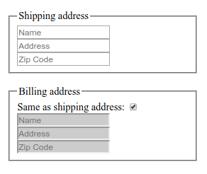

# :disabled

Псевдо-класс **`:disabled`** находит любой отключенный элемент.

Элемент отключен, если не может быть активирован (например, его нельзя выбрать, нажать на него или ввести текст) или получить фокус. У элемента также есть включенное состояние, когда его можно активировать или сфокусировать.

??? info "Псевдоклассы"

    <div class="col3" markdown="1">

    - [:active](active.md)
    - [:any-link](any-link.md)
    - [:blank](blank.md)
    - [:checked](checked.md)
    - [:current()](current.md)
    - [:default](default.md)
    - [:defined](defined.md)
    - [:dir()](dir.md)
    - **:disabled**
    - [:empty](empty.md)
    - [:enabled](enabled.md)
    - [:first](first.md)
    - [:first-child](first-child.md)
    - [:first-of-type](first-of-type.md)
    - [:focus](focus.md)
    - [:focus-visible](focus-visible.md)
    - [:focus-within](focus-within.md)
    - [:fullscreen](fullscreen.md)
    - [:future](future.md)
    - [:has()](has.md)
    - :host
    - :host()
    - :host-context()
    - [:hover](hover.md)
    - [:indeterminate](indeterminate.md)
    - [:in-range](in-range.md)
    - [:invalid](invalid.md)
    - [:is()](is.md)
    - [:lang()](lang.md)
    - [:last-child](last-child.md)
    - [:last-of-type](last-of-type.md)
    - [:left](left-pseudo-class.md)
    - [:link](link.md)
    - :local-link
    - [:not()](not.md)
    - [:nth-child()](nth-child.md)
    - :nth-col()
    - [:nth-last-child()](nth-last-child.md)
    - :nth-last-col()
    - [:nth-last-of-type()](nth-last-of-type.md)
    - [:nth-of-type()](nth-of-type.md)
    - [:only-child](only-child.md)
    - [:only-of-type](only-of-type.md)
    - [:optional](optional.md)
    - [:out-of-range](out-of-range.md)
    - [:past](past.md)
    - [:placeholder-shown](placeholder-shown.md)
    - [:read-only](read-only.md)
    - [:read-write](read-write.md)
    - [:required](required.md)
    - :right
    - [:root](root.md)
    - [:scope](scope.md)
    - [:target](target.md)
    - :target-within
    - :user-invalid
    - [:valid](valid.md)
    - [:visited](visited.md)
    - [:where()](where.md)

    </div>

## Синтаксис

```css
/* Selects any disabled <input> */
input:disabled {
  background: #ccc;
}
```

## Спецификации

- [HTML Living Standard](https://html.spec.whatwg.org/multipage/#selector-disabled)
- [HTML5](http://www.w3.org/TR/html5/#selector-disabled)
- [Selectors Level 4](https://drafts.csswg.org/selectors-4/#enableddisabled)
- [CSS Basic User Interface Module Level 3](https://drafts.csswg.org/css-ui-3/#pseudo-classes)
- [Selectors Level 3](https://drafts.csswg.org/selectors-3/#enableddisabled)

## Примеры

=== "HTML"

    ```html
    <form action="#">
      <fieldset id="shipping">
        <legend>Shipping address</legend>
        <input type="text" placeholder="Name" />
        <input type="text" placeholder="Address" />
        <input type="text" placeholder="Zip Code" />
      </fieldset>
      <br />
      <fieldset id="billing">
        <legend>Billing address</legend>
        <label for="billing_is_shipping">Same as shipping address:</label>
        <input type="checkbox" id="billing-checkbox" checked />
        <br />
        <input type="text" placeholder="Name" disabled />
        <input type="text" placeholder="Address" disabled />
        <input type="text" placeholder="Zip Code" disabled />
      </fieldset>
    </form>
    ```

=== "CSS"

    ```css
    input[type='text']:disabled {
      background: #ccc;
    }
    ```

=== "JS"

    ```js
    // Wait for the page to finish loading
    document.addEventListener(
      'DOMContentLoaded',
      function() {
        // Attach `change` event listener to checkbox
        document.getElementById('billing-checkbox').onchange = toggleBilling
      },
      false
    )

    function toggleBilling() {
      // Select the billing text fields
      var billingItems = document.querySelectorAll('#billing input[type="text"]')

      // Toggle the billing text fields
      for (var i = 0; i < billingItems.length; i++) {
        billingItems[i].disabled = !billingItems[i].disabled
      }
    }
    ```

=== "Результат"

    
