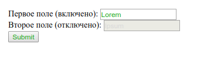

# :enabled

Псевдо-класс **`:enabled`** находит любой включенный элемент.

Элемент включен, если его можно активировать (например, выбрать, нажать на него или ввести текст) или поставить фокус. У элемента также есть [отключенное состояние](disabled.md), когда его нельзя активировать или сфокусировать.

## Синтаксис

```css
/* Selects any enabled <input> */
input:enabled {
  color: blue;
}
```

## Спецификации

- [HTML Living Standard](https://html.spec.whatwg.org/multipage/#selector-enabled)
- [HTML 5](http://www.w3.org/TR/html5/#selector-enabled)
- [Selectors Level 4](https://drafts.csswg.org/selectors-4/#enableddisabled)
- [CSS Basic User Interface Module Level 3](https://drafts.csswg.org/css-ui-3/#pseudo-classes)
- [Selectors Level 3](https://drafts.csswg.org/selectors-3/#enableddisabled)

## Пример

Следующий пример делает цвет текста средне-зелёного оттенка, когда поле включено, и серым, когда отключено. Это позволяет понимать пользователю какие элементы интерактивны, а какие нет.

=== "HTML"

    ```html
    <form action="url_of_form">
      <label for="FirstField">Первое поле (включено):</label>
      <input type="text" id="FirstField" value="Lorem" /><br />
      <label for="SecondField">Второе поле (отключено):</label>
      <input type="text" id="SecondField" value="Ipsum" disabled="disabled" /><br />
      <input type="button" value="Submit" />
    </form>
    ```

=== "CSS"

    ```css
    input:enabled {
      color: #22aa22;
    }
    input:disabled {
      color: #d9d9d9;
    }
    ```

=== "Результат"

    
