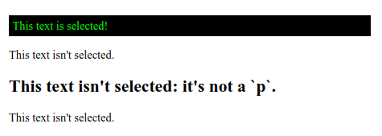

# :first-child

Псевдо-класс **`:first-child`** находит любой элемент, являющийся первым в своём родителе.

??? info "Псевдоклассы"

    <div class="col3" markdown="1">

    - [:active](active.md)
    - [:any-link](any-link.md)
    - [:blank](blank.md)
    - [:checked](checked.md)
    - [:current()](current.md)
    - [:default](default.md)
    - [:defined](defined.md)
    - [:dir()](dir.md)
    - [:disabled](disabled.md)
    - [:empty](empty.md)
    - [:enabled](enabled.md)
    - [:first](first.md)
    - **:first-child**
    - [:first-of-type](first-of-type.md)
    - [:focus](focus.md)
    - [:focus-visible](focus-visible.md)
    - [:focus-within](focus-within.md)
    - [:fullscreen](fullscreen.md)
    - [:future](future.md)
    - [:has()](has.md)
    - :host
    - :host()
    - :host-context()
    - [:hover](hover.md)
    - [:indeterminate](indeterminate.md)
    - [:in-range](in-range.md)
    - [:invalid](invalid.md)
    - [:is()](is.md)
    - [:lang()](lang.md)
    - [:last-child](last-child.md)
    - [:last-of-type](last-of-type.md)
    - [:left](left-pseudo-class.md)
    - [:link](link.md)
    - :local-link
    - [:not()](not.md)
    - [:nth-child()](nth-child.md)
    - :nth-col()
    - [:nth-last-child()](nth-last-child.md)
    - :nth-last-col()
    - [:nth-last-of-type()](nth-last-of-type.md)
    - [:nth-of-type()](nth-of-type.md)
    - [:only-child](only-child.md)
    - [:only-of-type](only-of-type.md)
    - [:optional](optional.md)
    - [:out-of-range](out-of-range.md)
    - [:past](past.md)
    - [:placeholder-shown](placeholder-shown.md)
    - [:read-only](read-only.md)
    - [:read-write](read-write.md)
    - [:required](required.md)
    - :right
    - [:root](root.md)
    - [:scope](scope.md)
    - [:target](target.md)
    - :target-within
    - :user-invalid
    - [:valid](valid.md)
    - [:visited](visited.md)
    - [:where()](where.md)

    </div>

## Синтаксис

```css
/* Selects any <p> that is the first element
   among its siblings */
p:first-child {
  color: lime;
}
```

## Спецификации

- [Selectors Level 4](https://drafts.csswg.org/selectors-4/#first-child-pseudo)
- [Selectors Level 3](https://drafts.csswg.org/selectors-3/#first-child-pseudo)
- [CSS Level 2 (Revision 1)](http://www.w3.org/TR/CSS2/selector.html#first-child)

## Пример

=== "HTML"

    ```html
    <div>
      <p>This text is selected!</p>
      <p>This text isn't selected.</p>
    </div>

    <div>
      <h2>This text isn't selected: it's not a `p`.</h2>
      <p>This text isn't selected.</p>
    </div>
    ```

=== "CSS"

    ```css
    p:first-child {
      color: lime;
      background-color: black;
      padding: 5px;
    }
    ```

=== "Результат"

    
