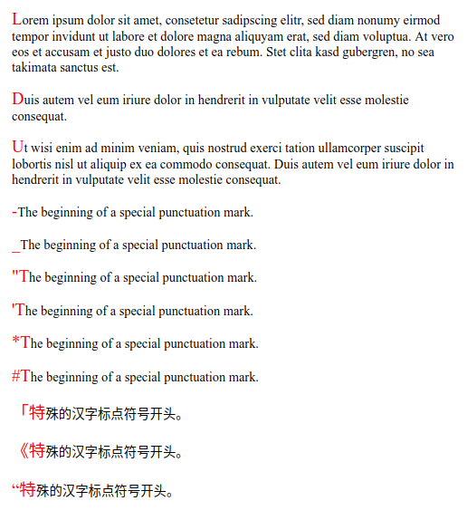

# ::first-letter

Псевдо-элемент **`::first-letter`** применяет стили к первой букве первой строки элемента уровня блока, но только тогда, когда не предшествует другой контент (например, изображения или встроенные таблицы).

## Синтаксис

```css
/* Selects the first letter of a <p> */
p::first-letter {
  font-size: 130%;
}
```

## Значения

Первая буква элемента не всегда тривиальна для идентификации:

- Пунктуация, которая предшествует или сразу следует за первой буквой, включается в псевдоэлемент. Пунктуация включает любой символ Юникода, определенный в открытии (Ps), закрытии (Pe), начальной кавычки (Pi), финальной кавычки (Pf) и других классах пунктуации (Po).
- На некоторых языках есть орграфы, которые всегда капитализируются вместе, как IJ на голландском языке. В этих случаях обе буквы орграфа должны быть сопоставлены псевдоэлементом `::first-letter` (это плохо поддерживается браузерами).
- Комбинация псевдо-элемента [`::before`](before.md) и свойства [`content`](content.md) может вводить некоторый текст в начале элемента. В этом случае `::first-letter` будет соответствовать первой букве этого сгенерированного контента.

Только малый поднабор свойств CSS можно использовать с псевдоэлементом `::first-letter`:

- Свойства шрифта: `font`, `font-style`, `font-feature-settings`, `font-kerning`, `font-language-override`, `font-stretch`, `font-synthesis`, `font-variant`, `font-variant-alternates`, `font-variant-caps`, `font-variant-east-asian`, `font-variant-ligatures`, `font-variant-numeric`, `font-variant-position`, `font-weight`, `font-size`, `font-size-adjust`, `line-height` и `font-family`
- Свойства фона: `background`, `background-color`, `background-image`, `background-clip`, `background-origin`, `background-position`, `background-repeat`, `background-size`, `background-attachment` и `background-blend-mode`
- Свойства отступов: `margin`, `margin-top`, `margin-right`, `margin-bottom`, `margin-left`
- Свойства полей: `padding`, `padding-top`, `padding-right`, `padding-bottom`, `padding-left`
- Свойства рамок: `border`, `border-style`, `border-color`, `border-width`, `border-radius`, `border-image`
- Цвет `color`
- Свойства `text-decoration`, `text-shadow`, `text-transform`, `letter-spacing`, `word-spacing`, `line-height`, `text-decoration-color`, `text-decoration-line`, `text-decoration-style`, `box-shadow`, `float`, `vertical-align`

## Спецификации

- [CSS Pseudo-Elements Level 4](https://drafts.csswg.org/css-pseudo-4/#first-letter-pseudo)
- [CSS Text Decoration Module Level 3](https://drafts.csswg.org/css-text-decor-3/#text-shadow)
- [Selectors Level 3](https://drafts.csswg.org/selectors-3/#first-letter)
- [CSS Level 2 (Revision 1)](http://www.w3.org/TR/CSS2/selector.html#first-letter)
- [CSS Level 1](http://www.w3.org/TR/CSS1/#the-first-letter-pseudo-element)

## Поддержка браузерами

<p class="ciu_embed" data-feature="css-first-letter" data-periods="future_1,current,past_1,past_2">
  <a href="http://caniuse.com/#feat=css-first-letter">Can I Use css-first-letter?</a> Data on support for the css-first-letter feature across the major browsers from caniuse.com.
</p>

## Пример

=== "HTML"

    ```html
    <p>
      Lorem ipsum dolor sit amet, consetetur sadipscing elitr, sed diam nonumy
      eirmod tempor invidunt ut labore et dolore magna aliquyam erat, sed diam
      voluptua. At vero eos et accusam et justo duo dolores et ea rebum. Stet clita
      kasd gubergren, no sea takimata sanctus est.
    </p>
    <p>
      Duis autem vel eum iriure dolor in hendrerit in vulputate velit esse molestie
      consequat.
    </p>
    <p>
      Ut wisi enim ad minim veniam, quis nostrud exerci tation ullamcorper suscipit
      lobortis nisl ut aliquip ex ea commodo consequat. Duis autem vel eum iriure
      dolor in hendrerit in vulputate velit esse molestie consequat.
    </p>
    <p>-The beginning of a special punctuation mark.</p>
    <p>_The beginning of a special punctuation mark.</p>
    <p>"The beginning of a special punctuation mark.</p>
    <p>'The beginning of a special punctuation mark.</p>
    <p>*The beginning of a special punctuation mark.</p>
    <p>#The beginning of a special punctuation mark.</p>
    <p>「特殊的汉字标点符号开头。</p>
    <p>《特殊的汉字标点符号开头。</p>
    <p>“特殊的汉字标点符号开头。</p>
    ```

=== "CSS"

    ```css
    p::first-letter {
      color: red;
      font-size: 130%;
    }
    ```

=== "Результат"

    
