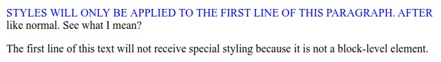

# ::first-line

Псевдокласс **`::first-line`** применяет стили к первой строке элемента уровня блока.

Обратите внимание, что длина первой строки зависит от многих факторов, включая ширину элемента, ширину документа и размер шрифта текста.

## Синтаксис

```css
/* Selects the first line of a <p> */
p::first-line {
  color: red;
}
```

## Значения

Только малый поднабор свойств CSS можно использовать с псевдоэлементом `::first-line`:

- Свойства шрифта: `font`, `font-kerning`, `font-style`, `font-variant`, `font-variant-numeric`, `font-variant-position`, `font-variant-east-asian`, `font-variant-caps`, `font-variant-alternates`, `font-variant-ligatures`, `font-synthesis`, `font-feature-settings`, `font-language-override`, `font-weight`, `font-size`, `font-size-adjust`, `font-stretch` и `font-family`
- Свойства фона: `background-color`, `background-clip`, `background-image`, `background-origin`, `background-position`, `background-repeat`, `background-size`, `background-attachment` и `background-blend-mode`
- Свойство `color`
- `word-spacing`, `letter-spacing`, `text-decoration`, `text-transform` и `line-height`
- `text-shadow`, `text-decoration`, `text-decoration-color`, `text-decoration-line`, `text-decoration-style` и `vertical-align`.

## Спецификации

- [CSS Pseudo-Elements Level 4](https://drafts.csswg.org/css-pseudo-4/#first-line-pseudo)
- [CSS Text Decoration Module Level 3](https://drafts.csswg.org/css-text-decor-3/#text-shadow)
- [Selectors Level 3](https://drafts.csswg.org/selectors-3/#first-line)
- [CSS Level 2 (Revision 1)](http://www.w3.org/TR/CSS2/selector.html#first-line-pseudo)
- [CSS Level 1](http://www.w3.org/TR/CSS1/#the-first-line-pseudo-element)

## Поддержка браузерами

<p class="ciu_embed" data-feature="css-first-line" data-periods="future_1,current,past_1,past_2">
  <a href="http://caniuse.com/#feat=css-first-line">Can I Use css-first-line?</a> Data on support for the css-first-line feature across the major browsers from caniuse.com.
</p>

## Описание и примеры

=== "HTML"

    ```html
    <p>
      Styles will only be applied to the first line of this paragraph. After that,
      all text will be styled like normal. See what I mean?
    </p>

    <span
      >The first line of this text will not receive special styling because it is
      not a block-level element.</span
    >
    ```

=== "CSS"

    ```css
    ::first-line {
      color: blue;
      text-transform: uppercase;

      /* WARNING: DO NOT USE THESE */
      /* Many properties are invalid in ::first-line pseudo-classes */
      margin-left: 20px;
      text-indent: 20px;
    }
    ```

=== "Результат"

    
