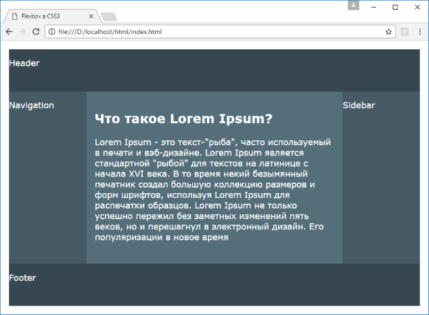

# Макет страницы на Flexbox

<small markdown="1">

1. [Что такое Flexbox. Flex Container](flex-1.md)
2. [Макет страницы на Flexbox](flex-2.md)
3. [Направление flex-direction](flex-3.md)
4. [flex-wrap](flex-4.md)
5. [flex-flow. Порядок элементов](flex-5.md)
6. [Выравнивание элементов. justify-content](flex-6.md)
7. [Выравнивание элементов. align-items и align-self](flex-7.md)
8. [Выравнивание строк и столбцов. align-content](flex-8.md)
9. [Управление элементами. flex-basis, flex-shrink и flex-grow](flex-9.md)
10. **Многоколоночный дизайн на Flexbox**

</small>

Теперь рассмотрим создание стандартного макета страницы, который состоит их шапки, футера и центральной части, в которой есть три столбца: основное содержимое и два сайдбара.

Для этого определим следующую веб-страницу:

```html
<!DOCTYPE html>
<html>
  <head>
    <meta charset="utf-8" />
    <meta name="viewport" content="width=device-width" />
    <title>Flexbox в CSS3</title>
    <style>
      * {
        box-sizing: border-box;
      }
      html,
      body {
        padding: 0;
        margin: 0;
        font-family: verdana, arial, sans-serif;
      }

      body {
        color: #fff;
        font-size: 1.1em;
        padding: 1em;
        display: flex;
        flex-direction: column;
      }

      main {
        display: flex;
        flex-direction: column;
      }

      article {
        background-color: #546e7a;
        flex: 2 2 12em;
        padding: 1em;
      }

      nav,
      aside {
        flex: 1;
        background-color: #455a64;
      }

      nav {
        order: -1;
      }

      header,
      footer {
        flex: 0 0 5em;
        background-color: #37474f;
      }

      @media screen and (min-width: 600px) {
        body {
          min-height: 100vh;
        }
        main {
          flex-direction: row;
          min-height: 100%;
          flex: 1 1 auto;
        }
      }
    </style>
  </head>
  <body>
    <header>
      <p>Header</p>
    </header>
    <main>
      <article>
        <h1>Что такое Lorem Ipsum?</h1>
        <p>
          Lorem Ipsum - это текст-"рыба", часто используемый в печати и
          вэб-дизайне. Lorem Ipsum является стандартной "рыбой" для текстов на
          латинице с начала XVI века. В то время некий безымянный печатник
          создал большую коллекцию размеров и форм шрифтов, используя Lorem
          Ipsum для распечатки образцов. Lorem Ipsum не только успешно пережил
          без заметных изменений пять веков, но и перешагнул в электронный
          дизайн. Его популяризации в новое время
        </p>
      </article>
      <nav>
        <p>Navigation</p>
      </nav>
      <aside>
        <p>Sidebar</p>
      </aside>
    </main>
    <footer>
      <p>Footer</p>
    </footer>
  </body>
</html>
```



Итак, flex-контейнером верхнего уровня здесь является элемент `body`. Его flex-элементами являются `header`, `main` и `footer`. `Body` располагает все свои элементы сверху вниз в столбик. Здесь также стоит отметить, что при ширине от `600px` и выше для заполнения всего пространства браузера у `body` устанавливается стиль `height: 100vh;`.

Элементы `header` и `footer` аналогичны. Их свойство `flex: 0 0 5em;` указывают, что при любом изменении контейнера эти элементы будут иметь размер в `5em`. То есть они имеют статический размер.

Более сложным является элемент `main`, который определяет основное содержимое. При этом будучи flex-элементом, он также является flex-контейнером для вложенных элементов и управляет их позиционированием. При ширине браузера до `600px` он располагает элементы в столбик, что очень удобно на мобильных устройствах.

При ширине от `600px` вложенные элементы `nav`, `article` и `aside` располагаются в виде строки. И поскольку при такой ширине браузера родительский элемент `body` заполняет по высоте все пространство браузера, то для заполнения всей высоты контейнера `body` при его изменении у элемента `main` устанавливается свойство `flex: 1 1 auto;`.

У вложенных в `main` flex-элементов стоит отметить, что элемент навигации `nav` и элемент сайдбара `aside` будут иметь одинаковые размеры при масштабировании контейнера. А элемент `article`, содержащий основное содержимое, будет соответственно больше. При этом хотя nav определен после элемента `article`, но благодаря установке свойства `order: -1` блок навигации будет стоять до блока `article`.

<small markdown="1">

1. [Что такое Flexbox. Flex Container](flex-1.md)
2. [Макет страницы на Flexbox](flex-2.md)
3. [Направление flex-direction](flex-3.md)
4. [flex-wrap](flex-4.md)
5. [flex-flow. Порядок элементов](flex-5.md)
6. [Выравнивание элементов. justify-content](flex-6.md)
7. [Выравнивание элементов. align-items и align-self](flex-7.md)
8. [Выравнивание строк и столбцов. align-content](flex-8.md)
9. [Управление элементами. flex-basis, flex-shrink и flex-grow](flex-9.md)
10. **Многоколоночный дизайн на Flexbox**

</small>
