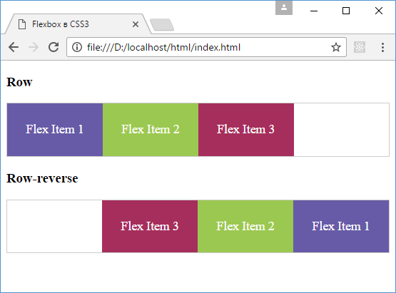
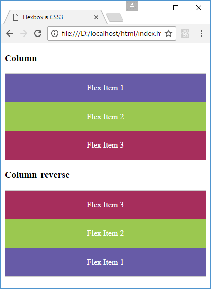

# Направление flex-direction

Flex-элементы во flex-контейнере могут иметь определенное направление, а именно они могут располагаться в виде строк или в виде столбцов.

Для управления направлением элементов CSS3 предоставляет свойство `flex-direction`. Оно определяет направление элементов и может принимать следующие значения:

- `row`: значение по умолчанию, при котором элементы располагаются в виде строки слева направо
- `row-reverse`: элементы также располагаются в виде стоки только в обратном порядке справа налево
- `column`: элементы располагаются в столбик сверху вниз
- `column-reverse`: элементы располагаются в столбик в обратном порядке снизу вверх

Например, расположение в виде строки:

```html
<!DOCTYPE html>
<html>
  <head>
    <meta charset="utf-8" />
    <title>Flexbox в CSS3</title>
    <style>
      .flex-container {
        display: flex;
        border: 1px solid #ccc;
      }
      .row {
        flex-direction: row;
      }
      .row-reverse {
        flex-direction: row-reverse;
      }
      .flex-item {
        text-align: center;
        font-size: 1.1em;
        padding: 1.5em;
        color: white;
      }
      .color1 {
        background-color: #675ba7;
      }
      .color2 {
        background-color: #9bc850;
      }
      .color3 {
        background-color: #a62e5c;
      }
    </style>
  </head>
  <body>
    <h3>Row</h3>
    <div class="flex-container row">
      <div class="flex-item color1">Flex Item 1</div>
      <div class="flex-item color2">Flex Item 2</div>
      <div class="flex-item color3">Flex Item 3</div>
    </div>

    <h3>Row-reverse</h3>
    <div class="flex-container row-reverse">
      <div class="flex-item color1">Flex Item 1</div>
      <div class="flex-item color2">Flex Item 2</div>
      <div class="flex-item color3">Flex Item 3</div>
    </div>
  </body>
</html>
```



Аналогично работает расположение в виде столбца:

```html
<!DOCTYPE html>
<html>
  <head>
    <meta charset="utf-8" />
    <title>Flexbox в CSS3</title>
    <style>
      .flex-container {
        display: flex;
        border: 1px solid #ccc;
      }
      .column {
        flex-direction: column;
      }
      .column-reverse {
        flex-direction: column-reverse;
      }
      .flex-item {
        text-align: center;
        font-size: 1em;
        padding: 1.2em;
        color: white;
      }
      .color1 {
        background-color: #675ba7;
      }
      .color2 {
        background-color: #9bc850;
      }
      .color3 {
        background-color: #a62e5c;
      }
    </style>
  </head>
  <body>
    <h3>Column</h3>
    <div class="flex-container column">
      <div class="flex-item color1">Flex Item 1</div>
      <div class="flex-item color2">Flex Item 2</div>
      <div class="flex-item color3">Flex Item 3</div>
    </div>

    <h3>Column-reverse</h3>
    <div class="flex-container column-reverse">
      <div class="flex-item color1">Flex Item 1</div>
      <div class="flex-item color2">Flex Item 2</div>
      <div class="flex-item color3">Flex Item 3</div>
    </div>
  </body>
</html>
```



## См. также

- [flex-direction](../flex-direction.md)
