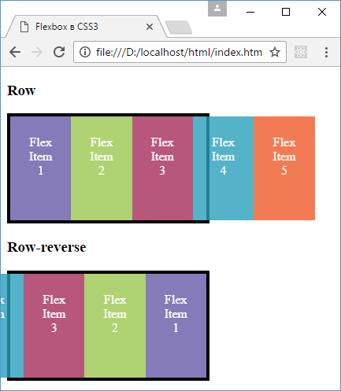
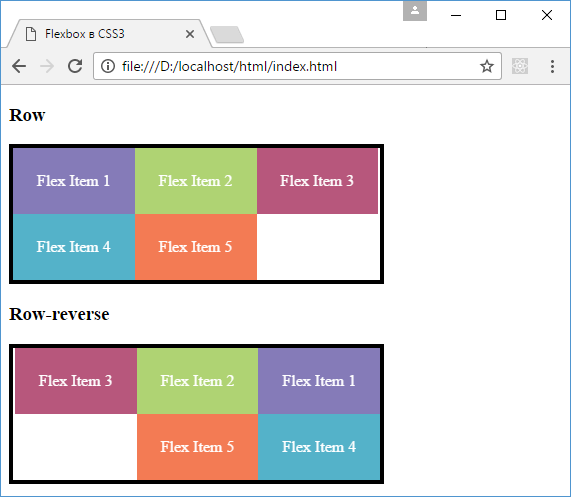
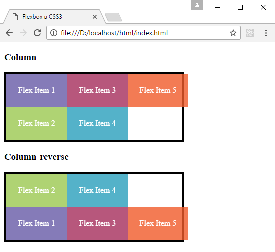

# flex-wrap

??? info "Содержание"

    <small markdown="1">

    1. [Что такое Flexbox. Flex Container](flex-1.md)
    2. [Макет страницы на Flexbox](flex-2.md)
    3. **Направление flex-direction**
    4. [flex-wrap](flex-4.md)
    5. [flex-flow. Порядок элементов](flex-5.md)
    6. [Выравнивание элементов. justify-content](flex-6.md)
    7. [Выравнивание элементов. align-items и align-self](flex-7.md)
    8. [Выравнивание строк и столбцов. align-content](flex-8.md)
    9. [Управление элементами. flex-basis, flex-shrink и flex-grow](flex-9.md)
    10. [Многоколоночный дизайн на Flexbox](flex-10.md)

    </small>

Свойство flex-wrap определяет, будет ли flex-контейнер несколько рядов элементов (строк или столбцов) в случае если его размеры недостаточны, чтобы вместить в один ряд все элементы.

Это свойство может принимать следующие значения:

- `nowrap`: значение по умолчанию, которое определяет flex-контейнер, где все элементы раполагаются в одну строку (при расположении в виде строк) или один столбец (при расположении в столбик)
- `wrap`: если элементы не помещаются во flex-контейнер, то создает дополнительные ряды в контейнере для размещения элементов. При расположении в виде строки содаются дополнительные строки, а при расположении в виде столбца добавляются дополнительные столбцы
- `wrap-reverse`: то же самое, что и значение wrap, только элементы располагаются в обратном порядке

Например, возьмем значение по умолчанию nowrap:

```html
<!DOCTYPE html>
<html>
  <head>
    <meta charset="utf-8" />
    <title>Flexbox в CSS3</title>
    <style>
      .flex-container {
        display: flex;
        border: solid 0.25em #000;
        width: 60%;
        height: 8.25em;
        flex-wrap: nowrap;
      }
      .row {
        flex-direction: row;
      }
      .row-reverse {
        flex-direction: row-reverse;
      }
      .flex-item {
        text-align: center;
        font-size: 1em;
        padding: 1.5em;
        color: white;
        opacity: 0.8;
      }
      .color1 {
        background-color: #675ba7;
      }
      .color2 {
        background-color: #9bc850;
      }
      .color3 {
        background-color: #a62e5c;
      }
      .color4 {
        background-color: #2a9fbc;
      }
      .color5 {
        background-color: #f15b2a;
      }
    </style>
  </head>
  <body>
    <h3>Row</h3>
    <div class="flex-container row">
      <div class="flex-item color1">Flex Item 1</div>
      <div class="flex-item color2">Flex Item 2</div>
      <div class="flex-item color3">Flex Item 3</div>
      <div class="flex-item color4">Flex Item 4</div>
      <div class="flex-item color5">Flex Item 5</div>
    </div>

    <h3>Row-reverse</h3>
    <div class="flex-container row-reverse">
      <div class="flex-item color1">Flex Item 1</div>
      <div class="flex-item color2">Flex Item 2</div>
      <div class="flex-item color3">Flex Item 3</div>
      <div class="flex-item color4">Flex Item 4</div>
      <div class="flex-item color5">Flex Item 5</div>
    </div>
  </body>
</html>
```

Здесь в каждом из flex-контейнеров по пять элементов, однако ширина контейнера может вмещать не все элементы, тогда они уходят за границу контейнера:



При установке значения wrap во flex-контейнере добавляются дополнительные ряды для помещения всех элементов в контейнере. Так, изменим значение свойства flex-wrap в контейнере:

```css
.flex-container {
  display: flex;
  border: solid 0.25em #000;
  width: 60%;
  height: 8.25em;
  flex-wrap: wrap;
}
```

В этом случае появится дополнительная стока:



При расположении в виде столбца контейнер будет создавать дополнительные столбцы:

```html
<!DOCTYPE html>
<html>
  <head>
    <meta charset="utf-8" />
    <title>Flexbox в CSS3</title>
    <style>
      .flex-container {
        display: flex;
        border: solid 0.25em #000;
        width: 60%;
        height: 8.25em;
        flex-wrap: wrap;
      }
      .column {
        flex-direction: column;
      }
      .column-reverse {
        flex-direction: column-reverse;
      }
      .flex-item {
        text-align: center;
        font-size: 1em;
        padding: 1.5em;
        color: white;
        opacity: 0.8;
      }
      .color1 {
        background-color: #675ba7;
      }
      .color2 {
        background-color: #9bc850;
      }
      .color3 {
        background-color: #a62e5c;
      }
      .color4 {
        background-color: #2a9fbc;
      }
      .color5 {
        background-color: #f15b2a;
      }
    </style>
  </head>
  <body>
    <h3>Column</h3>
    <div class="flex-container column">
      <div class="flex-item color1">Flex Item 1</div>
      <div class="flex-item color2">Flex Item 2</div>
      <div class="flex-item color3">Flex Item 3</div>
      <div class="flex-item color4">Flex Item 4</div>
      <div class="flex-item color5">Flex Item 5</div>
    </div>

    <h3>Column-reverse</h3>
    <div class="flex-container column-reverse">
      <div class="flex-item color1">Flex Item 1</div>
      <div class="flex-item color2">Flex Item 2</div>
      <div class="flex-item color3">Flex Item 3</div>
      <div class="flex-item color4">Flex Item 4</div>
      <div class="flex-item color5">Flex Item 5</div>
    </div>
  </body>
</html>
```



## См. также

- [flex-wrap](../flex-wrap.md)
