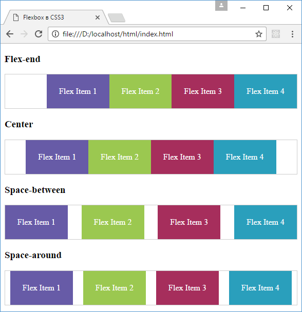
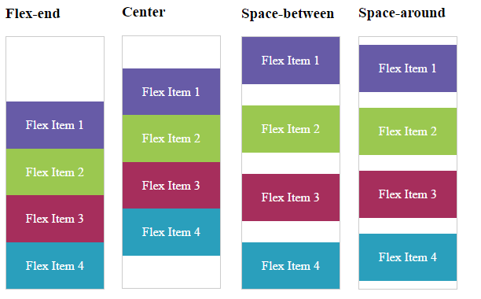

<!-- prettier-ignore-start -->
# Выравнивание элементов. justify-content
{: .no_toc }
<!-- prettier-ignore-end -->

<!-- prettier-ignore -->
1. TOC
{:toc}

Иногда мы можем сталкиваться с тем, что пространство flex-контейнеров по размеру отличается от пространства, необходимого для flex-элементов. Например:

- flex-элементы не используют все пространство flex-контейнера
- flex-элементам требуется большее пространство, чем доступно во flex-контейнере. В этом случае элементы выходят за пределы контейнера.

Для управления этими ситуациями мы можем применять свойство justify-content. Оно выравнивает элементы вдоль основной оси - main axis (при расположении в виде строки по горизонтали, при расположении в виде столбца - по вертикали) и принимает следующие значения:

- `flex-start`: значение по умолчанию, при котором первый элемент выравнивается по левому краю контейнера(при расположении в виде строки) или по верху (при расположении в виде столбца), за ним располагается второй элемент и так далее.
- `flex-end`: последний элемент выравнивается по правому краю (при расположении в виде строки) или по низу (при расположении в виде столбца) контейнера, за ним выравнивается предпоследний элемент и так далее
- `center`: элементы выравниваются по центру
- `space-between`: если в стоке только один элемент или элементы выходят за границы flex-контейнера, то данное значение аналогично flex-start. В остальных случаях первый элемент выравнивается по левому краю (при расположении в виде строки) или по верху (при расположении в виде столбца), а последний элемент - по правому краю контейнера (при расположении в виде строки) или по низу (при расположении в виде столбца). Все оставшееся пространство между ними равным образом распределяется между остальными элементами
- `space-around`: если в строке только один элемент или элементы выходят за пределы контейнера, то его действие аналогично значению center. В ином случае элементы равным образом распределяют пространство между левым и правым краем контейнера, а расстояние между первым и последним элементом и границами контейнера составляет половину расстояния между элементами.

Выравнивание для расположения элементов в виде строки:

```html
<!DOCTYPE html>
<html>
  <head>
    <meta charset="utf-8" />
    <title>Flexbox в CSS3</title>
    <style>
      .flex-container {
        display: flex;
        border: 1px #ccc solid;
      }
      .flex-end {
        justify-content: flex-end;
      }
      .center {
        justify-content: center;
      }
      .space-between {
        justify-content: space-between;
      }
      .space-around {
        justify-content: space-around;
      }
      .flex-item {
        text-align: center;
        font-size: 1em;
        padding: 1.5em;
        color: white;
      }
      .color1 {
        background-color: #675ba7;
      }
      .color2 {
        background-color: #9bc850;
      }
      .color3 {
        background-color: #a62e5c;
      }
      .color4 {
        background-color: #2a9fbc;
      }
      .color5 {
        background-color: #f15b2a;
      }
    </style>
  </head>
  <body>
    <h3>Flex-end</h3>
    <div class="flex-container flex-end">
      <div class="flex-item color1">Flex Item 1</div>
      <div class="flex-item color2">Flex Item 2</div>
      <div class="flex-item color3">Flex Item 3</div>
      <div class="flex-item color4">Flex Item 4</div>
    </div>
    <h3>Center</h3>
    <div class="flex-container center">
      <div class="flex-item color1">Flex Item 1</div>
      <div class="flex-item color2">Flex Item 2</div>
      <div class="flex-item color3">Flex Item 3</div>
      <div class="flex-item color4">Flex Item 4</div>
    </div>
    <h3>Space-between</h3>
    <div class="flex-container space-between">
      <div class="flex-item color1">Flex Item 1</div>
      <div class="flex-item color2">Flex Item 2</div>
      <div class="flex-item color3">Flex Item 3</div>
      <div class="flex-item color4">Flex Item 4</div>
    </div>
    <h3>Space-around</h3>
    <div class="flex-container space-around">
      <div class="flex-item color1">Flex Item 1</div>
      <div class="flex-item color2">Flex Item 2</div>
      <div class="flex-item color3">Flex Item 3</div>
      <div class="flex-item color4">Flex Item 4</div>
    </div>
  </body>
</html>
```



Выравнивание при расположении в виде столбцов:



## Ссылки

- [Выравнивание элементов. justify-content](https://metanit.com/web/html5/12.5.php)
