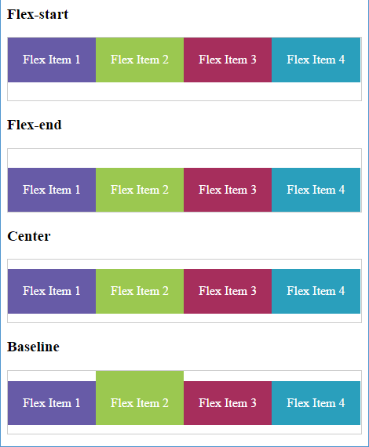
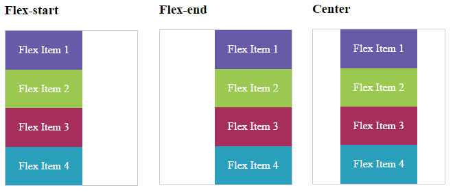
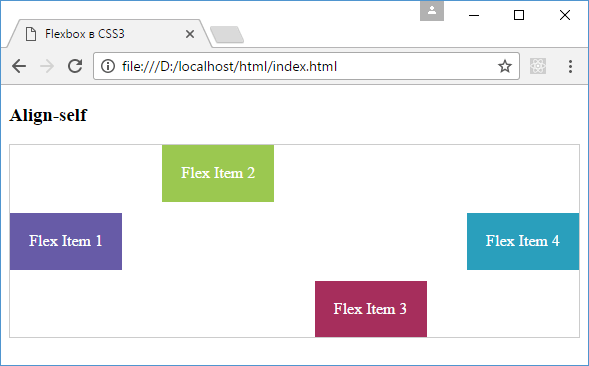

# Выравнивание элементов. align-items и align-self

## Свойство align-items

Свойство [`align-items`](../align-items.md) также выравнивает элементы, но уже по поперечной оси (cross axis) (при расположении в виде строки по вертикали, при расположении в виде столбца - по горизонтали). Это свойство может принимать следующие значения:

- `stretch`: значение по умолчанию, при котором flex-элементы растягиваются по всей высоте (при расположении в строку) или по всей ширине (при расположении в столбик) flex-контейнера
- `flex-start`: элементы выравниваются по верхнему краю (при расположении в строку) или по левому краю (при расположении в столбик) flex-контейнера
- `flex-end`: элементы выравниваются по нижнему краю (при расположении в строку) или по правому краю (при расположении в столбик) flex-контейнера
- `center`: элементы выравниваются по центру flex-контейнера
- `baseline`: элементы выравниваются в соответствии со своей базовой линией

Выравнивание при расположении в строку:

```html
<!DOCTYPE html>
<html>
    <head>
        <meta charset="utf-8" />
        <title>Flexbox в CSS3</title>
        <style>

            .flex-container {
                display: flex;
                border:1px #ccc solid;
                height:5em;
            }
            .flex-start{
                align-items: flex-start;
            }
            .flex-end{
                align-items: flex-end;
            }
            .center{
                align-items: center;
            }
            .baseline{
                align-items: baseline;
            }
            .flex-item {
                text-align:center;
                font-size: 1em;
                padding: 1.2em;
                color: white;

            }
            .largest-item{
                padding-top:2em;
            }
            .color1 {background-color: #675BA7;}
            .color2 {background-color: #9BC850;}
            .color3 {background-color: #A62E5C;}
            .color4 {background-color: #2A9FBC;}
        </style>
    </head>
    <body>
        <h3>Flex-start</h3>
        <div class="flex-container flex-start">
            <div class="flex-item color1">Flex Item 1</div>
            <div class="flex-item color2">Flex Item 2</div>
            <div class="flex-item color3">Flex Item 3</div>
            <div class="flex-item color4">Flex Item 4</div>
        </div>
        <h3>Flex-end</h3>
        <div class="flex-container flex-end">
            <div class="flex-item color1">Flex Item 1</div>
            <div class="flex-item color2">Flex Item 2</div>
            <div class="flex-item color3">Flex Item 3</div>
            <div class="flex-item color4">Flex Item 4</div>
        </div>
        <h3>Center</h3>
        <div class="flex-container center">
            <div class="flex-item color1">Flex Item 1</div>
            <div class="flex-item color2">Flex Item 2</div>
            <div class="flex-item color3">Flex Item 3</div>
            <div class="flex-item color4">Flex Item 4</div>
        </div>
        <h3>Baseline</h3>
        <div class="flex-container baseline">
            <div class="flex-item color1">Flex Item 1</div>
            <div class="flex-item color2 largest-item">Flex Item 2</div>
            <div class="flex-item color3">Flex Item 3</div>
            <div class="flex-item color4">Flex Item 4</div>
        </div>
</html>
```



Аналогично свойство работает при расположении в столбик. Например, изменим стили flex-контейнера следующим образом:

```css
.flex-container {
  display: flex;
  border: 1px #ccc solid;
  flex-direction: column;
  width: 12em;
}
```



## Свойство align-self

Свойство [`align-self`](../align-self.md) позволяет переопределить значение свойства `align-items` для одного элемента. Оно может принимать все те же значения плюс значение `auto`:

- `auto`: значение по умолчанию, при котором элемент получает значение от свойства `align-items`, которое определено в flex-контейнере. Если в контейнере такой стиль не определен, то применяется значение `stretch`.
- `stretch`
- `flex-start`
- `flex-end`
- `center`
- `baseline`

```html
<!DOCTYPE html>
<html>
    <head>
        <meta charset="utf-8">
        <title>Flexbox в CSS3</title>
        <style>
            .flex-container {
                display: flex;
                border:1px #ccc solid;
                justify-content: space-between;
                align-items: stretch;
                height:12em;
            }
            .flex-item {
                text-align:center;
                font-size: 1em;
                padding: 1.2em;
                color: white;
            }
            .item1 {background-color: #675BA7; align-self: center; }
            .item2 {background-color: #9BC850; align-self: flex-start;}
            .item3 {background-color: #A62E5C; align-self: flex-end;}
            .item4 {background-color: #2A9FBC; align-self: center;}
        </style>
    </head>
    <body>
        <h3>Align-self</h3>
        <div class="flex-container">
            <div class="flex-item item1">Flex Item 1</div>
            <div class="flex-item item2">Flex Item 2</div>
            <div class="flex-item item3">Flex Item 3</div>
            <div class="flex-item item4">Flex Item 4</div>
        </div>
</html>
```

Здесь для flex-контейнера задано растяжение по высоте с помощью значения `align-items: stretch;`. Однако каждый из элементов переопределяет это поведение:



## Ссылки

- [Выравнивание элементов. align-items и align-self](https://metanit.com/web/html5/12.6.php)
