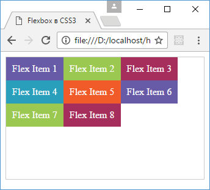
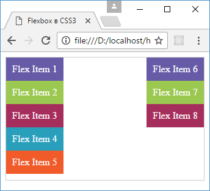

# Выравнивание строк и столбцов. align-content

<small markdown="1">

1. [Что такое Flexbox. Flex Container](flex-1.md)
2. [Макет страницы на Flexbox](flex-2.md)
3. [Направление flex-direction](flex-3.md)
4. [flex-wrap](flex-4.md)
5. [flex-flow. Порядок элементов](flex-5.md)
6. [Выравнивание элементов. justify-content](flex-6.md)
7. **Выравнивание элементов. align-items и align-self**
8. [Выравнивание строк и столбцов. align-content](flex-8.md)
9. [Управление элементами. flex-basis, flex-shrink и flex-grow](flex-9.md)
10. [Многоколоночный дизайн на Flexbox](flex-10.md)

</small>

Свойство [`align-content`](../align-content.md) управляет выравниванием рядов (строк и столбцов) во flex-контейнере и поэтому применяется, если свойство [`flex-wrap`](../flex-wrap.md) имеет значение `wrap` или `wrap-reverse`. Свойство `align-content` может иметь следующие значения:

- `stretch`: значение по умолчанию, при котором строки (столбцы) растягиваются, занимая все свободное место
- `flex-start`: строки (столбцы) выравниваются по началу контейнера (для строк - это верхний край, для столбцов - это левый край контейнера)
- `flex-end`: строки (столбцы) выравниваются по концу контейнера (строки - по нижнему краю, столбцы - по правому краю)
- `center`: строки (столбцы) позиционируются по центру контейнера
- `space-between`: строки (столбцы) равномерно распределяются по контейнеру, а между ними образуются одинаковые отступы. Если же имеющегося в контейнере места недостаточно, то действует аналогично значению `flex-start`
- `space-around`: строки (столбцы) равным образом распределяют пространство контейнера, а растояние между первой и последней строкой (столбцом) и границами контейнера составляет половину расстояния между соседними строками (столбцами).

Стоит учитывать, что это свойство имеет смысл, если в контейнере две и больше строки (столбца).

Например, расположение строк в начале контейнера:

```html
<!DOCTYPE html>
<html>
  <head>
    <meta charset="utf-8" />
    <title>Flexbox в CSS3</title>
    <style>
      .flex-container {
        display: flex;
        border: 1px #ccc solid;
        flex-wrap: wrap;
        height: 200px;
        align-content: flex-start;
      }
      .flex-item {
        text-align: center;
        font-size: 16px;
        padding: 10px;
        color: white;
      }
      .item1 {
        background-color: #675ba7;
      }
      .item2 {
        background-color: #9bc850;
      }
      .item3 {
        background-color: #a62e5c;
      }
      .item4 {
        background-color: #2a9fbc;
      }
      .item5 {
        background-color: #f15b2a;
      }
    </style>
  </head>
  <body>
    <div class="flex-container">
      <div class="flex-item item1">Flex Item 1</div>
      <div class="flex-item item2">Flex Item 2</div>
      <div class="flex-item item3">Flex Item 3</div>
      <div class="flex-item item4">Flex Item 4</div>
      <div class="flex-item item5">Flex Item 5</div>
      <div class="flex-item item1">Flex Item 6</div>
      <div class="flex-item item2">Flex Item 7</div>
      <div class="flex-item item3">Flex Item 8</div>
    </div>
  </body>
</html>
```



Изменим стиль контейнера:

```css
.flex-container {
  display: flex;
  border: 1px #ccc solid;
  flex-wrap: wrap;
  height: 200px;
  align-content: space-between;
  flex-direction: column;
}
```

И в этом случае мы получим ряд столбцов, разделенных отступами:



## См. также

- [align-content](../align-content.md)

<small markdown="1">

1. [Что такое Flexbox. Flex Container](flex-1.md)
2. [Макет страницы на Flexbox](flex-2.md)
3. [Направление flex-direction](flex-3.md)
4. [flex-wrap](flex-4.md)
5. [flex-flow. Порядок элементов](flex-5.md)
6. [Выравнивание элементов. justify-content](flex-6.md)
7. **Выравнивание элементов. align-items и align-self**
8. [Выравнивание строк и столбцов. align-content](flex-8.md)
9. [Управление элементами. flex-basis, flex-shrink и flex-grow](flex-9.md)
10. [Многоколоночный дизайн на Flexbox](flex-10.md)

</small>
