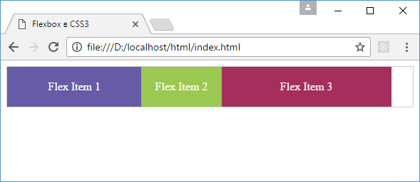
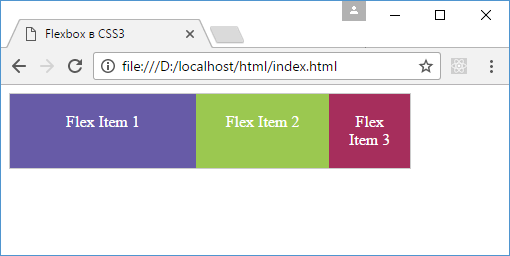
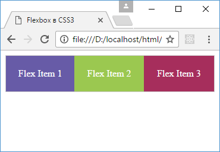
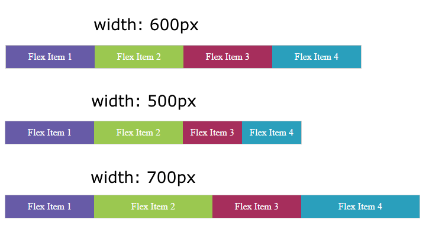

# Управление элементами. flex-basis, flex-shrink и flex-grow

<small markdown="1">

1. [Что такое Flexbox. Flex Container](flex-1.md)
2. [Макет страницы на Flexbox](flex-2.md)
3. [Направление flex-direction](flex-3.md)
4. [flex-wrap](flex-4.md)
5. [flex-flow. Порядок элементов](flex-5.md)
6. [Выравнивание элементов. justify-content](flex-6.md)
7. [Выравнивание элементов. align-items и align-self](flex-7.md)
8. **Выравнивание строк и столбцов. align-content**
9. [Управление элементами. flex-basis, flex-shrink и flex-grow](flex-9.md)
10. [Многоколоночный дизайн на Flexbox](flex-10.md)

</small>

Кроме свойств, устанавливающих выравнивание элементов относительно границ flex-контейнера, есть еще три свойства, которые позволяют управлять элементами:

- `flex-basis`: определяет начальный размер flex-элемента
- `flex-shrink`: определяет, как flex-элемент будет уменьшаться относительно других flex-элементов во flex-контейнере
- `flex-grow`: определяет, как flex-элемент будет увеличиваться относительно других flex-элементов во flex-контейнере

## flex-basis

Flex-контейнер может увеличиваться или уменьшаться вдоль своей центральной оси, например, при изменении размеров браузера, если контейнер имеет нефиксированные размеры. И вместе с контейнером также могут увеличиваться и уменьшаться его flex-элементы. Свойство [`flex-basis`](../flex-basis.md) определяет начальный размер flex-элемента до того, как он начнет изменять размер, подстраиваясь под размеры flex-контейнера.

Это свойство может принимать следующие значения:

- `auto`: начальный размер flex-элемента устанавливается автоматически
- `content`: размер flex-элемента определяется по его содержимому, в то же время это значение поддерживается не всеми современными браузерами, поэтому его пока стоит избегать
- `числовое значение`: мы можем установить конкретное числовое значение для размеров элемента

Например:

```html
<!DOCTYPE html>
<html>
  <head>
    <meta charset="utf-8" />
    <title>Flexbox в CSS3</title>
    <style>
      .flex-container {
        display: flex;
        border: 1px #ccc solid;
      }
      .flex-item {
        text-align: center;
        font-size: 1em;
        padding: 1.2em;
        color: white;
      }
      .item1 {
        background-color: #675ba7;
        flex-basis: auto;
        width: 150px;
      }
      .item2 {
        background-color: #9bc850;
        flex-basis: auto;
        width: auto;
      }
      .item3 {
        background-color: #a62e5c;
        flex-basis: 200px;
        width: 150px;
      }
    </style>
  </head>
  <body>
    <div class="flex-container">
      <div class="flex-item item1">Flex Item 1</div>
      <div class="flex-item item2">Flex Item 2</div>
      <div class="flex-item item3">Flex Item 3</div>
    </div>
  </body>
</html>
```



У первого элемента у свойства `flex-basis` установлено значение `auto`. Поэтому первый элемент в качестве реального значения для ширины будет использовать значение свойства `width`.

У второго элемента у свойства `flex-basis` установлено значение `auto`, однако и свойство `width` имеет значение `auto`. Поэтому реальная ширина элемента будет устанавливаться по его содержимому.

У третьего элемента свойство `flex-basis` имеет конкретное значение, которое и используется. А свойство `width` в этом случае уже не играет никакой роли.

## flex-shrink

Если flex-контейнер имеет недостаточно места для размещения элемента, то дальнейшее поведение этого элемента мы можем определить с помощью свойства [`flex-shrink`](../flex-shrink.md). Оно указывает, как элемент будет усекаться относительно других элементов.

В качестве значения свойство принимает число. По умолчанию его значение `1`.

Рассмотрим действие этого свойства на примере:

```html
<!DOCTYPE html>
<html>
  <head>
    <meta charset="utf-8" />
    <title>Flexbox в CSS3</title>
    <style>
      .flex-container {
        display: flex;
        border: 1px #ccc solid;
        width: 400px;
      }
      .flex-item {
        text-align: center;
        font-size: 1em;
        padding: 1.2em;
        color: white;
      }
      .item1 {
        background-color: #675ba7;
        flex-basis: 200px;
        flex-shrink: 1;
      }
      .item2 {
        background-color: #9bc850;
        flex-basis: 200px;
        flex-shrink: 2;
      }
      .item3 {
        background-color: #a62e5c;
        flex-basis: 200px;
        flex-shrink: 3;
      }
    </style>
  </head>
  <body>
    <div class="flex-container">
      <div class="flex-item item1">Flex Item 1</div>
      <div class="flex-item item2">Flex Item 2</div>
      <div class="flex-item item3">Flex Item 3</div>
    </div>
  </body>
</html>
```



В данном случае начальная ширина каждого элемента равна `200px`, то есть совокупная ширина составляет `600px`. Однако ширина flex-контейнера составляет всего `400px`. То есть размер контейнера недостаточен для вмещения в него элементов, поэтому в действие вступает свойство `flex-shrink`, которое определено у элементов.

Для усечения элементов браузер вычисляет коэффициент усечения (shrinkage factor). Он вычисляется путем перемножения значения свойства `flex-basis` на `flex-shrink`. Таким образом, для трех элементов мы получим следующие вычисления:

```
// первый элемент
200px * 1 = 200
// второй элемент
200px * 2 = 400
// третий элемент
200px * 3 = 600
```

Таким образом, мы получаем, что для второго элемента коэффициент усечения в два раза больше, чем коэффициент для первого элемента. А для третьего элемента коэффициент больше в три раза, чем у первого элемента. Поэтому в итоге первый элемент при усечении будет в три раза больше, чем третий и в два раза больше, чем второй.

## flex-grow

Свойство [`flex-grow`](../flex-grow.md) управляет расширением элементов, если во flex-контейнере есть дополнительное место. Данное свойство во многом похоже на свойство `flex-shrink` за тем исключением, что работает в сторону увеличения элементов.

В качестве значения свойство `flex-grow` принимает положительное число, которое указывает, во сколько раз элемент будет увеличиваться относительно других элементов при увеличении размеров flex-контейнера. По умолчанию свойство `flex-grow` равно `0`.

Итак, используем свойство `flex-grow`:

```html
<!DOCTYPE html>
<html>
  <head>
    <meta charset="utf-8" />
    <title>Flexbox в CSS3</title>
    <style>
      .flex-container {
        display: flex;
        border: 1px #ccc solid;
      }
      .flex-item {
        text-align: center;
        font-size: 1em;
        padding: 1.3em;
        color: white;
      }
      .item1 {
        background-color: #675ba7;
        flex-grow: 0;
      }
      .item2 {
        background-color: #9bc850;
        flex-grow: 1;
      }
      .item3 {
        background-color: #a62e5c;
        flex-grow: 2;
      }
    </style>
  </head>
  <body>
    <div class="flex-container">
      <div class="flex-item item1">Flex Item 1</div>
      <div class="flex-item item2">Flex Item 2</div>
      <div class="flex-item item3">Flex Item 3</div>
    </div>
  </body>
</html>
```

Итак, для каждого элемента есть базовые начальные размеры. Здесь явным образом размеры для элементов не указаны, поэтому размер каждого элемента в данном случае будет складываться из размеров внутреннего содержимого, к которым добавляются внутренние отступы.



По мере растягивания контейнера будут увеличиваться элементы в соответствии со свойством `flex-grow`, которое указано для каждого элемента. Пространство, на которое растягивается контейнер, считается дополнительным пространством.


Так как у первого элемента свойство `flex-grow` равно `0`, то первый элемент будет иметь константные постоянные размеры. У второго элемента `flex-grow` равно `1`, а третьего - `2`. Таким образом, в сумме они дадут `0 + 1 + 2 = 3`. Поэтому второй элемент будет увеличиваться на `1/3` дополнительного пространства, на которое растягивается контейнер, а третий элемент будет получать `2/3` дополнительного пространства.

## Свойство flex

Свойство [`flex`](../flex.md) является объединением свойств `flex-basis`, `flex-shrink` и `flex-grow` и имеет следующий формальный синтаксис:

```css
flex: [flex-grow] [flex-shrink] [flex-basis];
```

По умолчанию свойство `flex` имеет значение `0 1 auto`.

Кроме конкретных значений для каждого из подсвойств мы можем задать для свойства `flex` одно из трех общих значений:

- `flex: none`: эквивалентно значению `0 0 auto`, при котором flex-элемент не растягивается и не усекается при увеличении и уменьшении контейнера
- `flex: auto`: эквивалентно значению `1 1 auto`
- `flex: initial`: эквивалентно значению `0 1 auto`

Так, применим свойство flex:

```html
<!DOCTYPE html>
<html>
  <head>
    <meta charset="utf-8" />
    <title>Flexbox в CSS3</title>
    <style>
      .flex-container {
        display: flex;
        border: 1px #ccc solid;
        width: 600px;
      }
      .flex-item {
        text-align: center;
        font-size: 16px;
        padding: 10px 0;
        color: white;
      }
      .item1 {
        background-color: #675ba7;
        width: 150px;
        flex: 0 0 auto;
      }
      .item2 {
        background-color: #9bc850;
        width: 150px;
        flex: 1 0 auto;
      }
      .item3 {
        background-color: #a62e5c;
        width: 150px;
        flex: 0 1 auto;
      }
      .item4 {
        background-color: #2a9fbc;
        width: 150px;
        flex: 1 1 auto;
      }
    </style>
  </head>
  <body>
    <div class="flex-container">
      <div class="flex-item item1">Flex Item 1</div>
      <div class="flex-item item2">Flex Item 2</div>
      <div class="flex-item item3">Flex Item 3</div>
      <div class="flex-item item4">Flex Item 4</div>
    </div>
  </body>
</html>
```



Здесь каждый элемент имеет начальную ширину в 150 пикселей, так как у всех элементов свойство `flex-basis` имеет значение `0`, что в целом для всех элементов будет составлять 600 пикселей.

При сжатии контейнера будут уменьшаться 3-й и 4-й элементы, так как у них свойство `flex-shrink` больше нуля. И так как у обоих элементов это свойство равно `1`, то оба элемента будут уменьшаться в равных долях.

При растяжении контейнера будут увеличиваться 2-й и 4-й элементы, так как у этих элементов свойство `flex-grow` больше нуля. И также, так как это свойство равно `1`, то эти элементы будут увеличиваться в равных долях.

## См. также

- [flex](../flex.md)
- [flex-basis](../flex-basis.md)
- [flex-shrink](../flex-shrink.md)
- [flex-grow](../flex-grow.md)

<small markdown="1">

1. [Что такое Flexbox. Flex Container](flex-1.md)
2. [Макет страницы на Flexbox](flex-2.md)
3. [Направление flex-direction](flex-3.md)
4. [flex-wrap](flex-4.md)
5. [flex-flow. Порядок элементов](flex-5.md)
6. [Выравнивание элементов. justify-content](flex-6.md)
7. [Выравнивание элементов. align-items и align-self](flex-7.md)
8. **Выравнивание строк и столбцов. align-content**
9. [Управление элементами. flex-basis, flex-shrink и flex-grow](flex-9.md)
10. [Многоколоночный дизайн на Flexbox](flex-10.md)

</small>
