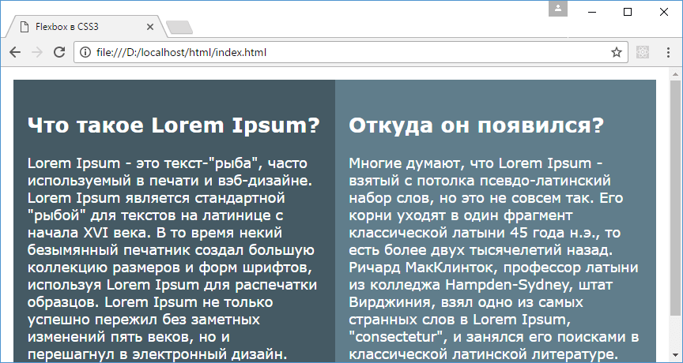
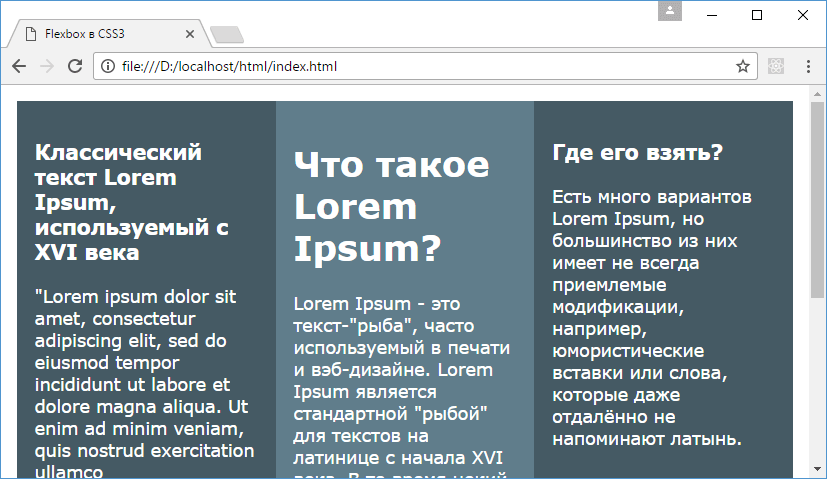
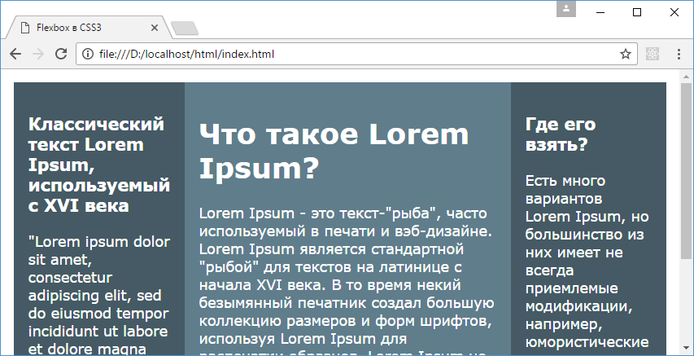

# Многоколоночный дизайн на Flexbox

??? info "Содержание"

    <small markdown="1">

    1. [Что такое Flexbox. Flex Container](flex-1.md)
    2. [Макет страницы на Flexbox](flex-2.md)
    3. [Направление flex-direction](flex-3.md)
    4. [flex-wrap](flex-4.md)
    5. [flex-flow. Порядок элементов](flex-5.md)
    6. [Выравнивание элементов. justify-content](flex-6.md)
    7. [Выравнивание элементов. align-items и align-self](flex-7.md)
    8. [Выравнивание строк и столбцов. align-content](flex-8.md)
    9. **Управление элементами. flex-basis, flex-shrink и flex-grow**
    10. [Многоколоночный дизайн на Flexbox](flex-10.md)

    </small>

Рассмотрим, как сделать простейшие многоколонночные макеты страницы с помощью Flexbox.

## Двуколоночный дизайн

```html
<!DOCTYPE html>
<html>
  <head>
    <meta charset="utf-8" />
    <title>Flexbox в CSS3</title>
    <style>
      * {
        box-sizing: border-box;
      }
      html,
      body {
        padding: 0;
        margin: 0;
        font-family: verdana, arial, sans-serif;
      }

      body {
        display: flex;
        padding: 1em;
        flex-direction: column;
      }

      .item {
        background-color: #455a64;
        color: #fff;
        font-size: 1.1em;
        padding: 1em;
      }

      .item:nth-child(even) {
        background-color: #607d8b;
      }
      @media screen and (min-width: 600px) {
        body {
          flex-direction: row;
        }
      }
    </style>
  </head>
  <body>
    <div class="item">
      <h2>Что такое Lorem Ipsum?</h2>
      <p>
        Lorem Ipsum - это текст-"рыба", часто используемый в
        печати и вэб-дизайне. Lorem Ipsum является
        стандартной "рыбой" для текстов на латинице с начала
        XVI века...
      </p>
    </div>

    <div class="item">
      <h2>Откуда он появился?</h2>
      <p>
        Многие думают, что Lorem Ipsum - взятый с потолка
        псевдо-латинский набор слов, но это не совсем так.
        Его корни уходят в один фрагмент классической латыни
        45 года н.э...
      </p>
    </div>
  </body>
</html>
```

Здесь flex-контейнером является элемент `body`. Так как на мобильных устройствах (особенно смартфонах) размер экрана не такой большой, поэтому по умолчанию устанавливаем расположение элементов в столбик. Однако для устройств с экраном от 600рх и выше действует правило media-query, которое устанавливает расположение в виде строки.



## Трехколоночный режим

```html
<!DOCTYPE html>
<html>
  <head>
    <meta charset="utf-8" />
    <title>Flexbox в CSS3</title>
    <style>
      * {
        box-sizing: border-box;
      }
      html,
      body {
        padding: 0;
        margin: 0;
        font-family: verdana, arial, sans-serif;
      }

      body {
        display: flex;
        padding: 1em;
        flex-direction: column;
      }

      .item {
        background-color: #455a64;
        color: #fff;
        font-size: 1.1em;
        padding: 1em;
        flex: 1;
      }

      .item:nth-child(1) {
        background-color: #607d8b;
      }
      @media screen and (min-width: 600px) {
        body {
          flex-direction: row;
        }
        .item:nth-child(2) {
          order: -1;
        }
      }
    </style>
  </head>
  <body>
    <div class="item">
      <h1>Что такое Lorem Ipsum?</h1>
      <p>
        Lorem Ipsum - это текст-"рыба", часто используемый в
        печати и вэб-дизайне. Lorem Ipsum является
        стандартной "рыбой" для текстов на латинице с начала
        XVI века. В то время некий безымянный печатник
        создал ...
      </p>
    </div>

    <div class="item">
      <h3>
        Классический текст Lorem Ipsum, используемый с XVI
        века
      </h3>
      <p>
        "Lorem ipsum dolor sit amet, consectetur adipiscing
        elit, sed do eiusmod tempor incididunt ut labore et
        dolore magna aliqua. Ut enim ad minim veniam, quis
        nostrud exercitation ullamco
      </p>
    </div>
    <div class="item">
      <h3>Где его взять?</h3>
      <p>
        Есть много вариантов Lorem Ipsum, но большинство из
        них имеет не всегда приемлемые модификации,
        например, юмористические вставки или слова, которые
        даже отдалённо не напоминают латынь.
      </p>
    </div>
  </body>
</html>
```

В отличие от предыдущего примера здесь добавлен еще один элемент. Особенностью этого примера является то, что столбцы имеют одинаковые размеры. Для этого у них установлено свойство `flex: 1`, то есть при растяжении или уменьшении границ контейнера все элементы будут масштабироваться на равную величину.

И кроме того, при ширине экрана больше `600px` у второго элемента устанавливается свойство `order: -1`, благодаря чему этот элемент помещается первым:



Подобным образом мы можем добавить и большее количество столбцов. Но в данном случае по умолчанию столбцы имеют одинаковую ширину. Но что делать, если один из столбцов (как правило, центральный) должен иметь ширину больше, чем у остальных? Для этого добавим в стили страницы следующее правило:

```css
.item:first-child {
  flex: 0 0 50%;
}
```

В этом случае первый элемент всегда будет занимать 50% пространства контейнера:


