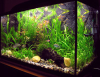

# flex-shrink

Свойство **`flex-shrink`** устанавливает коэффициент сжатия флексов в контейнере и задаёт, насколько элемент будет уменьшаться по отношению к другим флексам, чтобы разместить все элементы в одну строку.

??? info "Flexbox и выравнивание"

    **Руководство по [Flexbox](flex-guide/flex-1.md)**

    <div class="col3" markdown="1">

    - [flex](flex.md)
    - [flex-basis](flex-basis.md)
    - [flex-direction](flex-direction.md)
    - [flex-flow](flex-flow.md)
    - [flex-grow](flex-grow.md)
    - **flex-shrink**
    - [flex-wrap](flex-wrap.md)
    - [order](order.md)

    </div>

    <div class="col3" markdown="1">

    - [justify-content](justify-content.md)
    - [align-content](align-content.md)
    - [place-content](place-content.md)
    - [justify-items](justify-items.md)
    - [align-items](align-items.md)
    - [place-items](place-items.md)
    - [justify-self](justify-self.md)
    - [align-self](align-self.md)
    - [place-self](place-self.md)
    - [row-gap](row-gap.md)
    - [column-gap](column-gap.md)
    - [gap](gap.md)

    </div>

## Синтаксис

```css
flex-shrink: 2;
flex-shrink: 0.6;

/* Global values */
flex-shrink: inherit;
flex-shrink: initial;
flex-shrink: unset;
```

## Значения

Значение по-умолчанию: `1`

Наследуется: нет

Применяется к флекс-элементам

Анимируется: да

`<число>`
: Принимаются целые числа. Отрицательные значения игнорируются.

### Примечание

Safari до версии 9 поддерживает свойство `-webkit-flex-shrink`.

## Спецификации

- [CSS Flexible Box Layout Module](https://www.w3.org/TR/css-flexbox/#propdef-flex-shrink)

## Поддержка браузерами

<p class="ciu_embed" data-feature="flexbox" data-periods="future_1,current,past_1,past_2">
  <a href="http://caniuse.com/#feat=flexbox">Can I Use flexbox?</a> Data on support for the flexbox feature across the major browsers from caniuse.com.
</p>

## Описание и примеры

=== "HTML"

    ```html
    <!DOCTYPE html>
    <html>
      <head>
        <meta charset="utf-8" />
        <title>flex-shrink</title>
        <style>
          .flex-container {
            display: flex;
          }
          .flex1 {
            flex-shrink: 3;
            margin-right: 2rem;
          }
          .flex1 img {
            width: 100%;
          }
          .flex2 {
            flex-shrink: 2;
          }
        </style>
      </head>
      <body>
        <div class="flex-container">
          <div class="flex-item flex1">
            
          </div>
          <div class="flex-item flex2">
            Понравились готовые инсталляции, некоторые даже без
            рыбок смотрятся так, что хочется фотографию на
            рабочий стол поставить и любоваться.
          </div>
        </div>
      </body>
    </html>
    ```

=== "Результат"

    <style>
    .flex-container {
    display: flex;
    }
    .flex1 {
    flex-shrink: 3;
    margin-right: 2rem;
    }
    .flex1 img {
    width: 100%;
    }
    .flex2 {
    flex-shrink: 2;
    }
    </style>
    <div class="flex-container">
    <div class="flex-item flex1"></div>
    <div class="flex-item flex2">Понравились готовые инсталляции, некоторые
    даже без рыбок смотрятся так, что хочется фотографию на рабочий
    стол поставить и любоваться.</div>
    </div>

## См. также

- [Руководство по Flexbox](flex-guide/flex-1.md)
