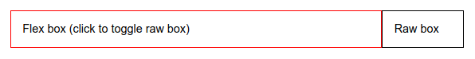

# flex

Сокращённое свойство **`flex`**, которое позволяет указать параметры элемента, чтобы он эффективно заполнял доступное пространство.

Элементы могут быть растянуты пропорционально с учётом заданного соотношения или сжаты, чтобы целиком вместить все элементы без переносов в одну строку.

## Синтаксис

```css
/* Basic values */
flex: auto;
flex: initial;
flex: none;
flex: 2;

/* One value, unitless number: flex-grow */
flex: 2;

/* One value, width/height: flex-basis */
flex: 10em;
flex: 30px;

/* Two values: flex-grow | flex-basis */
flex: 1 30px;

/* Two values: flex-grow | flex-shrink */
flex: 2 2;

/* Three values: flex-grow | flex-shrink | flex-basis */
flex: 2 2 10%;

/* Global values */
flex: inherit;
flex: initial;
flex: unset;
```

## Значения

Значение по-умолчанию:

- [`flex-grow`](/css/flex-grow/): `0`
- [`flex-shrink`](/css/flex-shrink/): `1`
- [`flex-basis`](/css/flex-basis/): `auto`

Наследуется: нет

Применяется к флекс-элементам

Анимируется: да

`none`
: Соответствует значению `0 0 auto`.

!!! note "Примечание"

	Safari до версии 9 поддерживает свойство `-webkit-flex`.

## Спецификации

- [CSS Flexible Box Layout Module](https://www.w3.org/TR/css-flexbox/#flex-property)

## Поддержка браузерами

<p class="ciu_embed" data-feature="flexbox" data-periods="future_1,current,past_1,past_2">
  <a href="http://caniuse.com/#feat=flexbox">Can I Use flexbox?</a> Data on support for the flexbox feature across the major browsers from caniuse.com.
</p>

## Описание и примеры

CSS

```css
#flex-container {
  display: flex;
  flex-direction: row;
}

#flex-container > .flex-item {
  flex: auto;
}

#flex-container > .raw-item {
  width: 5rem;
}
```

HTML

```html
<div id="flex-container">
  <div class="flex-item" id="flex">Flex box (click to toggle raw box)</div>
  <div class="raw-item" id="raw">Raw box</div>
</div>
```

Результат



## См. также

- [Руководство по Flexbox](flex-guide/flex-1.md)
