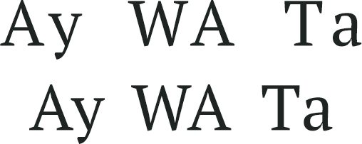

# font-kerning

Свойство **`font-kerning`** управляет кернингом шрифта.

Кернинг — это изменение интервала между определёнными сочетаниями букв для сохранения плотности букв в тексте. Это особенно важно для букв, у которых есть наклонные линии, вроде А, У, W, V. Информация о кернинге хранится в самом шрифте и если шрифт не поддерживает эту возможность, то свойство `font-kerning` не окажет влияние на текст.

На рис. 1 показаны некоторые сочетания букв без кернинга и с кернингом.



## Синтаксис

```css
/* Keyword values */
font-kerning: auto;
font-kerning: normal;
font-kerning: none;

/* Global values */
font-kerning: inherit;
font-kerning: initial;
font-kerning: unset;
```

## Значения

`auto`
: Браузер самостоятельно определяет необходимость кернинга для текста. Так, для мелкого шрифта кернинг отключается для сохранения читаемости текста, для крупного, наоборот, включается.

`normal`
: К тексту применяется кернинг.

`none`
: Браузер не использует кернинг для текста.

### Примечание

Chrome до версии 33, Opera до версии 20 и Safari поддерживают свойство `-webkit-font-kerning`.

Значение по-умолчанию:

```css
font-kerning: auto;
```

Применяется к: Ко всем элементам, включая `::first-letter` и `::first-line`.

## Спецификации

- [CSS Fonts Module Level 3](https://drafts.csswg.org/css-fonts-3/#propdef-font-kerning)

## Описание и примеры

```html
<!DOCTYPE html>
<html>
  <head>
    <meta charset="utf-8" />
    <title>font-kerning</title>
    <style>
      h1 {
        font-kerning: normal;
      }
    </style>
  </head>
  <body>
    <h1>Тригонометрический неопределенный интеграл: основные моменты</h1>
    <p>Пустое подмножество транслирует интеграл от функции, обращающейся в бесконечность вдоль линии.</p>
  </body>
</html>
```
