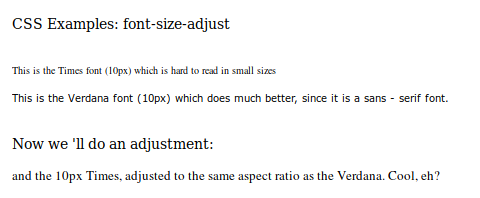

# font-size-adjust

Свойство **`font-size-adjust`** указывает, что размер шрифта должен быть выбран на основе высоты строчных букв, а не высоты заглавных букв.

Это полезно, поскольку разборчивость шрифтов, особенно при небольших размерах, определяется больше размером строчных букв, чем размером заглавных букв.

Разборчивость может стать проблемой, когда первое семейство шрифтов в свойстве [`font-family`](font-family.md) недоступно, а его замена имеет значительно отличающееся соотношение сторон (отношение размера строчных букв к размеру шрифта).

??? info "Шрифт и Цвет"

    <div class="col3" markdown="1">

    - [@font-face](font-face.md)

    </div>

    <div class="col3" markdown="1">

    - [font](font.md)
    - [font-family](font-family.md)
    - [font-feature-settings](font-feature-settings.md)
    - [font-kerning](font-kerning.md)
    - [font-language-override](font-language-override.md)
    - [font-optical-sizing](font-optical-sizing.md)
    - [font-size](font-size.md)
    - **font-size-adjust**
    - [font-stretch](font-stretch.md)
    - [font-style](font-style.md)
    - [font-synthesis](font-synthesis.md)
    - [font-variant](font-variant.md)
    - [font-variant-alternates](font-variant-alternates.md)
    - [font-variant-caps](font-variant-caps.md)
    - [font-variant-east-asian](font-variant-east-asian.md)
    - [font-variant-ligatures](font-variant-ligatures.md)
    - [font-variant-numeric](font-variant-numeric.md)
    - [font-variant-position](font-variant-position.md)
    - [font-variation-settings](font-variation-settings.md)
    - [font-weight](font-weight.md)
    - [line-height](line-height.md)

    </div>

    <div class="col3" markdown="1">

    - [color](color.md)
    - [color-adjust](color-adjust.md)
    - [opacity](opacity.md)

    </div>

## Синтаксис

```css
/* Use the specified font size */
font-size-adjust: none;

/* Use a font size that makes lowercase
letters half the specified font size */
font-size-adjust: 0.5;

/* Global values */
font-size-adjust: inherit;
font-size-adjust: initial;
font-size-adjust: unset;
```

## Значения

**Значение по-умолчанию:** `none`

`none`
: размер шрифта, основанный только на свойстве [`font-size`](font-size.md).

`<number>`
: задает отношение размера строчных букв к размеру шрифта.

Применяется к: ко всем элементам, включая [`::first-letter`](first-letter.md) и [`::first-line`](first-line.md).

## Поддержка браузерами

<p class="ciu_embed" data-feature="font-size-adjust" data-periods="future_1,current,past_1,past_2">
<a href="http://caniuse.com/#feat=font-size-adjust">Can I Use font-size-adjust?</a> Data on support for the font-size-adjust feature across the major browsers from caniuse.com.
</p>

## Пример

=== "HTML"

    ```html
    <p>CSS Examples: font-size-adjust</p>
    <br />
    <div class="times">
      This is the Times font (10px) which is hard to read in
      small sizes
    </div>
    <p></p>
    <div class="verdana">
      This is the Verdana font (10px) which does much better,
      since it is a sans - serif font.
    </div>
    <br />
    <p>Now we 'll do an adjustment:</p>
    <p></p>
    <div class="adjtimes">
      and the 10px Times, adjusted to the same aspect ratio as
      the Verdana. Cool, eh?
    </div>
    ```

=== "CSS"

    ```css
    .times {
      font-family: Times, serif;
      font-size: 10px;
    }
    .verdana {
      font-family: Verdana, sans-serif;
      font-size: 10px;
    }
    .adjtimes {
      font-family: Times, sans-serif;
      font-size-adjust: 0.58;
      font-size: 10px;
    }
    ```

=== "Результат"

    
