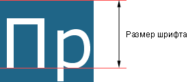

# font-size

Свойство **`font-size`** определяет размер шрифта элемента.

Размер может быть установлен несколькими способами. Набор констант (`xx-small`, `x-small`, `small`, `medium`, `large`, `x-large`, `xx-large`) задаёт размер, который называется абсолютным. По правде говоря, они не совсем абсолютны, поскольку зависят от настроек браузера и операционной системы.

Другой набор констант (`larger`, `smaller`) устанавливает относительные размеры шрифта. Поскольку размер унаследован от родительского элемента, эти относительные размеры применяются к родительскому элементу, чтобы определить размер шрифта текущего элемента.

В конечном итоге, размер шрифта сильно зависит от значения свойства `font-size` у родителя элемента.

Сам размер шрифта определяется как высота от базовой линии до верхней границы кегельной площадки, как показано на рис. 1.



## Синтаксис

```css
/* <absolute-size> values */
font-size: xx-small;
font-size: x-small;
font-size: small;
font-size: medium;
font-size: large;
font-size: x-large;
font-size: xx-large;

/* <relative-size> values */
font-size: smaller;
font-size: larger;

/* <length> values */
font-size: 12px;
font-size: 0.8em;

/* <percentage> values */
font-size: 80%;

/* Global values */
font-size: inherit;
font-size: initial;
font-size: unset;
```

## Значения

Для задания абсолютного размера используются следующие значения: `xx-small`, `x-small`, `small`, `medium`, `large`, `x-large`, `xx-large`. Их соответствие с размером шрифта в HTML приведено в табл. 1.

<table>
<caption>Табл. 1. Размер шрифта в CSS и HTML</caption>
<thead>
<tr><th>CSS</th><td>xx-small</td><td>x-small</td><td>small</td><td>medium</td><td>large</td><td>x-large</td><td>xx-large</td><td>Нет</td></tr>
</thead>
<tbody>
<tr><th>HTML</th><td>1</td><td>Нет</td><td>2</td><td>3</td><td>4</td><td>5</td><td>6</td><td>7</td>
</tr>
</tbody>
</table>

Относительный размер шрифта задается значениями `larger` и `smaller`.

Также разрешается использовать любые допустимые единицы CSS: `em` (высота шрифта элемента), `ex` (высота символа х), пункты (`pt`), пикселы (`px`), проценты (`%`) и др. За 100% берётся размер шрифта родительского элемента. Отрицательные значения не допускаются.

Значение по-умолчанию:

```css
font-size: medium;
```

Применяется ко всем элементам

## Спецификации

- [CSS Fonts Module Level 3](http://dev.w3.org/csswg/css3-fonts/#font-size-prop)
- [CSS Transitions](http://dev.w3.org/csswg/css-transitions/#animatable-css)
- [CSS Level 2 (Revision 1)](http://www.w3.org/TR/CSS2/fonts.html#propdef-font-size)
- [CSS Level 1](http://www.w3.org/TR/CSS1/#font-size)

## Описание и примеры

```html
<!DOCTYPE html>
<html>
  <head>
    <meta charset="utf-8" />
    <title>font-size</title>
    <style>
      h1 {
        font-family: 'Times New Roman', Times, serif; /* Гарнитура текста */
        font-size: 250%; /* Размер шрифта в процентах */
      }
      p {
        font-family: Verdana, Arial, Helvetica, sans-serif;
        font-size: 11pt; /* Размер шрифта в пунктах */
      }
    </style>
  </head>
  <body>
    <h1>Амазонская низменность</h1>
    <p>
      Для гостей открываются погреба Прибалатонских винодельческих хозяйств,
      известных отличными сортами вин "Олазрислинг" и "Сюркебарат".
    </p>
  </body>
</html>
```
