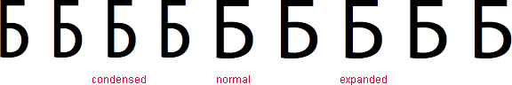

# font-stretch

Свойство **`font-stretch`** устанавливает узкое, нормальное или широкое начертание шрифта, что позволяет уплотнять или расширять текст.

## Синтаксис

```css
/* Keyword values */
font-stretch: ultra-condensed;
font-stretch: extra-condensed;
font-stretch: condensed;
font-stretch: semi-condensed;
font-stretch: normal;
font-stretch: semi-expanded;
font-stretch: expanded;
font-stretch: extra-expanded;
font-stretch: ultra-expanded;

/* Global values */
font-stretch: inherit;
font-stretch: initial;
font-stretch: unset;
```

## Значения

Влияние разных значений `font-stretch` на вид букв в тексте показано на рис. 1.



### Примечание

Браузеры применяют свойство `font-stretch` не ко всем шрифтам, поэтому уплотнение или расширение текста может не работать с некоторыми популярными и распространёнными гарнитурами шрифтов.

Значение по-умолчанию:

```css
font-stretch: normal;
```

Применяется к: Ко всем элементам

## Спецификации

- [CSS Fonts Module Level 3](http://dev.w3.org/csswg/css3-fonts/#propdef-font-stretch)

## Поддержка браузерами

<p class="ciu_embed" data-feature="css-font-stretch" data-periods="future_1,current,past_1,past_2">
  <a href="http://caniuse.com/#feat=css-font-stretch">Can I Use css-font-stretch?</a> Data on support for the css-font-stretch feature across the major browsers from caniuse.com.
</p>

## Описание и примеры

```html
<!DOCTYPE html>
<html>
  <head>
    <meta charset="utf-8" />
    <title>font-stretch</title>
    <style>
      p {
        font-size: 5em;
        font-family: 'Myriad Pro';
      }
    </style>
  </head>
  <body>
    <p>
      <span style="font-stretch: ultra-condensed">Б</span>
      <span style="font-stretch: extra-condensed">Б</span>
      <span style="font-stretch: condensed">Б</span>
      <span style="font-stretch: semi-condensed">Б</span>
      <span style="font-stretch: normal">Б</span>
      <span style="font-stretch: semi-expanded">Б</span>
      <span style="font-stretch: expanded">Б</span>
      <span style="font-stretch: extra-expanded">Б</span>
      <span style="font-stretch: ultra-expanded">Б</span>
    </p>
  </body>
</html>
```
