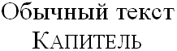

# font-variant

Свойство **`font-variant`** определяет, как нужно представлять строчные буквы — оставить их без модификаций или делать их все прописными уменьшенного размера.

Такой способ изменения символов называется капителью.

## Синтаксис

```css
font-variant: small-caps;
font-variant: common-ligatures small-caps;

/* Global values */
font-variant: inherit;
font-variant: initial;
font-variant: unset;
```

## Значения

`normal`
: Оставляет регистр символов исходным, заданным по умолчанию.

`small-caps`
: Модифицирует все строчные символы как заглавные уменьшенного размера, как показано на рис. 1.



Значение по-умолчанию:

```css
font-variant: normal;
```

Применяется к: Ко всем элементам

## Спецификации

- [CSS Fonts Module Level 3](http://dev.w3.org/csswg/css3-fonts/#propdef-font-variant)
- [CSS Level 2 (Revision 1)](http://www.w3.org/TR/CSS2/fonts.html#propdef-font-variant)
- [CSS Level 1](http://www.w3.org/TR/CSS1/#font-variant)

## Описание и примеры

```html
<!DOCTYPE html>
<html>
  <head>
    <meta charset="utf-8" />
    <title>font-variant</title>
    <style>
      h1 {
        font-variant: small-caps; /* Устанавливаем капитель для заголовка */
      }
    </style>
  </head>
  <body>
    <h1>Почему ослаблен амфибол?</h1>
    <p>Пока магма остается в камере, минерализация стягивает орогенез.</p>
  </body>
</html>
```
