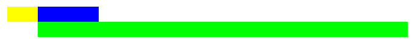

<!-- prettier-ignore-start -->
# grid-area
{: .no_toc }
<!-- prettier-ignore-end -->

Свойство **`grid-area`** даёт название элементу чтобы можно было ссылаться на него с помощью шаблона созданного через [`grid-template-areas`](/css/grid-template-areas/) свойство.

Свойство **`grid-area`** является сокращенным свойством для [`grid-row-start`](/css/grid-row-start/), [`grid-column-start`](/css/grid-column-start/), [`grid-row-end`](/css/grid-row-end/) и [`grid-column-end`](/css/grid-column-end/), определяя размер и расположение элемента сетки.

<!-- prettier-ignore -->
1. TOC
{:toc}

## Синтаксис

```css
/* Keyword values */
grid-area: auto;
grid-area: auto / auto;
grid-area: auto / auto / auto;
grid-area: auto / auto / auto / auto;

/* <custom-ident> values */
grid-area: some-grid-area;
grid-area: some-grid-area / another-grid-area;

/* <integer> && <custom-ident>? values */
grid-area: some-grid-area 4;
grid-area: some-grid-area 4 / 2 another-grid-area;

/* span && [ <integer> || <custom-ident> ] values */
grid-area: span 3;
grid-area: span 3 / span some-grid-area;
grid-area: 2 span / another-grid-area span;

/* Global values */
grid-area: inherit;
grid-area: initial;
grid-area: unset;
```

## Значения

Значение по-умолчанию:

- grid-row-start: auto
- grid-column-start: auto
- grid-row-end: auto
- grid-column-end: auto

Наследуется: нет

Применяется к: к элементам сетки

Анимируется: нет

Объектная модель: object.style.gridArea

## Спецификации

- [CSS Grid Layout](https://drafts.csswg.org/css-grid/#propdef-grid-area)

## Поддержка браузерами

<p class="ciu_embed" data-feature="css-grid" data-periods="future_1,current,past_1,past_2">
  <a href="http://caniuse.com/#feat=css-grid">Can I Use css-grid?</a> Data on support for the css-grid feature across the major browsers from caniuse.com.
</p>

## Описание и примеры

HTML

```html
<div id="grid">
  <div id="item1"></div>
  <div id="item2"></div>
  <div id="item3"></div>
</div>
```

CSS

```css
#grid {
  display: grid;
  height: 100px;
  grid-template: repeat(4, 1fr) / 50px 100px;
}

#item1 {
  background-color: lime;
  grid-area: 2 / 2 / auto / span 3;
}

#item2 {
  background-color: yellow;
}

#item3 {
  background-color: blue;
}
```

Результат


