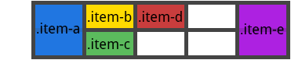

# grid-auto-flow

Свойство **`grid-auto-flow`** управляет тем, как работает алгоритм автоматического размещения, точно указывая, как элементы попадают в сетку.

Если у вас есть элементы, которые вы явно не позиционируете в сетке, запускается алгоритм авто-размещения, чтобы их автоматически разместить. Это свойство контролирует то, как алгоритм авто-размещения работает.

## Синтаксис

```css
/* Keyword values */
grid-auto-flow: row;
grid-auto-flow: column;
grid-auto-flow: dense;
grid-auto-flow: row dense;
grid-auto-flow: column dense;

/* Global values */
grid-auto-flow: inherit;
grid-auto-flow: initial;
grid-auto-flow: unset;
```

## Значения

Значение по-умолчанию: `row`

Наследуется: нет

Применяется к: к grid контейнерам

Анимируется: нет

- `row` — алгоритм размещает элементы, заполняя каждую строку поочередно, добавляя новые строки по мере необходимости.
- `column` — алгоритм помещает элементы, заполняя каждый столбец поочередно, добавляя по мере необходимости новые столбцы.
- `dense` — алгоритм использует «плотный» алгоритм упаковки, который пытается заполнить дыры в сетке, если позже появятся более мелкие элементы. Это может привести к тому, что элементы появятся не по порядку, но при этом заполнят отверстия, оставленные более крупными элементами.

## Спецификации

- [CSS Grid Layout](https://drafts.csswg.org/css-grid/#propdef-grid-auto-flow)

## Поддержка браузерами

<p class="ciu_embed" data-feature="css-grid" data-periods="future_1,current,past_1,past_2">
  <a href="http://caniuse.com/#feat=css-grid">Can I Use css-grid?</a> Data on support for the css-grid feature across the major browsers from caniuse.com.
</p>

## Описание и примеры

### Пример 1

HTML

```html
<div id="grid">
  <div id="item1"></div>
  <div id="item2"></div>
  <div id="item3"></div>
  <div id="item4"></div>
  <div id="item5"></div>
</div>
```

CSS

```css
#grid {
  height: 200px;
  width: 200px;
  display: grid;
  grid-gap: 10px;
  grid-template: repeat(4, 1fr) / repeat(2, 1fr);
  grid-auto-flow: column; /* or 'row', 'row dense', 'column dense' */
}

#item1 {
  background-color: lime;
  grid-row-start: 3;
}

#item2 {
  background-color: yellow;
}

#item3 {
  background-color: blue;
}

#item4 {
  grid-column-start: 2;
  background-color: red;
}

#item5 {
  background-color: aqua;
}
```

### Пример 2

Рассмотрим следующий HTML:

```html
<section class="container">
  <div class="item-a">item-a</div>
  <div class="item-b">item-b</div>
  <div class="item-c">item-c</div>
  <div class="item-d">item-d</div>
  <div class="item-e">item-e</div>
</section>
```

Вы определили сетку с пятью колонками и двумя рядами, а свойство `grid-auto-flow` установили в `row` (оно же значение по умолчанию).

```css
.container {
  display: grid;
  grid-template-columns: 60px 60px 60px 60px 60px;
  grid-template-rows: 30px 30px;
  grid-auto-flow: row;
}
```

При размещении элементов в сетке, вы указываете позиции только для двух из них:

```css
.item-a {
  grid-column: 1;
  grid-row: 1 / 3;
}
.item-e {
  grid-column: 5;
  grid-row: 1 / 3;
}
```

Так как мы установили `grid-auto-flow` в `row`, наша сетка будет выглядеть как на изображении ниже. Обратите внимание на то, как три элемента которые мы не расположили (item-b, item-c и item-d) перетекают через пустые строки:


Если вместо этого мы установим свойство grid-auto-flow в column, элементы item-b, item-c and item-d будут перетекать сквозь колонки:

```css
.container {
  display: grid;
  grid-template-columns: 60px 60px 60px 60px 60px;
  grid-template-rows: 30px 30px;
  grid-auto-flow: column;
}
```


