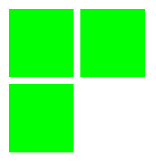

# grid-auto-rows

Свойство **`grid-auto-rows`** определяет размер любых автоматически созданных треков (иначе говоря, неявных треков). Неявные треки создаются при явном позиционировании столбцов и строк (через [`grid-template-rows`](/css/grid-template-rows/)/[`grid-template-columns`](/css/grid-template-columns/)), которые находятся за пределами заданной сетки.

## Синтаксис

```css
/* Keyword values */
grid-auto-rows: min-content;
grid-auto-rows: max-content;
grid-auto-rows: auto;

/* <length> values */
grid-auto-rows: 100px;
grid-auto-rows: 20cm;
grid-auto-rows: 50vmax;

/* <percentage> values */
grid-auto-rows: 10%;
grid-auto-rows: 33.3%;

/* <flex> values */
grid-auto-rows: 0.5fr;
grid-auto-rows: 3fr;

/* minmax() values */
grid-auto-rows: minmax(100px, auto);
grid-auto-rows: minmax(max-content, 2fr);
grid-auto-rows: minmax(20%, 80vmax);

/* multiple track-size values */
grid-auto-rows: min-content max-content auto;
grid-auto-rows: 100px 150px 390px;
grid-auto-rows: 10% 33.3%;
grid-auto-rows: 0.5fr 3fr 1fr;
grid-auto-rows: minmax(100px, auto) minmax(max-content, 2fr) minmax(20%, 80vmax);
grid-auto-rows: 100px minmax(100px, auto) 10% 0.5fr fit-content(400px);

/* Global values */
grid-auto-rows: inherit;
grid-auto-rows: initial;
grid-auto-rows: unset;
```

## Значения

Значение по-умолчанию: `auto`

Наследуется: нет

Применяется к: к grid контейнеру

Анимируется: нет

## Спецификации

- [CSS Grid Layout](https://drafts.csswg.org/css-grid/#propdef-grid-auto-rows)

## Поддержка браузерами

<p class="ciu_embed" data-feature="css-grid" data-periods="future_1,current,past_1,past_2">
  <a href="http://caniuse.com/#feat=css-grid">Can I Use css-grid?</a> Data on support for the css-grid feature across the major browsers from caniuse.com.
</p>

## Описание и примеры

HTML

```html
<div id="grid">
  <div id="item1"></div>
  <div id="item2"></div>
  <div id="item3"></div>
</div>
```

CSS

```css
#grid {
  width: 200px;
  display: grid;
  grid-template-areas: 'a a';
  grid-gap: 10px;
  grid-auto-rows: 100px;
}

#grid > div {
  background-color: lime;
}
```

Результат


