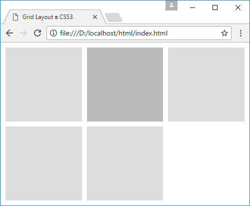
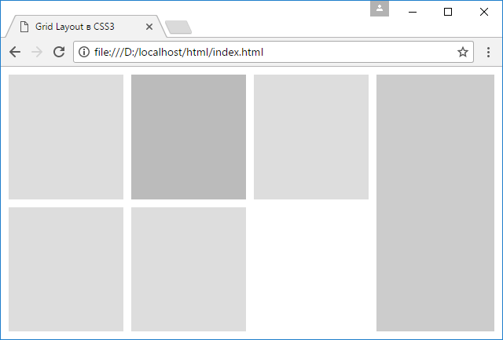

# Именованные grid-линии и функция repeat

??? info "Содержание"

    <small markdown="1">

    1. [Что такое Grid Layout. Grid Container](grid-1.md)
    2. [Строки и столбцы](grid-2.md)
    3. [Функция repeat и свойство grid](grid-3.md)
    4. [Размеры строк и столбцов](grid-4.md)
    5. [Отступы между столбцами и строками](grid-5.md)
    6. [Позиционирование элементов](grid-6.md)
    7. [Наложение элементов](grid-7.md)
    8. [Направление и порядок элементов](grid-8.md)
    9. [Именованные grid-линии](grid-9.md)
    10. **Именованные grid-линии и функция repeat**
    11. [Области грида](grid-11.md)
    12. [Макет страницы в Grid Layout](grid-12.md)

    </small>

С помощью ранее рассмотренной функции repeat мы можем растиражировать столбцы и строки, которые создаются между именованными grid-линиями:

```html
<!DOCTYPE html>
<html>
  <head>
    <meta charset="utf-8" />
    <meta name="viewport" content="width=device-width" />
    <title>Grid Layout в CSS3</title>
    <style>
      * {
        box-sizing: border-box;
      }
      html,
      body {
        margin: 0;
        padding: 0;
      }
      .grid-container {
        height: 100vh;
        display: grid;
        grid-template-columns: 10px repeat(3, [column] 1fr
              [colgutter] 10px);
        grid-template-rows: 10px repeat(2, [row] 1fr
              [rowgutter] 10px);
      }

      .grid-item {
        background-color: #ddd;
      }

      .special-item {
        grid-column: column 2;
        grid-row: row 1;
        background-color: #bbb;
      }
      .item1 {
        grid-column: column 1;
        grid-row: row 1;
      }
      .item2 {
        grid-column: column 3;
        grid-row: row 1;
      }
      .item3 {
        grid-column: column 1;
        grid-row: row 2;
      }
      .item4 {
        grid-column: column 2;
        grid-row: row 2;
      }
    </style>
  </head>
  <body>
    <div class="grid-container">
      <div class="grid-item special-item"></div>
      <div class="grid-item item1"></div>
      <div class="grid-item item2"></div>
      <div class="grid-item item3"></div>
      <div class="grid-item item4"></div>
    </div>
  </body>
</html>
```

Возьмем из данного примера определение столбцов:

```css
grid-template-columns: 10px repeat(3, [column] 1fr
      [colgutter] 10px);
```

Первый столбец будет иметь ширину в 10 пикселей. Затем происходит тиражирование столбцов с помощью функции repeat. Она создает подряд три копии двух столбцов. Первый столбец имеет ширину 1fr, то есть имеет пропорциональные размеры, и располагается между grid-линиями "column" и "colgutter". После grid-линии "colgutter" идет еще один столбец шириной в 10 пикселей. И эти два столбца будут повторяться три раза. То есть всего в гриде будет 7 столбцов.

Со строками будет во многом аналогично, только там создается 5 строк с помощью grid-линий "row" и "rowgutter".

При определении стиля элементов, используя имя grid-линий и их порядковый номер, мы можем явным образом указать с помощью свойств grid-column и grid-row, где именно должен располагаться элемент:

```css
.special-item {
  grid-column: column 2; /* второй столбец с именем column */
  grid-row: row 1; /* первая строка с именем row */
  background-color: #bbb;
}
```

Причем свойство grid-column: column 2 указывает на столбец в гриде, который начинается со второй grid-линии "column". В итоге мы получим следующий грид:



Возможно, многие найдут такой подход более интуитивно понятным для определения позиции элемента.

И более того мы можем дополнительно добавлять новые именованные грид-линии вне функции repeat:

```html
<!DOCTYPE html>
<html>
  <head>
    <meta charset="utf-8" />
    <meta name="viewport" content="width=device-width" />
    <title>Grid Layout в CSS3</title>
    <style>
      * {
        box-sizing: border-box;
      }
      html,
      body {
        margin: 0;
        padding: 0;
      }
      .grid-container {
        height: 100vh;
        display: grid;
        grid-template-columns:
          10px repeat(3, [column] 1fr [colgutter] 10px)
          [sidebarstart] 150px [sidebarend] 10px;
        grid-template-rows: 10px repeat(2, [row] 1fr
              [rowgutter] 10px);
      }

      .grid-item {
        background-color: #ddd;
      }

      .special-item {
        grid-column: column 2;
        grid-row: row 1;
        background-color: #bbb;
      }
      .item1 {
        grid-column: column 1;
        grid-row: row 1;
      }
      .item2 {
        grid-column: column 3;
        grid-row: row 1;
      }
      .item3 {
        grid-column: column 1;
        grid-row: row 2;
      }
      .item4 {
        grid-column: column 2;
        grid-row: row 2;
      }
      .sidebar {
        grid-column: sidebarstart / sidebarend;
        grid-row: 2 / 5;
        background-color: #ccc;
      }
    </style>
  </head>
  <body>
    <div class="grid-container">
      <div class="grid-item special-item"></div>
      <div class="grid-item item1"></div>
      <div class="grid-item item2"></div>
      <div class="grid-item item3"></div>
      <div class="grid-item item4"></div>
      <div class="grid-item sidebar"></div>
    </div>
  </body>
</html>
```

И также стоит отметить, что вне зависимости от того, именованные строки,столбцы и grid-линии или неименованные, мы по прежнему можем позиционировать элементы, используя номера grid-линий, как в данном случае происходит в отношении сайдбара:

```css
.sidebar {
  grid-column: sidebarstart / sidebarend;
  grid-row: 2 / 5;
  background-color: #ccc;
}
```


