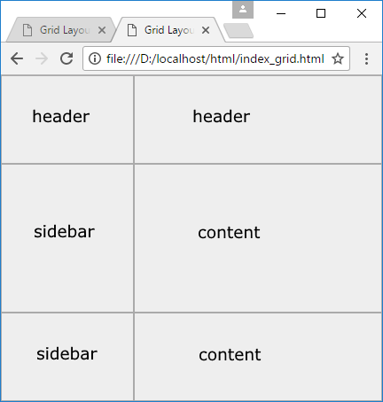
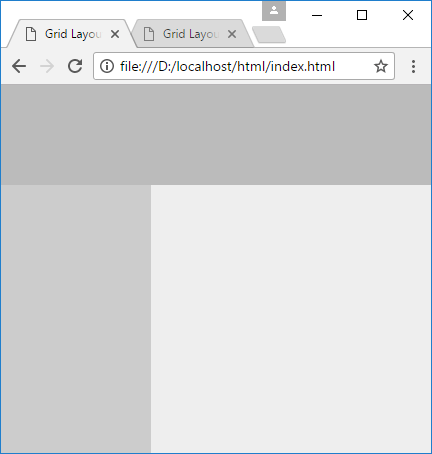
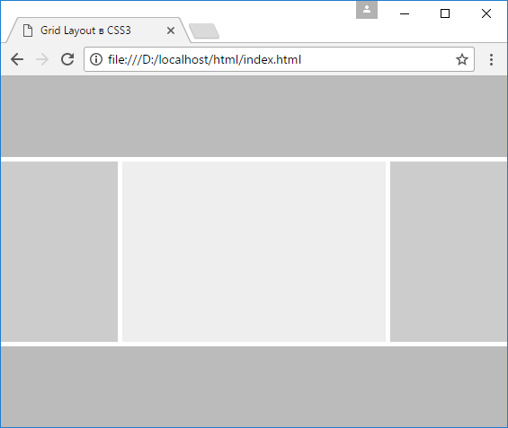

# Области грида

В рамках грида мы можем определять области (grid area). Области определятся с помощью двух вертикальных и двух горизонтальных grid-линий, которые собственно и задают занимаемое областью пространство. В этом плане область не эквивалентна одной ячейке грида и может включать несколько ячеек. Области особенно полезны для определения семантических отношений между различными частями макета страницы.

Для определения областей у grid-контейнера применяется свойство grid-template-areas. Например, определим три области:

```html
<!DOCTYPE html>
<html>
  <head>
    <meta charset="utf-8" />
    <meta name="viewport" content="width=device-width" />
    <title>Grid Layout в CSS3</title>
    <style>
      * {
        box-sizing: border-box;
      }
      html,
      body {
        margin: 0;
        padding: 0;
      }
      .grid-container {
        height: 100vh;
        display: grid;
        grid-template-areas:
          'header header'
          'sidebar content'
          'sidebar content';
        grid-template-columns: 150px 1fr;
        grid-template-rows: 100px 1fr 100px;
      }
      .header {
        grid-area: header;
        background-color: #bbb;
      }
      .sidebar {
        grid-area: sidebar;
        background-color: #ccc;
      }
      .content {
        grid-area: content;
        background-color: #eee;
      }
    </style>
  </head>
  <body>
    <div class="grid-container">
      <div class="header"></div>
      <div class="sidebar"></div>
      <div class="content"></div>
    </div>
  </body>
</html>
```

Здесь у grid-контейнера определяется два столбца и три строки:

```css
grid-template-columns: 150px 1fr;
grid-template-rows: 100px 1fr 100px;
```

То есть в итоге у нас будет в гриде 3 х 2 = 6 ячеек. Но в разметке страницы определено три элемента с одноименными областями: header, sidebar, content. И свойство grid-template-areas как раз устанавливает, как эти области будут располагаться в ячейках грида:

```css
grid-template-areas:
  'header header'
  'sidebar content'
  'sidebar content';
```

Выражение "header header" представляет первую строку и указывает, что область header занимает две ячейки подряд подряд.

Следующее выражение "sidebar content" указывает на вторую строку, где область sidebar занимает первую ячейку, а content - вторую ячейку. Третья строка повторяет вторую. То есть в итоге, если смотреть по ячейкам, то получится следующим образом:



Для установки области у элементов задается свойство grid-area:

```css
.header {
  grid-area: header; /* элемент с классом header помещается в область header*/
  background-color: #bbb;
}
```

В итоге мы получим следующую страницу:



Теперь рассмотрим другой более сложный пример. Пусть код веб-страницы выглядит следующим образом:

```html
<!DOCTYPE html>
<html>
  <head>
    <meta charset="utf-8" />
    <meta name="viewport" content="width=device-width" />
    <title>Grid Layout в CSS3</title>
    <style>
      * {
        box-sizing: border-box;
      }
      html,
      body {
        margin: 0;
        padding: 0;
      }
      .grid-container {
        height: 100vh;
        display: grid;
        grid-template-areas:
          'header header header header header'
          '. . . . .'
          'menu . content . sidebar'
          '. . . . .'
          'footer footer footer footer footer';
        grid-template-columns: 130px 5px 1fr 5px 130px;
        grid-template-rows: 90px 5px 1fr 5px 90px;
      }
      .header {
        grid-area: header;
        background-color: #bbb;
      }
      .menu {
        grid-area: menu;
        background-color: #ccc;
      }
      .sidebar {
        grid-area: sidebar;
        background-color: #ccc;
      }
      .content {
        grid-area: content;
        background-color: #eee;
      }
      .footer {
        grid-area: footer;
        background-color: #bbb;
      }
    </style>
  </head>
  <body>
    <div class="grid-container">
      <div class="header"></div>
      <div class="content"></div>
      <div class="menu"></div>
      <div class="sidebar"></div>
      <div class="footer"></div>
    </div>
  </body>
</html>
```

Теперь грид содержит 5 строк и 5 столбцов, то есть в совокупности 25 ячеек, которые размещают 5 областей: header, menu, sidebar, content и footer.

Свойство grid-template-areas в стилях grid-контейнера опять же содержит определение того, как все эти области сопоставляются с ячейками. Например, элемент header должен занимать все пять ячеек первой строки: "header header header header header". Но определение второй строки, высота которой 5px, выглядит уже необычно: ". . . . .". Точка означает, что данная ячейка не будет принадлежать ни одной области и останется незаполненной. Если надо оставить 5 незаполненных ячеек, то указывается пять точек, между которыми ставятся пробелы. В итоге мы получим пять областей, между которыми будут располагаться незаполненные пространства:


