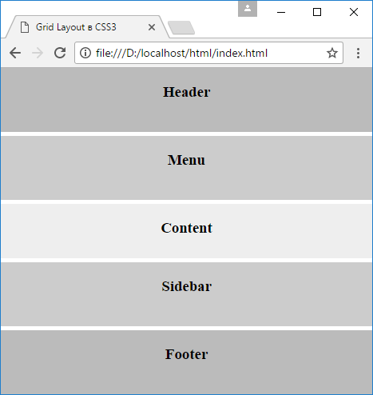
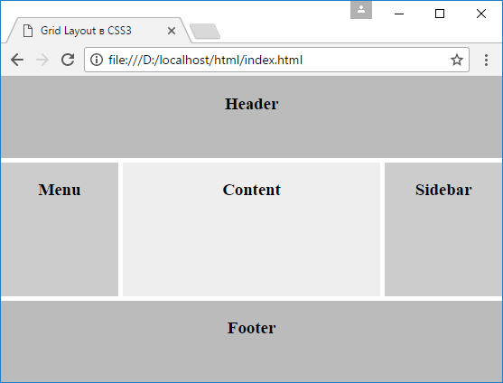

# Макет страницы в Grid Layout

Рассмотрим создание простейшего адаптивного стандартного макета веб-страницы, который состоит из шапки, подвала, основного содержимого, блока навигации и сайдбара. Для этого определим следующую веб-станицу:

```html
<!DOCTYPE html>
<html>
  <head>
    <meta charset="utf-8" />
    <meta name="viewport" content="width=device-width" />
    <title>Grid Layout в CSS3</title>
    <style>
      * {
        box-sizing: border-box;
      }
      html,
      body {
        margin: 0;
        padding: 0;
      }
      .grid-container {
        height: 100vh;
        display: grid;
        grid-template-areas:
          'header'
          '.'
          'menu'
          '.'
          'content'
          '.'
          'sidebar'
          '.'
          'footer';
        grid-template-columns: 1fr;
        grid-template-rows: 80px 5px 80px 5px 1fr 5px 80px 5px 80px;
      }
      .header {
        grid-area: header;
        background-color: #bbb;
      }
      .menu {
        grid-area: menu;
        background-color: #ccc;
      }
      .sidebar {
        grid-area: sidebar;
        background-color: #ccc;
      }
      .content {
        grid-area: content;
        background-color: #eee;
      }
      .footer {
        grid-area: footer;
        background-color: #bbb;
      }
      h3 {
        text-align: center;
      }
      @media screen and (min-width: 468px) {
        .grid-container {
          height: 100vh;
          display: grid;
          grid-template-areas:
            'header header header header header'
            '. . . . .'
            'menu . content . sidebar'
            '. . . . .'
            'footer footer footer footer footer';
          grid-template-columns: 130px 5px 1fr 5px 130px;
          grid-template-rows: 90px 5px 1fr 5px 90px;
        }
      }
    </style>
  </head>
  <body>
    <div class="grid-container">
      <div class="header"><h3>Header</h3></div>
      <div class="content"><h3>Content</h3></div>
      <div class="menu"><h3>Menu</h3></div>
      <div class="sidebar"><h3>Sidebar</h3></div>
      <div class="footer"><h3>Footer</h3></div>
    </div>
  </body>
</html>
```

В прошлой теме уже рассматривалось применение именованных областей. И здесь они также используются, так как очень удобно связывать стили с семантикой станицы через области.

Однако, так как предполагается, что веб-станицу могут просматривать на мобильных устройствах, где ширина экрана ограничена, то хотелось бы иметь адаптивный макет. Поэтому в стиля имеются два разных определения грида. Одно определение грида для мобильных устройств (условно в качестве ширины устройств выбрано значение в 468px):

```css
.grid-container {
  height: 100vh;
  display: grid;
  grid-template-areas:
    'header'
    '.'
    'menu'
    '.'
    'content'
    '.'
    'sidebar'
    '.'
    'footer';
  grid-template-columns: 1fr;
  grid-template-rows: 80px 5px 80px 5px 1fr 5px 80px 5px 80px;
}
```

В таком состоянии грид имеет только один столбец и 5 строк для каждой области плюс 4 строки-разделители.



При увеличении ширины экрана в действие вступает другое определение грида:

```css
.grid-container {
  height: 100vh;
  display: grid;
  grid-template-areas:
    'header header header header header'
    '. . . . .'
    'menu . content . sidebar'
    '. . . . .'
    'footer footer footer footer footer';
  grid-template-columns: 130px 5px 1fr 5px 130px;
  grid-template-rows: 90px 5px 1fr 5px 90px;
}
```

В этом случае столбцов и строк будет по пять:


