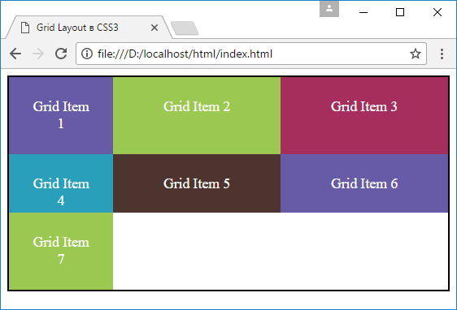
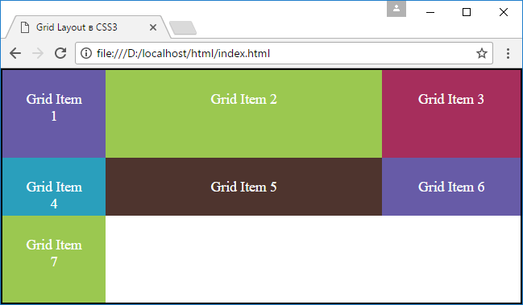

<!-- prettier-ignore-start -->
# Размеры строк и столбцов
{: .no_toc }
<!-- prettier-ignore-end -->

<!-- prettier-ignore -->
1. TOC
{:toc}

## Фиксированные размеры

В примерах, которые были рассмотрены в предыдущих статьях, ширина столбцов и длина строк устанавливались на основании фиксированных значений, которые передаются свойствам `grid-template-columns` и `grid-template-rows`. Для определения размеров мы можем использовать самые различные единицы измерения, которые нам доступны в CSS (px, em, rem, pt, %), например:

```css
.grid-container {
  border: solid 2px #000;
  display: grid;
  grid-template-columns: repeat(3, 200px);
  grid-template-rows: repeat(3, 4.5em);
}
```

## Автоматические размеры

Кроме точных размеров можно задавать автоматические размеры с помощью слова `auto`. В этом случае ширина столбцов и высота строк вычисляются исходя из размеров содержимого:

```html
<!DOCTYPE html>
<html>
  <head>
    <meta charset="utf-8" />
    <meta name="viewport" content="width=device-width" />
    <title>Grid Layout в CSS3</title>
    <style>
      .grid-container {
        border: solid 2px #000;
        display: grid;
        grid-template-columns: 8em auto auto;
        grid-template-rows: auto 4.5em auto;
      }
      .grid-item {
        text-align: center;
        font-size: 1.1em;
        padding: 1.5em;
        color: white;
      }
      .color1 {
        background-color: #675ba7;
      }
      .color2 {
        background-color: #9bc850;
      }
      .color3 {
        background-color: #a62e5c;
      }
      .color4 {
        background-color: #2a9fbc;
      }
      .color5 {
        background-color: #4e342e;
      }
    </style>
  </head>
  <body>
    <div class="grid-container">
      <div class="grid-item color1">Grid Item 1</div>
      <div class="grid-item color2">Grid Item 2</div>
      <div class="grid-item color3">Grid Item 3</div>
      <div class="grid-item color4">Grid Item 4</div>
      <div class="grid-item color5">Grid Item 5</div>
      <div class="grid-item color1">Grid Item 6</div>
      <div class="grid-item color2">Grid Item 7</div>
    </div>
  </body>
</html>
```

Здесь задано три строки и ти столбца. Первый столбец имеет фиксированную ширину в `8em`, а второй и третий столбцы - автоматическую ширину. И также первая и третья строки имеют автоматическую высоту, а вторая строка - фиксированную.



## Пропорциональные размеры

Для установки пропорциональных размеров применяется специальная единица измерения `fr`. Она представляет собой часть пространства (fraction), которое отводится для данного столбца или строки. Значение `fr` еще называют flex-фактором (flex factor).

Вычисление пропорциональных размеров производится по формуле:

```
flex-фактор * доступное_пространство  / сумма всех flex-факторов
```

При этом под доступным пространством понимается все пространство grid-контейнера за исключением фиксированных значений строк и столбцов.

```html
<!DOCTYPE html>
<html>
  <head>
    <meta charset="utf-8" />
    <meta name="viewport" content="width=device-width" />
    <title>Grid Layout в CSS3</title>
    <style>
      * {
        box-sizing: border-box;
      }
      html,
      body {
        margin: 0;
        padding: 0;
      }
      .grid-container {
        height: 100vh;
        border: solid 2px #000;
        display: grid;
        grid-template-columns: 8em 2fr 1fr;
        grid-template-rows: 1fr 4.5em 1fr;
      }
      .grid-item {
        text-align: center;
        font-size: 1.1em;
        padding: 1.5em;
        color: white;
      }
      .color1 {
        background-color: #675ba7;
      }
      .color2 {
        background-color: #9bc850;
      }
      .color3 {
        background-color: #a62e5c;
      }
      .color4 {
        background-color: #2a9fbc;
      }
      .color5 {
        background-color: #4e342e;
      }
    </style>
  </head>
  <body>
    <div class="grid-container">
      <div class="grid-item color1">Grid Item 1</div>
      <div class="grid-item color2">Grid Item 2</div>
      <div class="grid-item color3">Grid Item 3</div>
      <div class="grid-item color4">Grid Item 4</div>
      <div class="grid-item color5">Grid Item 5</div>
      <div class="grid-item color1">Grid Item 6</div>
      <div class="grid-item color2">Grid Item 7</div>
    </div>
  </body>
</html>
```



В данном случае имеются три столбца с шириной `2fr`, `8em`, `1fr`. Поэтому ширина второго столбца будет вычисляться по формуле:

```
2 * (ширина_грида - 8em) / (2 + 1)
```

Ширина третьего столбца будет вычисляться по формуле:

```
1 * (ширина_грида - 8em) / (2 + 1)
```

И если первый столбец фиксированный с шириной `8em`, то ширина второго и третьего столбца будут зависеть от ширины контейнера и будут автоматически масштабироваться при ее изменении.

В отношении строк все аналогично.

## Ссылки

- [Размеры строк и столбцов](https://metanit.com/web/html5/13.4.php)
