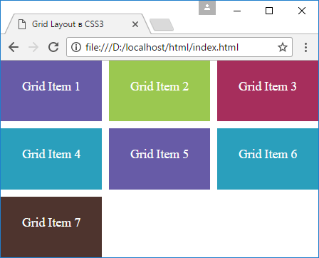

# Отступы между столбцами и строками

<small markdown="1">

1. [Что такое Grid Layout. Grid Container](grid-1.md)
2. [Строки и столбцы](grid-2.md)
3. [Функция repeat и свойство grid](grid-3.md)
4. [Размеры строк и столбцов](grid-4.md)
5. **Отступы между столбцами и строками**
6. [Позиционирование элементов](grid-6.md)
7. [Наложение элементов](grid-7.md)
8. [Направление и порядок элементов](grid-8.md)
9. [Именованные grid-линии](grid-9.md)
10. [Именованные grid-линии и функция repeat](grid-10.md)
11. [Области грида](grid-11.md)
12. [Макет страницы в Grid Layout](grid-12.md)

</small>

Для создания отступов между столбцами и строками применяются свойства `grid-column-gap` и `grid-row-gap` соответственно.

```html
<!DOCTYPE html>
<html>
  <head>
    <meta charset="utf-8" />
    <meta name="viewport" content="width=device-width" />
    <title>Grid Layout в CSS3</title>
    <style>
      * {
        box-sizing: border-box;
      }
      html,
      body {
        margin: 0;
        padding: 0;
      }
      .grid-container {
        height: 100vh;
        display: grid;
        grid-template-columns: repeat(3, 1fr);
        grid-template-rows: repeat(3, 1fr);
        grid-column-gap: 10px;
        grid-row-gap: 10px;
      }
      .grid-item {
        text-align: center;
        font-size: 1.1em;
        padding: 1.5em;
        color: white;
      }
      .color1 {
        background-color: #675ba7;
      }
      .color2 {
        background-color: #9bc850;
      }
      .color3 {
        background-color: #a62e5c;
      }
      .color4 {
        background-color: #2a9fbc;
      }
      .color5 {
        background-color: #4e342e;
      }
    </style>
  </head>
  <body>
    <div class="grid-container">
      <div class="grid-item color1">Grid Item 1</div>
      <div class="grid-item color2">Grid Item 2</div>
      <div class="grid-item color3">Grid Item 3</div>
      <div class="grid-item color4">Grid Item 4</div>
      <div class="grid-item color1">Grid Item 5</div>
      <div class="grid-item color4">Grid Item 6</div>
      <div class="grid-item color5">Grid Item 7</div>
    </div>
  </body>
</html>
```



Если значения свойств `grid-column-gap` и `grid-row-gap` совпадают, то вместо них можно определить одно свойство `grid-gap`, которое установит оба отступа:

```css
.grid-container {
  height: 100vh;
  display: grid;
  grid-template-columns: repeat(3, 1fr);
  grid-template-rows: repeat(3, 1fr);
  grid-gap: 10px;
}
```

## См. также

- [grid-gap](../grid-gap.md)
- [grid-column-gap](../grid-column-gap.md)
- [grid-row-gap](../grid-row-gap.md)

<small markdown="1">

1. [Что такое Grid Layout. Grid Container](grid-1.md)
2. [Строки и столбцы](grid-2.md)
3. [Функция repeat и свойство grid](grid-3.md)
4. [Размеры строк и столбцов](grid-4.md)
5. **Отступы между столбцами и строками**
6. [Позиционирование элементов](grid-6.md)
7. [Наложение элементов](grid-7.md)
8. [Направление и порядок элементов](grid-8.md)
9. [Именованные grid-линии](grid-9.md)
10. [Именованные grid-линии и функция repeat](grid-10.md)
11. [Области грида](grid-11.md)
12. [Макет страницы в Grid Layout](grid-12.md)

</small>
