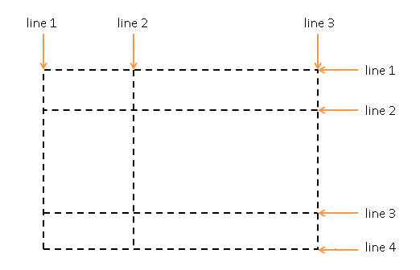
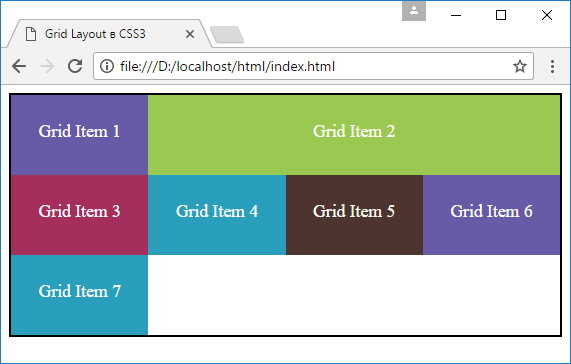
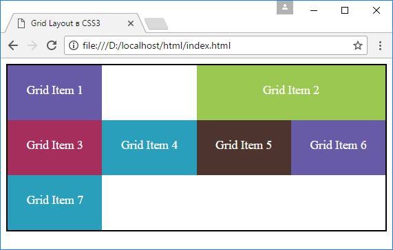
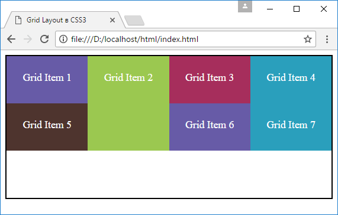
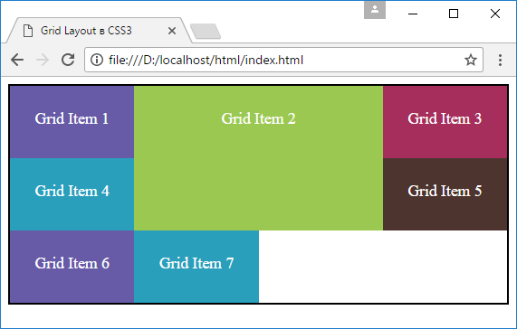

# Позиционирование элементов

??? info "Содержание"

    <small markdown="1">

    1. [Что такое Grid Layout. Grid Container](grid-1.md)
    2. [Строки и столбцы](grid-2.md)
    3. [Функция repeat и свойство grid](grid-3.md)
    4. [Размеры строк и столбцов](grid-4.md)
    5. [Отступы между столбцами и строками](grid-5.md)
    6. **Позиционирование элементов**
    7. [Наложение элементов](grid-7.md)
    8. [Направление и порядок элементов](grid-8.md)
    9. [Именованные grid-линии](grid-9.md)
    10. [Именованные grid-линии и функция repeat](grid-10.md)
    11. [Области грида](grid-11.md)
    12. [Макет страницы в Grid Layout](grid-12.md)

    </small>

Грид представляет собой набор ячеек, которые образуются на пересечении столбцов и строк. Но сами строки и столбцы образуются с помощью grid-линий, которые рассекают грид по вертикали и горизонтали:



И по умолчанию каждый элемент в гриде позиционируется в одну ячейку по порядку. Но мы можем более точно настроить расположение элемента в гриде с помощью ряда свойств:

- `grid-row-start`: задает начальную горизонтальную grid-линию, с которой начинается элемент
- `grid-row-end`: указывает, до какой горизонтальной grid-линии надо растягивать элемент
- `grid-column-start`: задает начальную вертикальную grid-линию, от которой начинается элемент
- `grid-column-end`: указывает, до какой вертикальной grid-линии нужно растягивать элемент

Например, растянем элемент на несколько столбцов:

```html
<!DOCTYPE html>
<html>
  <head>
    <meta charset="utf-8" />
    <meta name="viewport" content="width=device-width" />
    <title>Grid Layout в CSS3</title>
    <style>
      .grid-container {
        border: solid 2px #000;
        display: grid;
        grid-template-columns: repeat(4, 1fr);
        grid-template-rows: repeat(3, 5em);
      }
      .special-item {
        grid-column-start: 2;
        grid-column-end: 5;
      }
      .grid-item {
        text-align: center;
        font-size: 1.1em;
        padding: 1.5em;
        color: white;
      }
      .color1 {
        background-color: #675ba7;
      }
      .color2 {
        background-color: #9bc850;
      }
      .color3 {
        background-color: #a62e5c;
      }
      .color4 {
        background-color: #2a9fbc;
      }
      .color5 {
        background-color: #4e342e;
      }
    </style>
  </head>
  <body>
    <div class="grid-container">
      <div class="grid-item color1">Grid Item 1</div>
      <div class="grid-item color2 special-item">
        Grid Item 2
      </div>
      <div class="grid-item color3">Grid Item 3</div>
      <div class="grid-item color4">Grid Item 4</div>
      <div class="grid-item color5">Grid Item 5</div>
      <div class="grid-item color1">Grid Item 6</div>
      <div class="grid-item color4">Grid Item 7</div>
    </div>
  </body>
</html>
```



Здесь определено четыре столбца, причем второму элементу присвоен особый класс `special-item`, который располагается, начиная со 2 grid-линии или 2-го столбца (`grid-column-start: 2`) до 5-й вертикальной grid-линии (`grid-column-end: 5`).

Второй элемент необязательно должен начинаться со второго столбца, это может быть любой другой: и 1-й, и 3-й и т.д. Например, если мы поместим второй элемент, начиная с 3-го столбца, то на месте второго столбца образуется пустота:

```css
.special-item {
  grid-column-start: 3;
  grid-column-end: 5;
}
```



Если для второго элемента установить начало с первого столбца, то второй элемент будет перенесен на следующую строку, и таким образом, он будет начинаться с первого столбца.

Вместо использования двух выше рассмотренных свойств мы можем использовать одно свойство - `grid-column`, которое принимает значения `grid-column-start` и `grid-column-end` через слеш:

```css
grid-column: grid-column-start / grid-column-end;
```

Например, мы можем сократить стиль класса `special-item` следующим образом:

```css
.special-item {
  grid-column: 3 / 5;
}
```

Аналогично с помощью свойств `grid-row-start` и `grid-row-end` можно задать позиционирование элемента на несколько строк. Так, изменим класс `special-item` следующим образом:

```css
.special-item {
  grid-column-start: 2;
  grid-row-start: 1;
  grid-row-end: 3;
}
```

В данном случае второй элемент позиционируется во втором столбце первой строки и растягивается до 3-й строки.



Вместо использования пары свойств `grid-row-start` и `grid-row-end` можно использовать одно общее свойство `grid-row`:

```css
grid-row: grid-row-start / grid-row-end;
```

Так, мы могли бы изменить стиль `special-item` следующим образом:

```css
.special-item {
  grid-column-start: 2;
  grid-row: 1 / 3;
}
```

## span

С помощью специального слова `span` можно задать растяжение элемента на несколько ячеек. После слова `span` указывается, на какое количество ячеек надо растянуть элемент:

```css
.special-item {
  grid-row: 1 / span 2;
  grid-column: 2 / span 2;
}
```

Элемент помещается в ячейку, которая находится на пересечении первой строки и второго столбца, и растягивается на две строки вниз и на два столбца вправо.

## grid-area

Свойство `grid-area` объединяет свойства `grid-column` и `grid-row`, позволяя сократить их запись:

```css
grid-area: row-start / column-start / row-end / column-end;
```

Например, изменим стили класса `special-item`:

```css
.special-item {
  grid-area: 1 / 2 / 3 / 4;
}
```



## См. также

- [grid-row](/css/grid-row/)
- [grid-column](/css/grid-column/)
- [grid-area](/css/grid-area/)
- [grid-row-start](/css/grid-row-start/)
- [grid-row-end](/css/grid-row-end/)
- [grid-column-start](/css/grid-column-start/)
- [grid-column-end](/css/grid-column-end/)
