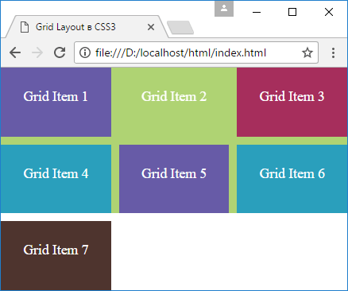
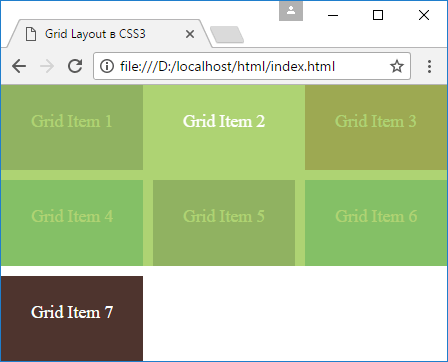

# Наложение элементов

Манипулируя положением элементов мы легко можем осуществить их наложение, создать своего рода слои из элементов. Например, определим следующий грид:

```html
<!DOCTYPE html>
<html>
  <head>
    <meta charset="utf-8" />
    <meta name="viewport" content="width=device-width" />
    <title>Grid Layout в CSS3</title>
    <style>
      * {
        box-sizing: border-box;
      }
      html,
      body {
        margin: 0;
        padding: 0;
      }
      .grid-container {
        height: 100vh;
        display: grid;
        grid-template-columns: repeat(3, 1fr);
        grid-template-rows: repeat(3, 1fr);
        grid-gap: 10px;
      }
      .grid-item {
        text-align: center;
        font-size: 1.1em;
        padding: 1.5em;
        color: white;
        z-index: 1;
      }
      .item1 {
        grid-area: 1 / 1 / 3 / 4;
        opacity: 0.8;
      }
      .item2 {
        grid-area: 1 / 1 / 2 / 2;
      }
      .item3 {
        grid-area: 1 / 3 / 2 / 4;
      }
      .item4 {
        grid-area: 2 / 1 / 3 / 2;
      }
      .item5 {
        grid-area: 2 / 2 / 3 / 3;
      }
      .item6 {
        grid-area: 2 / 3 / 3 / 4;
      }
      .item7 {
        grid-area: 3 / 1 / 4 / 2;
      }
      .color1 {
        background-color: #675ba7;
      }
      .color2 {
        background-color: #9bc850;
      }
      .color3 {
        background-color: #a62e5c;
      }
      .color4 {
        background-color: #2a9fbc;
      }
      .color5 {
        background-color: #4e342e;
      }
    </style>
  </head>
  <body>
    <div class="grid-container">
      <div class="grid-item item1 color2">Grid Item 2</div>
      <div class="grid-item item2 color1">Grid Item 1</div>
      <div class="grid-item item3 color3">Grid Item 3</div>
      <div class="grid-item item4 color4">Grid Item 4</div>
      <div class="grid-item item5 color1">Grid Item 5</div>
      <div class="grid-item item6 color4">Grid Item 6</div>
      <div class="grid-item item7 color5">Grid Item 7</div>
    </div>
  </body>
</html>
```

Здесь первый элемент занимает то же пространство, что и пять следующих элементов. Благодаря установке свойства `z-index: 1` у всех элементов получается, что как первый элемент как-будто лежит фоном под другими пятью элементами.



При необходимости слой из первого элемента можно наоборот перенести ближе к пользователю, накрыв остальные элементы. Для этого надо увеличить у него значение `z-index`:

```css
.item1 {
  grid-area: 1 / 1 / 3 / 4;
  opacity: 0.8;
  z-index: 10;
}
```


