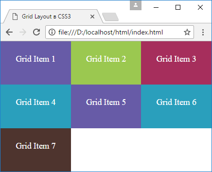
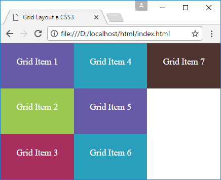
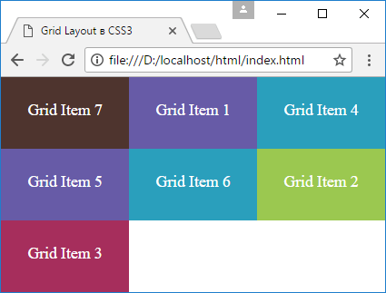

# Направление и порядок элементов

## Свойство grid-auto-flow

По умолчанию все элементы располагаются по порядку горизонтально, если места в строке больше нет, то элементы переносятся на следующую строку. Но с помощью свойства `grid-auto-flow` можно изменить направление элементов. Это свойство принимает два значения:

- `row`: значение по умолчанию, элементы располагаются в строку друг за другом, если места в строке не хватает, элементы переносятся на следующую строку
- `column`: элементы располагаются в столбик, если места в столбце не хватает, то элементы переходят в следующий столбец

Применим данное свойство:

```html
<!DOCTYPE html>
<html>
  <head>
    <meta charset="utf-8" />
    <meta name="viewport" content="width=device-width" />
    <title>Grid Layout в CSS3</title>
    <style>
      * {
        box-sizing: border-box;
      }
      html,
      body {
        margin: 0;
        padding: 0;
      }
      .grid-container {
        height: 100vh;
        display: grid;
        grid-template-columns: repeat(3, 1fr);
        grid-template-rows: repeat(3, 1fr);
        grid-auto-flow: row;
      }
      .grid-item {
        text-align: center;
        font-size: 1.1em;
        padding: 1.5em;
        color: white;
      }
      .color1 {
        background-color: #675ba7;
      }
      .color2 {
        background-color: #9bc850;
      }
      .color3 {
        background-color: #a62e5c;
      }
      .color4 {
        background-color: #2a9fbc;
      }
      .color5 {
        background-color: #4e342e;
      }
    </style>
  </head>
  <body>
    <div class="grid-container">
      <div class="grid-item color1">Grid Item 1</div>
      <div class="grid-item color2">Grid Item 2</div>
      <div class="grid-item color3">Grid Item 3</div>
      <div class="grid-item color4">Grid Item 4</div>
      <div class="grid-item color1">Grid Item 5</div>
      <div class="grid-item color4">Grid Item 6</div>
      <div class="grid-item color5">Grid Item 7</div>
    </div>
  </body>
</html>
```

Свойство `grid-auto-flow` имеет значение `row`, поэтому элементы будут располагаться в строку.



Теперь изменим стиль grid-контейнера:

```css
.grid-container {
  height: 100vh;
  display: grid;
  grid-template-columns: repeat(3, 1fr);
  grid-template-rows: repeat(3, 1fr);
  grid-auto-flow: column;
}
```

После этого элементы будут располагаться в столбец



## Свойство order

Свойство `order` позволяет задать порядок элементов. По умолчанию для каждого элемента в гриде это свойство имеет значение `0`. Поэтому элементы располагаются друг за другом как они определены в разметке html. Но мы можем переопределить этот порядок:

```html
<!DOCTYPE html>
<html>
  <head>
    <meta charset="utf-8" />
    <meta name="viewport" content="width=device-width" />
    <title>Grid Layout в CSS3</title>
    <style>
      * {
        box-sizing: border-box;
      }
      html,
      body {
        margin: 0;
        padding: 0;
      }
      .grid-container {
        height: 100vh;
        display: grid;
        grid-template-columns: repeat(3, 1fr);
        grid-template-rows: repeat(3, 1fr);
      }
      .grid-item {
        text-align: center;
        font-size: 1.1em;
        padding: 1.5em;
        color: white;
      }
      .last-item {
        order: 1;
      }
      .first-item {
        order: -1;
      }
      .color1 {
        background-color: #675ba7;
      }
      .color2 {
        background-color: #9bc850;
      }
      .color3 {
        background-color: #a62e5c;
      }
      .color4 {
        background-color: #2a9fbc;
      }
      .color5 {
        background-color: #4e342e;
      }
    </style>
  </head>
  <body>
    <div class="grid-container">
      <div class="grid-item color1">Grid Item 1</div>
      <div class="grid-item color2 last-item">Grid Item 2</div>
      <div class="grid-item color3 last-item">Grid Item 3</div>
      <div class="grid-item color4">Grid Item 4</div>
      <div class="grid-item color1">Grid Item 5</div>
      <div class="grid-item color4">Grid Item 6</div>
      <div class="grid-item color5 first-item">Grid Item 7</div>
    </div>
  </body>
</html>
```



Элементы с классом `last-item` имеет порядок `1`, поэтому они будут располагаться после других элементов, у которых порядок равен `0` или меньше.

Если же необходимо поставить одни элементы перед другими, то можно использовать отрицательное значение для свойства `order`. Так, у седьмого элемента порядок равен `-1`, что меньше, чем у других элементов. Поэтому последний в разметке элемент по факту будет располагаться перед всеми элементами.

## Ссылки

- [Направление и порядок элементов](https://metanit.com/web/html5/13.8.php)
