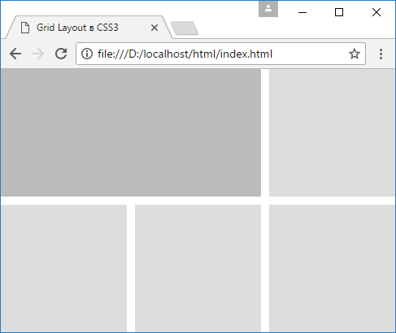
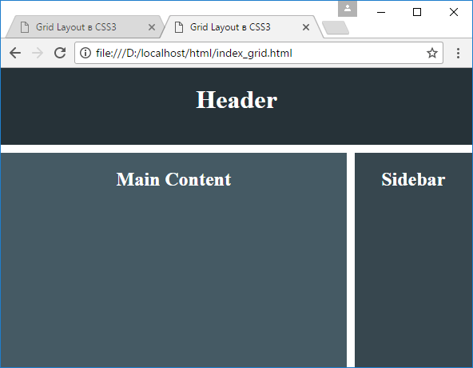

<!-- prettier-ignore-start -->
# Именованные grid-линии
{: .no_toc }
<!-- prettier-ignore-end -->

<!-- prettier-ignore -->
1. TOC
{:toc}

В Grid Layout мы можем дать наименование каждой линии грида, присвоив ей какое-либо имя в квадратных скобках и затем, используя это имя, позиционировать элементы. Например, определим следующую веб-страницу:

```html
<!DOCTYPE html>
<html>
  <head>
    <meta charset="utf-8" />
    <meta name="viewport" content="width=device-width" />
    <title>Grid Layout в CSS3</title>
    <style>
      * {
        box-sizing: border-box;
      }
      html,
      body {
        margin: 0;
        padding: 0;
      }
      .grid-container {
        height: 100vh;
        display: grid;
        grid-template-columns:
          [col1start] 1fr [col1end] 10px
          [col2start] 1fr [col2end] 10px
          [col3start] 1fr [col3end];
        grid-template-rows: [row1start] 1fr [row1end] 10px [row2start] 1fr [row2end];
      }

      .grid-item {
        background-color: #ddd;
      }

      .special-item {
        grid-column: col1start / col2end;
        grid-row: row1start;
        background-color: #bbb;
      }
      .item1 {
        grid-column: col3start / col3end;
        grid-row: row1start;
      }
      .item2 {
        grid-column: col1start / col1end;
        grid-row: row2start;
      }
      .item3 {
        grid-column: col2start / col2end;
        grid-row: row2start;
      }
      .item4 {
        grid-column: col3start / col3end;
        grid-row: row2start;
      }
    </style>
  </head>
  <body>
    <div class="grid-container">
      <div class="grid-item special-item"></div>
      <div class="grid-item item1"></div>
      <div class="grid-item item2"></div>
      <div class="grid-item item3"></div>
      <div class="grid-item item4"></div>
    </div>
  </body>
</html>
```

При именовании линий их имена заключаются в квадратные скобки, а между для именами указывается ширина столбца или высота строки, которые находятся между этими линиями:

```css
grid-template-columns:
  [col1start] 1fr [col1end] 10px
  [col2start] 1fr [col2end] 10px
  [col3start] 1fr [col3end];
grid-template-rows: [row1start] 1fr [row1end] 10px [row2start] 1fr [row2end];
```

Затем, используя эти названия, мы можем позиционировать элементы между определенными линиями:

```css
.special-item {
  grid-column: col1start / col2end;
  grid-row: row1start;
  background-color: #bbb;
}
```

Так, в данном случае элемент с классом special-item начинает от вертикальной линии col1start и растягивается до вертикальной линии col2end. И также он начинается от горизонтальной линии row1start, и так как конечная горизонтальная линия не указана, то элемент занимает только одну строку.



Или другой пример, связанный с созданием макета страницы:

```html
<!DOCTYPE html>
<html>
  <head>
    <meta charset="utf-8" />
    <meta name="viewport" content="width=device-width" />
    <title>Grid Layout в CSS3</title>
    <style>
      * {
        box-sizing: border-box;
      }
      html,
      body {
        padding: 0;
        margin: 0;
      }

      .grid-container {
        display: grid;
        height: 100vh;
        grid-template-rows: 6em 10px 1fr;
        grid-template-columns: [mainstart] 1fr [mainend] 10px [sidebarestart] 25% [sidebarend];
      }

      .grid-item-content {
        background-color: #455a64;
        grid-row: 3 / 4;
        grid-column: mainstart / mainend;
      }

      .grid-item-sidebar {
        background-color: #37474f;
        grid-row: 3 / 4;
        grid-column: sidebarestart / sidebarend;
      }

      .grid-item-header {
        background-color: #263238;
        grid-row: 1 / 2;
        grid-column: mainstart / sidebarend;
      }

      .grid-item {
        color: #fff;
        text-align: center;
      }
    </style>
  </head>
  <body>
    <main class="grid-container">
      <header class="grid-item grid-item-header">
        <h1>Header</h1>
      </header>

      <article class="grid-item grid-item-content">
        <h1>Main Content</h1>
      </article>

      <aside class="grid-item grid-item-sidebar">
        <h1>Sidebar</h1>
      </aside>
    </main>
  </body>
</html>
```



## Ссылки

- [Именованные grid-линии](https://metanit.com/web/html5/13.9.php)
