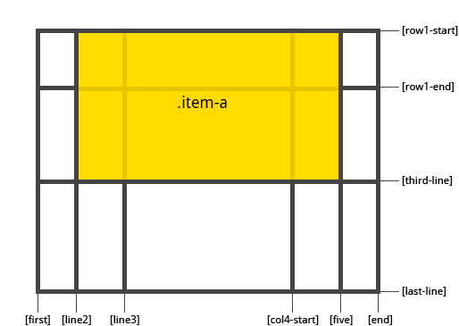
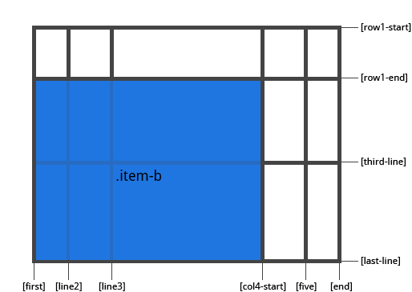

# grid-row-end

Свойство **`grid-row-end`** определяет местоположение в сетке ссылаясь на конкретные линии. `grid-column-end` / `grid-row-end` — это линия на которой элемент заканчивается.

## Синтаксис

```css
/* Keyword value */
grid-row-end: auto;

/* <custom-ident> values */
grid-row-end: somegridarea;

/* <integer> + <custom-ident> values */
grid-row-end: 2;
grid-row-end: somegridarea 4;

/* span + <integer> + <custom-ident> values */
grid-row-end: span 3;
grid-row-end: span somegridarea;
grid-row-end: 5 somegridarea span;

/* Global values */
grid-row-end: inherit;
grid-row-end: initial;
grid-row-end: unset;
```

## Значения

Значение по-умолчанию: `auto`

`<line>`
: может быть числом ссылающимся на пронумерованную линию, или названием ссылающимся на именованую линию;

`span <number>`
: элемент, который будет охватывать предоставленное количество треков;

`span <name>`
: элемент будет будет охватывать пока не достигнет линии с указанным названием;

`auto`
: указывает автоматическое размещения, автоматическое охват, или охват по умолчанию;

## Спецификации

- [CSS Grid Layout](https://drafts.csswg.org/css-grid/#propdef-grid-row-end)

## Поддержка браузерами

<p class="ciu_embed" data-feature="css-grid" data-periods="future_1,current,past_1,past_2">
  <a href="http://caniuse.com/#feat=css-grid">Can I Use css-grid?</a> Data on support for the css-grid feature across the major browsers from caniuse.com.
</p>

## Описание и примеры

Примеры:

```css
.item-a {
  grid-column-start: 2;
  grid-column-end: five;
  grid-row-start: row1-start;
  grid-row-end: 3;
}
```



```css
.item-b {
  grid-column-start: 1;
  grid-column-end: span col4-start;
  grid-row-start: 2;
  grid-row-end: span 2;
}
```



Если `grid-column-end` / `grid-row-end` не объявлены, элемент будет охватывать 1 трек по умолчанию.

Элементы могут перекрывать друг друга. Вы можете использовать [`z-index`](z-index.md) для управления их порядком.
