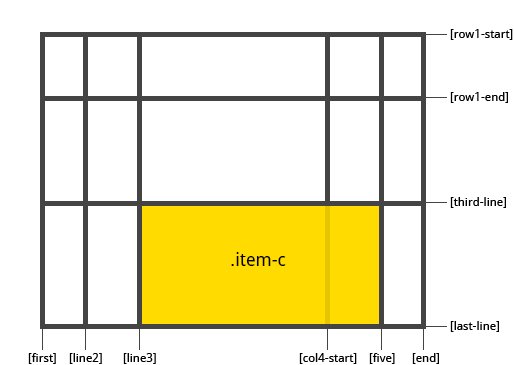
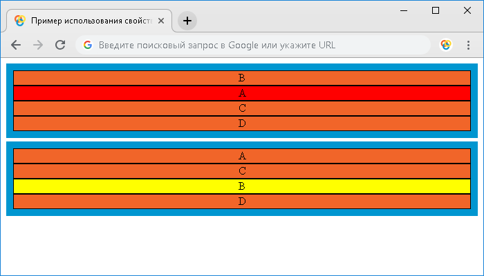
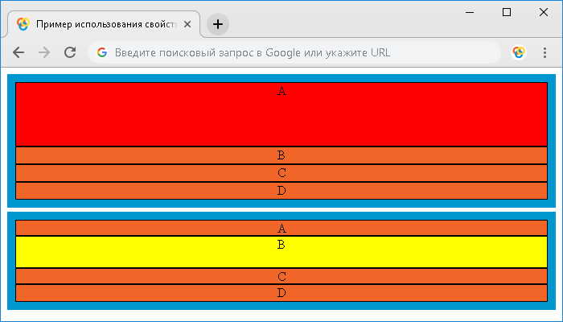
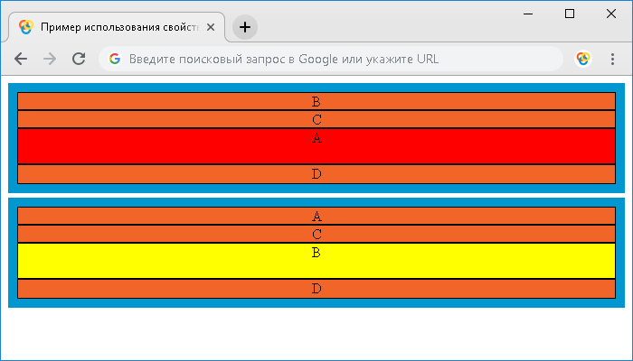

# grid-row

CSS свойство **`grid-row`** определяет с какой строки в макете сетки будет начинаться элемент, сколько строк будет занимать элемент, или на какой строке завершится элемент в макете сетки. Является сокращенным свойством для свойств [`grid-row-start`](grid-row-start.md) и [`grid-row-end`](grid-row-end.md).

## Синтаксис

```css
/* Keyword values */
grid-row: auto;
grid-row: auto / auto;

/* <custom-ident> values */
grid-row: somegridarea;
grid-row: somegridarea / someothergridarea;

/* <integer> + <custom-ident> values */
grid-row: somegridarea 4;
grid-row: 4 somegridarea / 6;

/* span + <integer> + <custom-ident> values */
grid-row: span 3;
grid-row: span somegridarea;
grid-row: 5 somegridarea span;
grid-row: span 3 / 6;
grid-row: span somegridarea / span someothergridarea;
grid-row: 5 somegridarea span / 2 span;

/* Global values */
grid-row: inherit;
grid-row: initial;
grid-row: unset;
```

## Значения

Значение по-умолчанию:

```css
grid-row-start: `auto`;
grid-row-end: `auto`;
```

`grid-row-start`
: Определяет сколько строк будет занимать элемент, или на какой строке начинается элемент в макете сетки. Возможные значения:
: - `auto` - ключевое слово, указывающее, что свойство не влияет на размещение элемента в макете сетки (автоматическое размещение, автоматический диапазон или диапазон по умолчанию равный 1). Является значением по умолчанию.
: - `line` - целое число, которое соответствует начальной грани элемента в макете сетки (отсчет граней в макете ведется сверху вниз от верхнего края элемента, схематичное отображение вверху страницы). Если задано отрицательное целое число, то отсчет ведется в обратном порядке, начиная с конечного края явной сетки макета. Значение `0` недопустимо.
: - `line-name` - строковое значение ссылающееся на именованную строку в макете сетки. Элемент располагается от начальной грани указанного элемента.
: - `span line` - ключевое слово `span` с целым числом, которое определяет какое количество строк сетки элемент будет охватывать. Если целое число опущено, то по умолчанию используется значение `1`. Отрицательные значения или значение `0` недопустимы.

`grid-row-end`
: Определяет сколько строк будет занимать элемент, или на какой строке заканчивается элемент в макете сетки. Возможные значения:
: - `auto` - ключевое слово, указывающее, что свойство не влияет на размещение элемента в макете сетки (автоматическое размещение, автоматический диапазон или диапазон по умолчанию равный 1). Является значением по умолчанию.
: - `line` - целое число, которое соответствует конечной грани элемента в макете сетки (отсчет граней в макете ведется сверху вниз от верхнего края элемента, схематичное отображение вверху страницы). Если задано отрицательное целое число, то отсчет ведется в обратном порядке, начиная с конечного края явной сетки макета. Значение `0` недопустимо.
: - `line-name` - строковое значение ссылающееся на именованную строку в макете сетки. Элемент располагается до начальной грани указанного элемента.
: - `span line` - ключевое слово `span` с целым числом, которое определяет какое количество строк сетки элемент будет охватывать. Если целое число опущено, то по умолчанию используется значение `1`. Отрицательные значения или значение `0` недопустимы.

`initial`
: Устанавливает свойство в значение по умолчанию.

`inherit`
: Указывает, что значение наследуется от родительского элемента.

## Спецификации

- [CSS Grid Layout](https://drafts.csswg.org/css-grid/#propdef-grid-row)

## Поддержка браузерами

<p class="ciu_embed" data-feature="css-grid" data-periods="future_1,current,past_1,past_2">
  <a href="http://caniuse.com/#feat=css-grid">Can I Use css-grid?</a> Data on support for the css-grid feature across the major browsers from caniuse.com.
</p>

## Описание и примеры

```css
.item-c {
  grid-column: 3 / span 2;
  grid-row: third-line / 4;
}
```



Если значение конечной линии не указано, то элемент будет охватывать только 1 трек, по умолчанию.

### Пример 1

```html
<!DOCTYPE html>
<html>
  <head>
    <title>
      Использование свойства grid-row с одним значением
    </title>
    <style>
      .grid-container,
      .grid-container2 {
        display: grid; /* элемент отображается как блочный   grid-контейнер */
        margin-top: 5px; /* внешний отступ сверху */
        padding: 10px; /* внешний отступ элемента со всех сторон */
        background: rgb(
          0,
          150,
          208
        ); /* цвет заднего фона */
        grid-template-rows: [line1] auto [line2] auto [line3] auto [line4] auto; /* определяем количество, наименование и высоту строк в макете сетки */
      }
      .grid-container > div,
      .grid-container2 > div {
        background: rgb(
          241,
          101,
          41
        ); /* цвет заднего фона */
        border: 1px solid #000; /* сплошная граница размером 1 пиксель черного цвета */
        text-align: center; /* горизонтальное выравнивание текста */
      }
      .item-a {
        grid-row: 2; /* определяем с какой строки будет расположен элемент в макете сетки */
        background: red !important; /* цвет заднего фона */
      }
      .item-b {
        grid-row: line3; /* определяем с какой строки будет расположен элемент в макете сетки */
        background: yellow !important; /* цвет заднего фона */
      }
    </style>
  </head>
  <body>
    <div class="grid-container">
      <div class="item-a">A</div>
      <div>B</div>
      <div>C</div>
      <div>D</div>
    </div>
    <div class="grid-container2">
      <div>A</div>
      <div class="item-b">B</div>
      <div>C</div>
      <div>D</div>
    </div>
  </body>
</html>
```

В этом примере мы разместили два блочных grid-контейнера, внутри которых мы разместили по четыре элемента `<div>`. С помощью свойства `grid-template-rows` мы указываем четыре значения, которые определяют, что мы размещаем четыре строки, используя значение `auto`, которое в зависимости от размера контейнера и размера содержимого элемента в строке, определяет размер строки. Кроме того, для каждой строки мы задаем уникальное имя.

Для элемента с классом `item-a`, расположенного в первом контейнере с помощью свойства `grid-row` определяем, что элемент будет распологаться в макете сетки со второй строки (целое число `2` соответствует начальной грани элемента (отсчет граней в макете ведется сверху вниз от верхнего края элемента). Это аналогично использованию свойства `grid-row-start` со значением `2`.

Для элемента с классом `item-b`, расположенного во втором контейнере с помощью свойства `grid-row` определяем, что элемент будет распологаться в макете сетки в строке с именем `line3` (элемент располагается от начальной грани указанного элемента). Это аналогично использованию отрицательного значения `grid-row: -3`, или свойства `grid-row-start` со значением `line3`, или `-3`.

Результат примера:



### Пример 2

В следующем примере мы рассмотрим с вами как правильно указывать два значения для свойства `grid-row`:

```html
<!DOCTYPE html>
<html>
  <head>
    <title>Использование свойства grid-row</title>
    <style>
      .grid-container,
      .grid-container2 {
        display: grid; /* элемент отображается как блочный   grid-контейнер */
        margin-top: 5px; /* внешний отступ сверху */
        padding: 10px; /* внешний отступ элемента со всех сторон */
        background: rgb(
          0,
          150,
          208
        ); /* цвет заднего фона */
        grid-template-rows: [line1] 20px [line2] 20px [line3] 20px [line4] 20px; /* определяем количество, наименование и высоту строк в макете сетки */
      }
      .grid-container > div,
      .grid-container2 > div {
        background: rgb(
          241,
          101,
          41
        ); /* цвет заднего фона */
        border: 1px solid #000; /* сплошная граница размером 1 пиксель черного цвета */
        text-align: center; /* горизонтальное выравнивание текста */
      }
      .item-a {
        grid-row: 1 / 5; /*  определяем с какой строки будет начинаться элемент и на какой строке завершится элемент */
        background: red !important; /* цвет заднего фона */
      }
      .item-b {
        grid-row: line2 / line4; /* определяем с какой строки будет начинаться элемент и на какой строке завершится элемент */
        background: yellow !important; /* цвет заднего фона */
      }
    </style>
  </head>
  <body>
    <div class="grid-container">
      <div class="item-a">A</div>
      <div>B</div>
      <div>C</div>
      <div>D</div>
    </div>
    <div class="grid-container2">
      <div>A</div>
      <div class="item-b">B</div>
      <div>C</div>
      <div>D</div>
    </div>
  </body>
</html>
```

В этом примере мы разместили два блочных grid-контейнера, внутри которых мы разместили по четыре элемента `<div>`. С помощью свойства `grid-template-rows` мы указываем четыре значения, которые определяют, что мы размещаем четыре строки, используя допустимое значение в пикселях. Кроме того, для каждой строки мы задаем уникальное имя.

Для элемента с классом `item-a`, расположенного в первом контейнере с помощью свойства `grid-row` определяем, что элемент будет распологаться в макете сетки с первой строки (целое число `1` соответствует начальной грани элемента (отсчет граней в макете ведется сверху вниз от верхнего края элемента), а завершаться будет в четвертой строке (целое число `5` соответствует конечной грани элемента в макете сетки). Это аналогично использованию отрицательного значения `grid-row: -5 / -1`.

Для элемента с классом `item-b`, расположенного во втором контейнере с помощью свойства `grid-row` определяем, что элемент будет распологаться в макете сетки со столбца с именем `line2` (элемент располагается от начальной грани указанного элемента), а завершаеться столбцом с именем `line4` (элемент располагается до начальной грани указанного элемента).

Результат примера:



### Пример 3

В следующем примере мы рассмотрим с Вами как использовать ключевое слово `span` для свойства `grid-row`:

```html
<!DOCTYPE html>
<html>
  <head>
    <title>
      Использование свойства grid-row и ключевого слова span
    </title>
    <style>
      .grid-container,
      .grid-container2 {
        display: grid; /* элемент отображается как блочный   grid-контейнер */
        margin-top: 5px; /* внешний отступ сверху */
        padding: 10px; /* внешний отступ элемента со всех сторон */
        background: rgb(
          0,
          150,
          208
        ); /* цвет заднего фона */
        grid-template-rows: [line1] 20px [line2] 20px [line3] 20px [line4] 20px; /* определяем количество, наименование и высоту строк в макете сетки */
      }
      .grid-container > div,
      .grid-container2 > div {
        background: rgb(
          241,
          101,
          41
        ); /* цвет заднего фона */
        border: 1px solid #000; /* сплошная граница размером 1 пиксель черного цвета */
        text-align: center; /* горизонтальное выравнивание текста */
      }
      .item-a {
        grid-row: span 2 / 5; /*  определяем сколько строк будет охватывать элемент и на какой строке завершится элемент */
        background: red !important; /* цвет заднего фона */
      }
      .item-b {
        grid-row: line3 / span 2; /* определяем с какой строки будет начинаться элемент и сколько строк будет охватывать элемент */
        background: yellow !important; /* цвет заднего фона */
      }
    </style>
  </head>
  <body>
    <div class="grid-container">
      <div class="item-a">A</div>
      <div>B</div>
      <div>C</div>
      <div>D</div>
    </div>
    <div class="grid-container2">
      <div>A</div>
      <div class="item-b">B</div>
      <div>C</div>
      <div>D</div>
    </div>
  </body>
</html>
```

В этом примере мы разместили два блочных grid-контейнера, внутри которых мы разместили по четыре элемента `<div>`. С помощью свойства `grid-template-rows` мы указываем четыре значения, которые определяют, что мы размещаем четыре строки, используя допустимое значение в пикселях. Кроме того, для каждой строки мы задаем уникальное имя.

Для элемента с классом `item-a`, расположенного в первом контейнере с помощью свойства `grid-row` определяем, что элемент будет охватывать две строки и будет завершаться на четвертой строке (целое число `5` соответствует конечной грани элемента в макете сетки).

Для элемента с классом `item-b`, расположенного во втором контейнере с помощью свойства `grid-row` определяем, что элемент будет распологаться в макете сетки со столбца с именем `line3` (элемент располагается от начальной грани указанного элемента) и при этом будет охватывать две строки.

Результат примера:



## См. также

- Связанные свойства [`grid-row-start`](grid-row-start.md), [`grid-row-end`](grid-row-end.md), [`grid-column`](grid-column.md), [`grid-column-start`](grid-column-start.md), [`grid-column-end`](grid-column-end.md)
- [Руководство по Grid](grid-guide/grid-1.md)

## Ссылки

- [grid-row](https://developer.mozilla.org/en-US/docs/Web/CSS/grid-row) на MDN
