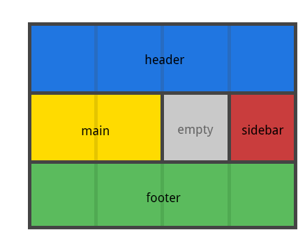
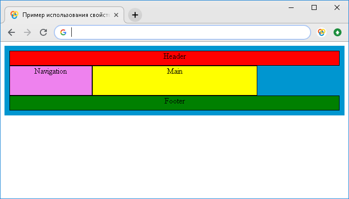

# grid-template-areas

Свойство **`grid-template-areas`** определяет шаблон сетки ссылаясь на имена областей, которые заданы с помощью свойства [`grid-area`](grid-area.md).

Повторение названия области приводит к тому, что содержимое охватывает эти ячейки. Точка означает пустую ячейку. Сам синтаксис предоставляет визуализацию структуры сетки.

## Синтаксис

```css
/* Keyword value */
grid-template-areas: none;

/* <string> values */
grid-template-areas: 'a b';
grid-template-areas:
  'a b b'
  'a c d';

/* Global values */
grid-template-areas: inherit;
grid-template-areas: initial;
grid-template-areas: unset;
```

## Значения

Значение по-умолчанию:

```css
grid-template-areas: none;
```

Применяется к grid-контейнерам

`none`
: Контейнер не определяет именованные области макета сетки. Значение по умолчанию.

`.`
: Точка означает пустую ячейку сетки макета.

`itemnames`
: Строка создается для каждой отдельной строки в списке, а столбец - для каждой ячейки в строке. Несколько маркеров именованных ячеек внутри строк и между строками создают одну именованную область сетки, которая охватывает соответствующие ячейки сетки. Каждая строка с областями должна быть помещена в кавычки. Если заданные ячейки не образуют прямоугольник, то объявление является недопустимым.

`initial`
: Устанавливает свойство в значение по умолчанию.

`inherit`
: Указывает, что значение наследуется от родительского элемента.

## Спецификации

- [CSS Grid Layout](https://drafts.csswg.org/css-grid/#propdef-grid-template-areas)

## Поддержка браузерами

<p class="ciu_embed" data-feature="css-grid" data-periods="future_1,current,past_1,past_2">
  <a href="http://caniuse.com/#feat=css-grid">Can I Use css-grid?</a> Data on support for the css-grid feature across the major browsers from caniuse.com.
</p>

## Описание и примеры

### Пример 1

```css
.item-a {
  grid-area: header;
}
.item-b {
  grid-area: main;
}
.item-c {
  grid-area: sidebar;
}
.item-d {
  grid-area: footer;
}

.container {
  grid-template-columns: 50px 50px 50px 50px;
  grid-template-rows: auto;
  grid-template-areas:
    'header header header header'
    'main main . sidebar'
    'footer footer footer footer';
}
```

Пример выше создаст сетку из 4 колонок и 3 строк. Вся верхняя строка будет состоять из области `header`. Строка по середине будет состоять из области `main`, занимающей две колонки, пустой ячейки и области `sidebar`, которая занимает одну колонку. Последняя строка будет состоять только из области `footer`.



У каждой строки должно быть одинаковое количество ячеек. Вы можете использовать любое количество примыкающих точек для объявления пустых ячеек. Пока между точками нет пробелов, они представляют одну ячейку.

Обратите внимание на то, что вы никак не называете линии, только области. Когда вы используете такой синтаксис, линии на обоих концах областей будут именоваться автоматически. Если ваша область называется `foo`, то название первых линий для строк и столбцов будет `foo-start`, а название для последних линий строк и столбцов будет `foo-end`. Это означает, что у некоторых линий может быть несколько имён, как нашем случае, у самой левой линии будет три названия: `header-start`, `main-start`, и `footer-start`.

### Пример 2

```html
<!DOCTYPE html>
<html>
  <head>
    <title>Использование свойств grid-area и grid-template-areas</title>
    <style>
      .grid-container {
        display: grid; /* элемент отображается как блочный   grid-контейнер */
        margin-top: 5px; /* внешний отступ сверху */
        padding: 10px; /* внешний отступ элемента со всех сторон */
        background: rgb(0, 150, 208); /* цвет заднего фона */
        grid-template-rows: 30px 30px 30px 30px; /* определяем количество и ширину строк в макете сетки */
        grid-template-columns: 25% 25% 25% 25%; /* определяем количество и ширину столбцов в макете сетки */
        grid-template-areas:
          'header header header header' /* определяем шаблон макета сетки, ссылаясь при этом на имена областей элементов */
          'nav main main .' /* точка обозначает элемент без имени */
          'nav main main .' /* точка обозначает элемент без имени */
          'footer footer footer footer';
      }
      .grid-container > div {
        background: rgb(241, 101, 41); /* цвет заднего фона */
        border: 1px solid #000; /* сплошная граница размером 1 пиксель черного цвета */
        text-align: center; /* горизонтальное выравнивание текста */
      }
      .item-a {
        grid-area: header; /* задаем имя элемента */
        background: red !important; /* цвет заднего фона */
      }
      .item-b {
        grid-area: main; /* задаем имя элемента */
        background: yellow !important; /* цвет заднего фона */
      }
      .item-c {
        grid-area: footer; /* задаем имя элемента */
        background: green !important; /* цвет заднего фона */
      }
      .item-d {
        grid-area: nav; /* задаем имя элемента */
        background: violet !important; /* цвет заднего фона */
      }
    </style>
  </head>
  <body>
    <div class="grid-container">
      <div class="item-a">Header</div>
      <div class="item-b">Main</div>
      <div class="item-c">Footer</div>
      <div class="item-d">Navigation</div>
    </div>
  </body>
</html>
```

В этом примере мы разместили один блочный grid-контейнер, внутри которого мы разместили четыре элемента `<div>`. С помощью свойства [`grid-template-columns`](grid-template-columns.md) мы указываем четыре значения, которые определяют, что мы размещаем четыре столбца (дорожки), используя допустимое значение в процентах. С помощью свойства [`grid-template-rows`](grid-template-rows.md) мы указываем четыре значения, которые определяют, что мы размещаем четыре строки, используя допустимое значение в пикселях.

Для элементов с классом `item-a`, `item-b`, `item-c` и `item-d` с помощью свойства [`grid-area`](grid-area.md) задаем собственное имя элемента.

После этого с помощью свойства `grid-template-areas` определяем шаблон макета сетки, ссылаясь при этом на имена областей элементов, которые мы создали с помощью свойства `grid-area`:

- В первой строке все столбцы занимает элемент с именем `header`.
- Во второй и третьей строке элемент с именем `nav` занимает первый столбец, второй и третий столбец занимает элемент с именем `main`, четвертые столбцы мы оставили пустыми. Обратите внимание, что необходимо в этом случае вместо имени указывать точку, в результате чего получим пустой элемент, а не ошибку в верстке.
- В четвертой строке все столбцы занимает элемент с именем `footer`.

Обратите внимание на то, что при описании шаблона с помощью свойства `grid-template-areas` мы каждую строку с областями помещаем в кавычки.

Результат примера:



## См. также

- Связанные свойства [`grid-template-rows`](grid-template-rows.md), [`grid-template-columns`](grid-template-columns.md), [`grid-template`](grid-template.md)
- [Руководство по Grid](grid-guide/grid-1.md)

## Ссылки

- [grid-template-areas](https://developer.mozilla.org/en-US/docs/Web/CSS/grid-template-areas) на MDN
