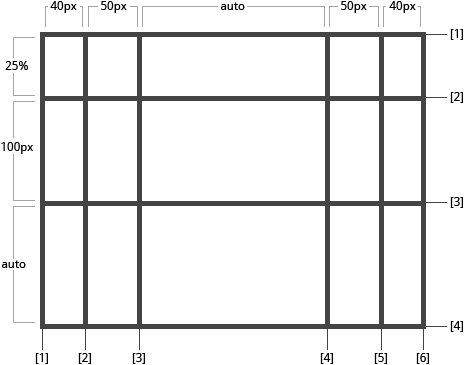
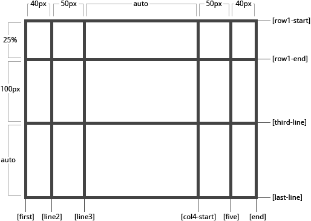

# grid-template-columns

Свойство **`grid-template-columns`** определяет колонки сетки с помощью списка значений разделённого пробелами. Значения представляют из себя размер трека, а пробелы между ними представляют линии сетки.

## Синтаксис

```css
/* Keyword value */
grid-template-columns: none;

/* <track-list> values */
grid-template-columns: 100px 1fr;
grid-template-columns: [linename] 100px;
grid-template-columns: [linename1] 100px [linename2 linename3];
grid-template-columns: minmax(100px, 1fr);
grid-template-columns: fit-content(40%);
grid-template-columns: repeat(3, 200px);

/* <auto-track-list> values */
grid-template-columns: 200px repeat(auto-fill, 100px) 300px;
grid-template-columns:
  minmax(100px, max-content)
  repeat(auto-fill, 200px) 20%;
grid-template-columns:
  [linename1] 100px [linename2]
  repeat(auto-fit, [linename3 linename4] 300px)
  100px;
grid-template-columns:
  [linename1 linename2] 100px
  repeat(auto-fit, [linename1] 300px) [linename3];

/* Global values */
grid-template-columns: inherit;
grid-template-columns: initial;
grid-template-columns: unset;
```

## Значения

Значение по-умолчанию:

```css
grid-template-columns: none;
```

Применяется к grid-контейнерам

`none`
: Ключевое слово, означающее, что явная сетка макета не создается. Любые столбцы будут генерироваться неявно, и их размер будет определяться с помощью свойства [`grid-auto-columns`](grid-auto-columns.md). Является значением по умолчанию.

`length / percentage`
: Задает размер столбцов, используя допустимое значение длины, или значение, указанное в процентах. Значение должно быть положительным.

`flex`
: Неотрицательное значение в "гибких" единицах измерения `fr` (fractional unit). Каждый столбец занимает часть оставшегося пространства в контейнере сетки макета пропорционально заданному коэффициенту. Например, при использовании значения `1fr 2fr`, столбцы будут занимать ⅓ и ⅔ оставшегося пространства, соответственно. Общий размер таких строк или столбцов вычитается из доступного пространства, что дает оставшееся пространство, которое затем делится между строками и столбцами гибкого размера пропорционально их коэффициенту.

: Значения между `0fr` и `1fr` имеют несколько особое поведение, когда сумма коэффициентов меньше `1`, они будут занимать менее 100% оставшегося пространства. Когда доступное пространство бесконечно (ширина или высота контейнера сетки макета неопределенны), размер столбцов сетки гибкого размера определяется их содержимым с сохранением соответствующих пропорций.

: Значения flex не являются значениями length, по этой причине они не могут быть представлены или объединены с другими типами единиц в выражениях `calc()` (функция выполняет математические расчеты для определения значений свойств).

`max-content`
: Ключевое слово, которое задает размер каждого столбца в зависимости от самого большого элемента в столбце.

`min-content`
: Ключевое слово, которое задает размер каждого столбца в зависимости от самого маленького элемента в столбце.

`minmax(min, max)`
: Функциональная нотация, определяющая диапазон размеров больше или равный `min` и меньше или равный `max`. Если `max` меньше `min`, то `max` игнорируется, а функция обрабатывается как `min`. Значение в "гибких" единицах измерения в качестве максимального значения задает коэффициент гибкости столбца, это недопустимо для определения минимума.

`auto`
: Размер столбцов определяется размером контейнера и размером содержимого элементов в столбце. Как максимум, идентичен значению `max-content`, а как минимум, представляет самый большой минимальный размер. Автоматические размеры столбцов допускается растягивать с помощью свойств [`align-content`](align-content.md) и [`justify-content`](justify-content.md).

`fit-content( length | percentage )`
: Представляет собой формулу `min(max-content, max(auto, argument))`, которая рассчитывается по аналогии с `auto` (то есть `minmax(auto, max-content)`), за исключением того, что размер столбца зажимается значением `argument`, если он больше, чем автоматический минимум.

`repeat( [ positive-integer | auto-fill | auto-fit ] , track-list )`
: Представляет из себя повторяющийся фрагмент списка столбцов (дорожек), позволяя записать в более компактной форме большое количество столбцов с повторяющимся шаблоном. Возможные значения:
: - `positive-integer` - положительное целое число, которое определяет количество повторений.
: - `auto-fill` - если контейнер сетки имеет определенный или максимальный размер на соответствующей оси, то число повторений является наибольшим возможным положительным целым числом, которое не вызывает переполнения сетки. Если любое количество повторений будет вызывать переполнение контейнера, то количество повторений будет равно `1`. В противном случае, если контейнер сетки имеет определенный минимальный размер на соответствующей оси, число повторений является наименьшим возможным положительным целым числом, удовлетворяющим этому минимальному требованию. В противном случае указанный список дорожек повторяется только один раз. Другими словами `auto-fill` заполняет строку любым количеством столбцов. Таким образом, он создает неявные столбцы всякий раз, когда новый столбец может поместиться, потому что он пытается заполнить строку как можно большим количеством столбцов. Добавленные столбцы могут быть пустыми, но они все равно будут занимать определенное место в строке.
: - `auto-fit` - ведет себя так же, как `auto-fill`, за исключением того, что после размещения элементов сетки пустые повторяющиеся дорожки объединяются (это может привести к тому, что все дорожки будут объеденены, если все они пусты). Другими словами `auto-fit` помещает доступные в данный момент столбцы в пространство, расширяя их так, чтобы они занимали любое доступное пространство. Браузер делает это после заполнения этого дополнительного пространства дополнительными столбцами (как при автоматическом заполнении), а затем сворачивает пустые.

`initial`
: Устанавливает свойство в значение по умолчанию.

`inherit`
: Указывает, что значение наследуется от родительского элемента.

## Спецификации

- [CSS Grid Layout](https://drafts.csswg.org/css-grid/#propdef-grid-template-columns)

## Поддержка браузерами

<p class="ciu_embed" data-feature="css-grid" data-periods="future_1,current,past_1,past_2">
  <a href="http://caniuse.com/#feat=css-grid">Can I Use css-grid?</a> Data on support for the css-grid feature across the major browsers from caniuse.com.
</p>

## Описание и примеры

Когда вы оставляете пустое пространство между значениями треков, линиям сетки автоматически присваиваются числовые имена:

```css
.container {
  grid-template-columns: 40px 50px auto 50px 40px;
  grid-template-rows: 25% 100px auto;
}
```



Но вы можете называть линии явно. Обратите внимание на синтаксис для их названия:

```css
.container {
  grid-template-columns: [first] 40px [line2] 50px [line3] auto [col4-start] 50px [five] 40px [end];
  grid-template-rows: [row1-start] 25% [row1-end] 100px [third-line] auto [last-line];
}
```



Обратите внимание на то что у линии может быть несколько названий. Например, здесь у второй линии будет два названия: `row1-end` и `row2-start`:

```css
.container {
  grid-template-rows: [row1-start] 25% [row1-end row2-start] 25% [row2-end];
}
```

Если в вашем определении содержатся повторяющиеся части, то можно использовать нотацию `repeat()`:

```css
.container {
  grid-template-columns: repeat(3, 20px [col-start]) 5%;
}
```

Тоже самое что и:

```css
.container {
  grid-template-columns: 20px [col-start] 20px [col-start] 20px [col-start] 5%;
}
```

Единица `fr` позволяет вам настраивать размер треков как часть свободного пространства в контейнере. Вот пример, который устанавливает каждому элементу одну третью ширины контейнера.

```css
.container {
  grid-template-columns: 1fr 1fr 1fr;
}
```

Свободное пространство высчитывается после вычисления всех фиксированных элементов. В этом примере, общее количество свободного пространства для единиц `fr` не будет включать в себя 50px.

```css
.container {
  grid-template-columns: 1fr 50px 1fr 1fr;
}
```

### Пример

=== "CSS"

    ```css
    #grid {
      display: grid;
      width: 100%;
      grid-template-columns: 50px 1fr;
    }

    #areaA {
      background-color: lime;
    }

    #areaB {
      background-color: yellow;
    }
    ```

=== "HTML"

    ```html
    <div id="grid">
      <div id="areaA">A</div>
      <div id="areaB">B</div>
    </div>
    ```

## См. также

- Связанные свойства [`grid-template-rows`](grid-template-rows.md), [`grid-template-areas`](grid-template-areas.md), [`grid-template`](grid-template.md)
- [Руководство по Grid](grid-guide/grid-1.md)

## Ссылки

- [`grid-template-columns`](https://developer.mozilla.org/ru/docs/Web/CSS/grid-template-columns) на MDN
