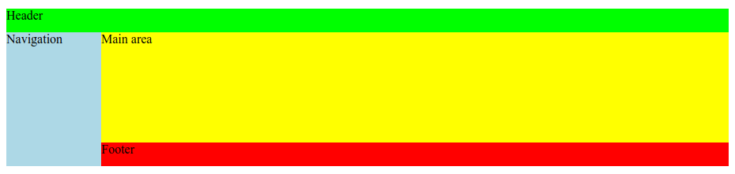

# grid-template

Свойство **`grid-template`** -- сокращение для [`grid-template-rows`](/css/grid-template-rows/), [`grid-template-columns`](/css/grid-template-columns/), и [`grid-template-areas`](/css/grid-template-areas/).

## Синтаксис

```css
/* Keyword value */
grid-template: none;

/* grid-template-rows / grid-template-columns values */
grid-template: 100px 1fr / 50px 1fr;
grid-template: auto 1fr / auto 1fr auto;
grid-template: [linename] 100px / [columnname1] 30% [columnname2] 70%;
grid-template: fit-content(100px) / fit-content(40%);

/* grid-template-areas grid-template-rows / grid-template-column values */
grid-template:
  'a a a'
  'b b b';
grid-template:
  'a a a' 20%
  'b b b' auto;
grid-template:
  [header-top] 'a a a' [header-bottom]
  [main-top] 'b b b' 1fr [main-bottom]
  / auto 1fr auto;

/* Global values */
grid-template: inherit;
grid-template: initial;
grid-template: unset;
```

## Значения

- `none` — устанавливает все три свойства в их начальное значение;
- `subgrid` — устанавливает `grid-template-rows` и `grid-template-columns` в `subgrid`, и `grid-template-areas` в его начальное значение;
- `<grid-template-rows>` / `<grid-template-columns>` — устанавливает `grid-template-columns` и `grid-template-rows` в определённое значение, соответственно, и устанавливает `grid-template-areas` в `none`;

```css
.container {
  grid-template: none | subgrid | <grid-template-rows> / <grid-template-columns>;
}
```

Он также принимает более сложный, но довольно удобный синтаксис, для указания всех трёх свойств. Вот пример:

```css
.container {
  grid-template:
    [row1-start] 25px 'header header header' [row1-end]
    [row2-start] 'footer footer footer' 25px [row2-end]
    / auto 50px auto;
}
```

Что эквивалентно следующему:

```css
.container {
  grid-template-rows: [row1-start] 25px [row1-end row2-start] 25px [row2-end];
  grid-template-columns: auto 50px auto;
  grid-template-areas:
    'header header header'
    'footer footer footer';
}
```

Так как `grid-template` не сбрасывает неявные свойства ([`grid-auto-columns`](/css/grid-auto-columns/), [`grid-auto-rows`](/css/grid-auto-rows/), и [`grid-auto-flow`](/css/grid-auto-flow/)), а в большинстве случаев, вероятно, вы бы захотели это сделать, рекомендуется использовать свойство [`grid`](/css/grid/), вместо `grid-template`.

## Спецификации

- [CSS Grid Layout](https://drafts.csswg.org/css-grid/#propdef-grid-template)

## Поддержка браузерами

<p class="ciu_embed" data-feature="css-grid" data-periods="future_1,current,past_1,past_2">
  <a href="http://caniuse.com/#feat=css-grid">Can I Use css-grid?</a> Data on support for the css-grid feature across the major browsers from caniuse.com.
</p>

## Описание и примеры

CSS

```css
#page {
  display: grid;
  width: 100%;
  height: 200px;
  grid-template:
    [header-left] 'head head' 30px [header-right]
    [main-left] 'nav  main' 1fr [main-right]
    [footer-left] 'nav  foot' 30px [footer-right]
    / 120px 1fr;
}

header {
  background-color: lime;
  grid-area: head;
}

nav {
  background-color: lightblue;
  grid-area: nav;
}

main {
  background-color: yellow;
  grid-area: main;
}

footer {
  background-color: red;
  grid-column: foot;
}
```

HTML

```html
<section id="page">
  <header>Header</header>
  <nav>Navigation</nav>
  <main>Main area</main>
  <footer>Footer</footer>
</section>
```

Результат:


