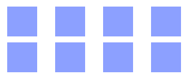

# grid

Свойство **`grid`** является сокращенной формой записи, которая устанавливает значения для всех явных свойств сетки ([`grid-template-rows`](grid-template-rows.md), [`grid-template-columns`](grid-template-columns.md) и [`grid-template-areas`](grid-template-areas.md)), всех неявных свойств сетки ([`grid-auto-rows`](grid-auto-rows.md), [`grid-auto-columns`](grid-auto-columns.md) и [`grid-auto-flow`](grid-auto-flow.md)) и свойств для промежутков между рядами и столбцами сетки ([`grid-column-gap`](grid-column-gap.md) и [`grid-row-gap`](grid-row-gap.md)) в одной строчке.

В одной строке `grid` могут быть описаны свойства только одного вида: явные или неявные. Подсвойства, которые не были описаны, принимают, как и в других сокращенных формах записи свойств, значения по умолчанию. Кроме того, при помощи сокращенной формы записи значения свойств для промежутков между рядами и столбцами сетки по умолчанию сбрасываются, не смотря на то, что они не могут быть установленны в сокращенной форме записи.

## Синтаксис

```css
/* <'grid-template'> values */
grid: none;
grid: 'a' 100px 'b' 1fr;
grid: [linename1] 'a' 100px [linename2];
grid: 'a' 200px 'b' min-content;
grid: 'a' minmax(100px, max-content) 'b' 20%;
grid: 100px / 200px;
grid: minmax(400px, min-content) / repeat(auto-fill, 50px);

/* <'grid-template-rows'> /
	[ auto-flow && dense? ] <'grid-auto-columns'>? values */
grid: 200px / auto-flow;
grid: 30% / auto-flow dense;
grid: repeat(3, [line1 line2 line3] 200px) / auto-flow 300px;
grid: [line1] minmax(20em, max-content) / auto-flow dense 40%;

/* [ auto-flow && dense? ] <'grid-auto-rows'>? /
	<'grid-template-columns'> values */
grid: auto-flow / 200px;
grid: auto-flow dense / 30%;
grid: auto-flow 300px / repeat(3, [line1 line2 line3] 200px);
grid: auto-flow dense 40% / [line1] minmax(20em, max-content);

/* Global values */
grid: inherit;
grid: initial;
grid: unset;
```

## Значения

Значение по-умолчанию:

- [`grid-template-rows: none`](grid-template-rows.md)
- [`grid-template-columns: none`](grid-template-columns.md)
- [`grid-template-areas: none`](grid-template-areas.md)
- [`grid-auto-rows: auto`](grid-auto-rows.md)
- [`grid-auto-columns: auto`](grid-auto-columns.md)
- [`grid-auto-flow: row`](grid-auto-flow.md)
- [`grid-column-gap: 0`](grid-column-gap.md)
- [`grid-row-gap: 0`](grid-row-gap.md)

Наследуется: нет

Применяется к: сеточные контейнеры

Анимируется: нет

Объектная модель: `object.style.grid`

- `<'grid-template'>` -- Определяет grid-template (шаблон сетки) включая grid-template-columns (столбцы), grid-template-rows (ряды) и grid-template-areas (области).
- `<'grid-template-rows'> / [ auto-flow && dense? ] <'grid-auto-columns'>?` -- Устанавливает auto-flow явно задавая размещение по рядам с помощью свойства grid-template-rows (и устанавливая свойство grid-template-columns в значение none) и уточняет, как должно работать авто-повторение столбцов при помощи свойства grid-auto-columns (и устанавливая grid-auto-rows в значение auto). Свойство grid-auto-flow может быть так же установлено для столбцев со свойством dense если оно определено. Все остальные подсвойства grid сбрасываются в их начальные значения.
- `[ auto-flow && dense? ] <'grid-auto-rows'>? / <'grid-template-columns'>` -- Устанавливает auto-flow явно задавая размещение по столбцам с помощью свойства grid-template-columns (и устанавливая свойство grid-template-rows в значение none) и уточняет, как должно работать авто-повторение рядов при помощи свойства grid-auto-rows (и устанавливая grid-auto-columns в значение auto). Свойство grid-auto-flow может быть так же установлено для рядов со свойством dense если оно определено. Все остальные подсвойства grid сбрасываются в их начальные значения.

## Спецификации

- [CSS Grid Layout](https://drafts.csswg.org/css-grid/#propdef-grid)

## Поддержка браузерами

<p class="ciu_embed" data-feature="css-grid" data-periods="future_1,current,past_1,past_2">
  <a href="http://caniuse.com/#feat=css-grid">Can I Use css-grid?</a> Data on support for the css-grid feature across the major browsers from caniuse.com.
</p>

## Описание и примеры

HTML

```html
<div id="container">
  <div></div>
  <div></div>
  <div></div>
  <div></div>
  <div></div>
  <div></div>
  <div></div>
  <div></div>
</div>
```

CSS

```css
#container {
  display: grid;
  grid: repeat(2, 60px) / auto-flow 80px;
}

#container > div {
  background-color: #8ca0ff;
  width: 50px;
  height: 50px;
}
```

Результат


