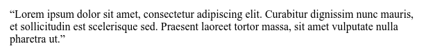

# hanging-punctuation

Свойство **`hanging-punctuation`** определяет как браузер будет отображать знаки пунктуации, попадающие в начало или в конец строки. Висячая пунктуация может располагаться за границами контейнера.

## Синтаксис

```css
/* Значения ключевых слов */
hanging-punctuation: none;
hanging-punctuation: first;
hanging-punctuation: last;
hanging-punctuation: force-end;
hanging-punctuation: allow-end;

/* Два ключевых слова */
hanging-punctuation: first force-end;
hanging-punctuation: first allow-end;
hanging-punctuation: first last;
hanging-punctuation: last force-end;
hanging-punctuation: last allow-end;

/* Три ключевых слова */
hanging-punctuation: first force-end last;
hanging-punctuation: first allow-end last;

/* Общие значения */
hanging-punctuation: inherit;
hanging-punctuation: initial;
hanging-punctuation: unset;
```

## Значения

Значение по-умолчанию: `none`

Свойство `hanging-punctuation` может быть определено с помощью одного, двух или трех ключевых слов.

Для одного значения может быть использовано любое из описанных ниже значений.

Для двух значений используются следующие варианты:

- `first` вместе с одним из `last`, `allow-end` или `force-end`
- `last` вместе с одним из `first`, `allow-end` или `force-end`

Для трех значений используются один из следующих вариантов:

- `first`, `allow-end` и `last`
- `first`, `force-end` и `last`

**`none`**
: Никакие символы не выносятся.

`first`
: Открывающая скобка или кавычка в начале первой строки выровненного элемента будет вынесена.

`last`
: Закрывающая скобка или кавычка последней строки выровненного элемента будет вынесена.

`force-end`
: Точка или запятая в конце строки выносится.

`allow-end`
: Точка или запятая в конце строки будет вынесена, если нет лучшего варианта для выравнивания.

## Спецификация

- [CSS Text Module Level 3](https://drafts.csswg.org/css-text-3/#hanging-punctuation-property)

## Поддержка браузерами

- Safari 10+

## Пример

=== "HTML"

    ```html
    <p>
      “Lorem ipsum dolor sit amet, consectetur adipiscing elit.
      Curabitur dignissim nunc mauris, et sollicitudin est
      scelerisque sed. Praesent laoreet tortor massa, sit amet
      vulputate nulla pharetra ut.”
    </p>
    ```

=== "CSS"

    ```css
    p {
      hanging-punctuation: first last;
      margin: 0.5rem;
    }
    ```

=== "Результат"

    

## Ссылки

- [`hanging-punctuation`](https://developer.mozilla.org/ru/docs/Web/CSS/hanging-punctuation) <sup><small>MDN (рус.)</small></sup>
