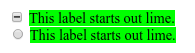

# :indeterminate

Псевдо-класс **`:indeterminate`** представляет любой элемент формы, состояние которого неопределенно.

## Синтаксис

```css
/* Selects any <input> whose state is indeterminate */
input:indeterminate {
  background: lime;
}
```

## Описание

Элементы, предназначенные для этого селектора:

- [`<input type = "checkbox">`](../html/input.md) элементы, неопределенное свойство которых установлено в JavaScript
- [`<input type = "radio">`](../html/input.md), когда все переключатели с одинаковым именем в форме не отмечены
- [`<progress>`](../html/progress.md) в неопределенном состоянии

## Спецификации

- [HTML Living Standard](https://html.spec.whatwg.org/multipage/#selector-indeterminate)
- [HTML5](http://www.w3.org/TR/html5/#selector-indeterminate)
- [Selectors Level 4](https://drafts.csswg.org/selectors-4/#indeterminate)
- [CSS Basic User Interface Module Level 3](https://drafts.csswg.org/css-ui-3/#indeterminate)

## Примеры

```html tab="HTML"
<div>
  <input type="checkbox" id="checkbox" />
  <label for="checkbox">This label starts out lime.</label>
</div>
<div>
  <input type="radio" id="radio" />
  <label for="radio">This label starts out lime.</label>
</div>
```

```css tab="CSS"
input:indeterminate + label {
  background: lime;
}
```

```js tab="JS"
var inputs = document.getElementsByTagName('input')

for (var i = 0; i < inputs.length; i++) {
  inputs[i].indeterminate = true
}
```

Результат


