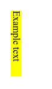

# inline-size

Свойство **`inline-size`** определяет горизонтальный или вертикальный размер блока элемента в зависимости от режима его записи. Он соответствует свойству [`width`](width.md) или [`height`](height.md), в зависимости от значения `writing-mode`.

Если режим записи ориентирован вертикально, значение `inline-size` относится к высоте элемента; в противном случае это относится к ширине элемента. Связанное свойство - это [`block-size`](block-size.md), который определяет другой размер элемента.

## Синтаксис

```css
/* <length> values */
inline-size: 300px;
inline-size: 25em;

/* <percentage> values */
inline-size: 75%;

/* Keyword values */
inline-size: 25em border-box;
inline-size: 75% content-box;
inline-size: max-content;
inline-size: min-content;
inline-size: available;
inline-size: fit-content;
inline-size: auto;

/* Global values */
inline-size: inherit;
inline-size: initial;
inline-size: unset;
```

## Спецификация

- [CSS Logical Properties and Values Level 1](https://drafts.csswg.org/css-logical/#dimension-properties)

## Пример

=== "CSS"

    ```css
    .exampleText {
      writing-mode: vertical-rl;
      background-color: yellow;
      inline-size: 110px;
    }
    ```

=== "HTML"

    ```html
    <p class="exampleText">Example text</p>
    ```

=== "Результат"

    

## См. также

- [`width`](width.md) и [`height`](height.md)
<!-- - [`writing-mode`](writing-mode.md) -->

## Ссылки

- [`inline-size`](https://developer.mozilla.org/en-US/docs/Web/CSS/inline-size) <sup><small>MDN (рус.)</small></sup>
- [Новые логические свойства в CSS!](https://medium.com/web-standards/logical-css-props-c5046c563640)
