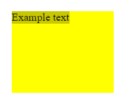

# inset

Свойство **`inset`** определяет логический блок и встроенные начальное и конечное смещения элемента, которые отображают физическое смещение, зависящее от способа записи, направления и ориентации текста. Оно соответствует свойствам [`top`](top.md) и [`bottom`](bottom.md), или [`right`](right.md) и [`left`](left.md), в зависимости от значений, определенных для [`writing-mode`](writing-mode.md), [`direction`](direction.md), и [`text-orientation`](text-orientation.md).

??? info "Логическое позиционирование"

    <div class="col3" markdown="1">

    - **inset**
    - [inset-block](inset-block.md)
    - [inset-block-end](inset-block-end.md)
    - [inset-block-start](inset-block-start.md)
    - [inset-inline](inset-inline.md)
    - [inset-inline-end](inset-inline-end.md)
    - [inset-inline-start](inset-inline-start.md)

    </div>

## Синтаксис

```css
/* <length> значения */
inset: 3px 10px 3px 10px;
inset: 2.4em 3em 3em 3em;
inset: 10px; /* значение применяется ко всем сторонам */

/* <percentage> от ширины или высоты внешнего блока */
inset: 10% 5% 5% 5%;

/* Ключевое значение */
inset: auto;

/* Глобальные значения */
inset: inherit;
inset: initial;
inset: unset;
```

## Значения

Свойство `inset` принимает значения, аналогичные значениям свойства [`left`](left.md).

## Определение

|                    |                                                                                                        |
| ------------------ | ------------------------------------------------------------------------------------------------------ |
| Начальное значение | `auto`                                                                                                 |
| Применяется ко     | позиционированные элементы                                                                             |
| Наследуется        | нет                                                                                                    |
| Проценты           | логическая высота контейнера                                                                           |
| Обработка значения | также как смещение блоков свойствами: `top`, `right`, `bottom`, `left`, кроме того направления логичны |
| Тип анимации       | длина, проценты или `calc()`                                                                           |

## Поддержка браузерами

<p class="ciu_embed" data-feature="mdn-css__properties__inset" data-periods="future_1,current,past_1,past_2" data-accessible-colours="false"></p>

## Пример

=== "HTML"

    ```html
    <div>
      <span class="exampleText">Example text</span>
    </div>
    ```

=== "CSS"

    ```css
    div {
      background-color: yellow;
      width: 150px;
      height: 120px;
      position: relative;
    }

    .exampleText {
      writing-mode: sideways-rl;
      position: absolute;
      inset: 20px 40px 30px 10px;
      background-color: #c8c800;
    }
    ```

=== "Результат"

    

## Ссылки

- Свойство [`inset`](https://developer.mozilla.org/ru/docs/Web/CSS/inset) <sup><small>MDN (рус.)</small></sup>
- [CSS Logical Properties and Values Level 1](https://drafts.csswg.org/css-logical/#propdef-inset) <sup><small>Spec (англ.)</small></sup>
