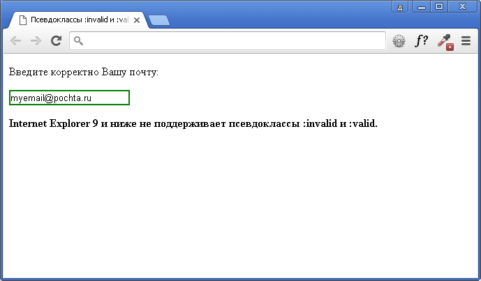

# :invalid

Псевдо-класс **`:invalid`** находит любые [`<input>`](/html/input/) или [`<form>`](/html/form/) элементы, контент которых не проходит валидацию, в соответствии с типом поля. Он позволяет вам легко менять внешний вид полей, что позволяет пользователю видеть и исправлять ошибки.

!!! warn "Замечание"

    **Радиокнопки**. Если любая из радиокнопок в группе (т. е., с одинаковым атрибутом `name`) имеет атрибут `required`, псевдо-класс `:invalid` применяется ко всем из них, если ни одна из кнопок группы не выбрана.

## Спецификации

- [HTML Living Standard](https://html.spec.whatwg.org/multipage/#selector-invalid)
- [HTML5](https://www.w3.org/TR/html50/#selector-invalid)
- [Selectors Level 4](https://drafts.csswg.org/selectors-4/#validity-pseudos)
- [CSS Basic User Interface Module Level 3](https://drafts.csswg.org/css-ui-3/#pseudo-validity)

## Пример 1

Этот пример представляет собой простую форму, цвета элементов которой зелёные, когда данные корректные, и красные, когда нет.

=== "HTML"

    ```html
    <form>
      <label>Введите URL:</label>
      <input type="url" />
      <br />
      <br />
      <label>Введите эл. почту:</label>
      <input type="email" required />
    </form>
    ```

=== "CSS"

    ```css
    input:invalid {
      background-color: #ffdddd;
    }

    form:invalid {
      border: 5px solid #ffdddd;
    }

    input:valid {
      background-color: #ddffdd;
    }

    form:valid {
      border: 5px solid #ddffdd;
    }

    input:required {
      border-color: #800000;
      border-width: 3px;
    }
    ```

## Пример 2

Использования псевдоклассов `:invalid` и `:valid` на примере ввода пользователем своего адреса электронной почты (проверка по наличию в написании адреса собаки - `@`):

=== "HTML"

    ```html
    <!DOCTYPE html>
    <html>
      <head>
        <title>Псевдокласс :first-of-type</title>
        <style type="text/css">
          input:invalid {
            border: 2px solid red;
          }
          input:valid {
            border: 2px solid green;
          }
        </style>
      </head>
      <body>
        <input
          type="email"
          value="myemailpochta.ru"
        /><br /><br />
        <p>
          <strong
            >Internet Explorer 9 и ниже не поддерживает
            псевдоклассы :invalid и :valid..</strong
          >
        </p>
      </body>
    </html>
    ```

=== "Результат"

    

## См. также

- [`:valid`](valid.md)
- [`:required`](required.md)
- [`:optional`](optional.md)

## Ссылки

- [`:invalid`](https://developer.mozilla.org/ru/docs/Web/CSS/:invalid) <sup><small>MDN (рус.)</small></sup>
