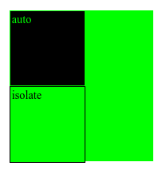

# isolation

Свойство **`isolation`** определяет, должен ли элемент создать новый контекст стека.

Это особенно полезно в сочетании с [`background-blend-mode`](background-blend-mode.md), которые только смешивают фон в заданном контексте стекирования: он позволяет изолировать группы элементов от их более глубокого фона и смешать их фоновый цвет вместе.

## Синтаксис

```css
/* Keyword values */
isolation: auto;
isolation: isolate;

/* Global values */
isolation: inherit;
isolation: initial;
isolation: unset;
```

## Значения

**`auto`**
: указывает, что новый контекст стека должен быть создан только в том случае, если это требует свойство, применяемое к элементу.

`isolate`
: указывает, что должен быть создан новый контекст стека.

Значение по-умолчанию:

```css
isolation: auto;
```

Применяется ко всем элементам

## Спецификации

- [Compositing and Blending Level 1](https://drafts.fxtf.org/compositing-1/#isolation)

## Описание и примеры

=== "HTML"

    ```html
    <div id="b" class="a">
      <div id="d">
        <div class="a c">auto</div>
      </div>
      <div id="e">
        <div class="a c">isolate</div>
      </div>
    </div>
    ```

=== "CSS"

    ```css
    .a {
      background-color: rgb(0, 255, 0);
    }
    #b {
      width: 200px;
      height: 210px;
    }
    .c {
      width: 100px;
      height: 100px;
      border: 1px solid black;
      padding: 2px;
      mix-blend-mode: difference;
    }
    #d {
      isolation: auto;
    }
    #e {
      isolation: isolate;
    }
    ```

=== "Результат"

    
