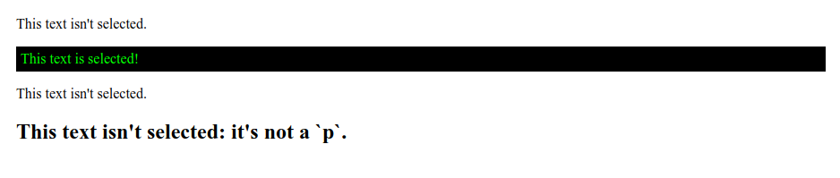
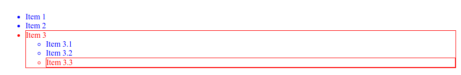

# :last-child

Псевдокласс **`:last-child`** представляет последний элемент среди группы элементов-братьев.

## Синтаксис

```css
/* Selects any <p> that is the last element
	   among its siblings */
p:last-child {
  color: lime;
}
```

## Спецификации

- [Selectors Level 4](https://drafts.csswg.org/selectors-4/#last-child)
- [Selectors Level 3](https://drafts.csswg.org/selectors-3/#last-child)

## Описание и примеры

### Пример 1

```html tab="HTML"
<div>
  <p>This text isn't selected.</p>
  <p>This text is selected!</p>
</div>

<div>
  <p>This text isn't selected.</p>
  <h2>This text isn't selected: it's not a `p`.</h2>
</div>
```

```css tab="CSS"
p:last-child {
  color: lime;
  background-color: black;
  padding: 5px;
}
```

Результат



### Пример 2

```html tab="HTML"
<ul>
  <li>Item 1</li>
  <li>Item 2</li>
  <li>
    Item 3
    <ul>
      <li>Item 3.1</li>
      <li>Item 3.2</li>
      <li>Item 3.3</li>
    </ul>
  </li>
</ul>
```

```css tab="CSS"
ul li {
  color: blue;
}

ul li:last-child {
  border: 1px solid red;
  color: red;
}
```

Результат


