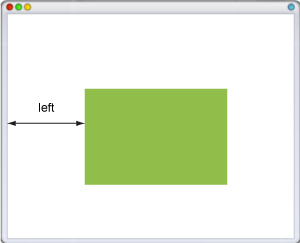
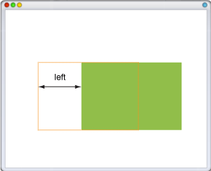

# left

Свойство **`left`** для позиционированного элемента определяет расстояние от левого края родительского элемента, не включая отступ, поле и ширину рамки, до левого края дочернего элемента.

Отсчёт координат зависит от значения свойства [`position`](position.md). Если оно равно `absolute`, в качестве родителя выступает окно браузера и положение элемента определяется от его левого края (рис. 1).



В случае значения `relative`, `left` отсчитывается от левого края исходного положения элемента (рис. 2).



Если для родительского элемента задано `position: relative`, то абсолютное позиционирование дочерних элементов определяет их положение от левого края родителя.


## Синтаксис

```css
/* <length> values */
left: 3px;
left: 2.4em;

/* <percentage>s of the width of the containing block */
left: 10%;

/* Keyword value */
left: auto;

/* Global values */
left: inherit;
left: initial;
left: unset;
```

## Значения

В качестве значений принимаются любые единицы длины, принятые в CSS — например, пиксели (px), дюймы (in), пункты (pt) и др. Значение свойства `left` может быть и отрицательным, в этом случае возможны наложения разных элементов друг на друга. При задании значения в процентах, положение элемента вычисляется в зависимости от ширины родительского элемента.

- `auto` — Не изменяет положение элемента.

Значение по-умолчанию:

```css
left: auto;
```

Применяется к: Ко всем элементам

## Спецификации

- [CSS Transitions](http://dev.w3.org/csswg/css-transitions/#animatable-css)
- [CSS Level 2 (Revision 1)](http://www.w3.org/TR/CSS2/visuren.html#propdef-left)

## Описание и примеры

```html
<!DOCTYPE html>
<html>
  <head>
    <meta charset="utf-8" />
    <title>left</title>
    <style>
      .layer1 {
        position: absolute; /* Абсолютное позиционирование */
        left: 20px; /* Положение от левого края */
        background: #fc3; /* Цвет фона */
        margin: 7px; /* Отступы вокруг элемента */
      }
      .layer2 {
        position: relative; /* Относительное позиционирование */
        left: -12px; /* Положение от левого края */
        top: 13px; /* Положение от верхнего края */
        border: 1px solid black; /* Параметры рамки */
        padding: 5px; /* Поля вокруг текста */
        margin: 7px; /* Отступы вокруг элемента */
      }
    </style>
  </head>
  <body>
    <div class="layer1">
      <div class="layer2">
        Бином Ньютона традиционно упорядочивает абсолютно сходящийся ряд, в итоге приходим к логическому противоречию.
      </div>
    </div>
  </body>
</html>
```
