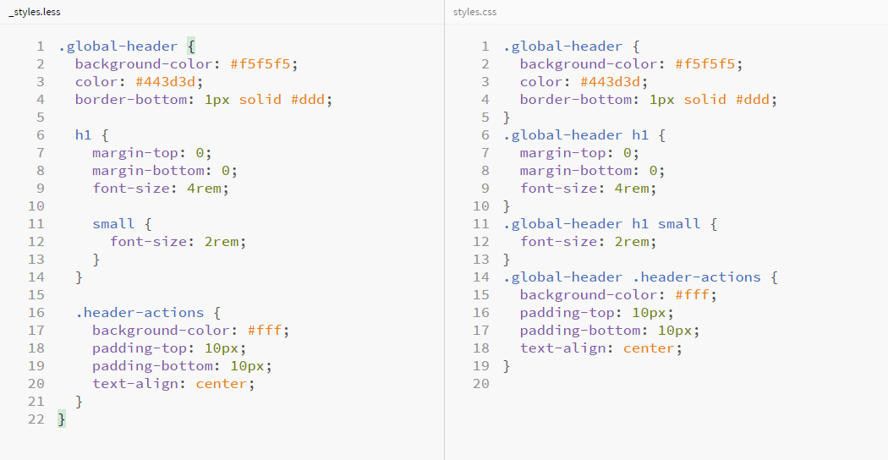

# Вложенные правила

В хорошо структурированных таблицах стилей нет необходимости присваивать каждому элементу классы. Достаточно лишь более подробно описывать стили элементов, используя возможность вкладывать селекторы в другие селекторы. К слову, такие селекторы называются **вложенными** и представляют собой объёмную структуру.

## Пример 2.2.1

Ниже приведён так называемый «подробный CSS», в котором представлена модель вложенности одних селекторов в другие селекторы.

```css
.global-header {
  background-color: #f5f5f5;
  color: #443d3d;
  border-bottom: 1px solid #ddd;
}

.global-header h1 {
  margin-top: 0;
  margin-bottom: 0;
  font-size: 4rem;
}

.global-header h1 small {
  font-size: 2rem;
}

.global-header .header-actions {
  background-color: #fff;
  padding-top: 10px;
  padding-bottom: 10px;
  text-align: center;
}
```

## Решение проблем

Все это хорошо, но ровно до тех пор, пока имена классов короткие, глубина вложенности не велика, а ваши глаза в состоянии уследить за этой структурой. Лично я, до тех пор, пока не стал пользоваться CSS-препроцессорами, писал код именно так, попутно разделяя CSS-файл на логические блоки и пытаясь уследить за его чистотой. Это удобно и практично, но мне быстро надоедало сортировать код по вложенности, и моя таблица стилей иногда была похожа на мешанину из букв и цифр. Разумеется, что перед финальной сборкой проекта все это исправлялось, но это не тот случай, на который хочется тратить время.

Представьте себе оглавление простейшей книги, например, такое:

```
1. Глава 1. Это моя первая глава книги
1.1. Это мой первый рассказ о том, что я сделал
1.1.1. Немного подробнее о том, что я сделал
1.2. Это мой второй рассказ о том, что я сделал
1.Х. ...
```

Здесь довольно легко понять, что пункт 1.1 — это следствие первого пункта. Но тем не менее, если переписать это в более читабельном формате, можно сэкономить время на обработке цифр в голове. Абстрактно, можно представить следующий формат:

```
Это моя первая глава книги
    Это мой первый рассказ о том, что я сделал
        Немного подробнее о том, что я сделал

    Это мой второй рассказ о том, что я сделал
```

Именно такая модель вложенности присутствует в Less, когда один селектор, в прямом смысле слова, вкладывается в другой селектор. Таким образом получается легко поддерживаемая, читаемая и приятная глазу структура. Если же попытаться спроецировать такую модель на CSS-код, то она будет иметь вид:

```less
.class-1 {
  property: value;

  .class-2 {
    property: value;
  }

  .class-3 {
    property: value;
  }
}
```

Для большей наглядности я предлагаю обратиться к конкретному примеру, в котором я постараюсь сопоставить классический CSS и Less код.

## Пример 2.2.2

Здесь я переписал код из _примера 2.2.1_, заменяя классический синтаксис на препроцессорный.

```less
.global-header {
  background-color: #f5f5f5;
  color: #443d3d;
  border-bottom: 1px solid #ddd;

  h1 {
    margin-top: 0;
    margin-bottom: 0;
    font-size: 4rem;

    small {
      font-size: 2rem;
    }
  }

  .header-actions {
    background-color: #fff;
    padding-top: 10px;
    padding-bottom: 10px;
    text-align: center;
  }
}
```

На изображении ниже представлена модель вложенности, описываемая в этом примере. Для наглядности и понимания сути происходящего экран разделен на две части, где слева код написан на препроцессорном языке, а справа на «чистом» CSS.



## Мысли и советы

Согласитесь, теперь ваш код становится интуитивно понятным и удобным для чтения. В такой структуре сложно запутаться и потеряться среди селекторов, ведь здесь чётко видна их вложенность и не нужно помнить имя родительского селектора — за нас это делает компилятор.

## Предостережение!

Постарайтесь запомнить раз и навсегда, что вкладывать селекторы друг в друга можно бесконечно, но делать это строго **не рекомендуется**! Многие разработчики советуют следить за тем, чтобы структура, в общем случае, не превышала **трёх вложений**. Нет необходимости вкладывать селекторы, начиная от родительского, на такую глубину. Максимально допустимый уровень, в крайних случаях, _пять вложений_. Старайтесь избегать крайних случаев, если это действительно не требуется.
