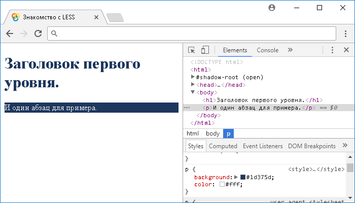
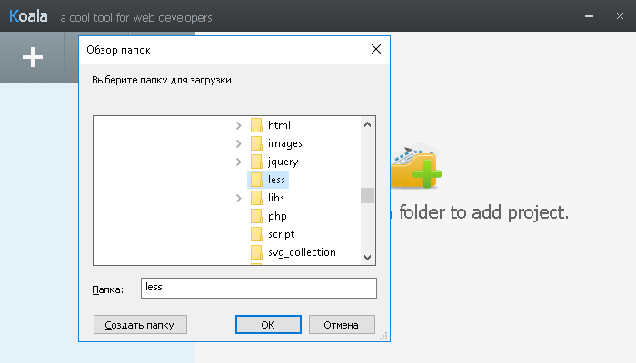

# Введение в LESS

## Что такое LESS?

**LESS** — это динамический метаязык на основе каскадных таблиц стилей (англ. Cascading Style Sheets - CSS), предназначенный для упрощения, масштабирования и поддержки большого объёма CSS кода.

LESS был создан Alexis Sellier под влиянием более раннего метаязыка стилей SASS (Syntactically Awesome Stylesheets). Одной из особенностью LESS является то, что он может работать как на клиентской стороне, так и на стороне сервера. Язык стилей LESS это продукт с открытым исходным кодом, который строится на языке программирования JavaScript.

LESS, как, например, и язык стилей SASS - это CSS препроцессор, он позволяет расширить язык CSS, добавляя в него переменные, функции, миксины (примеси), которые позволяют повторно использовать код в таблицах стилей и прочие методы, которые сделают ваш CSS код более настраиваемым, расширяемым и масштабируемым. Возможно Вас удивит тот факт, что вы можете начать использовать LESS уже прямо сейчас, так как валидный CSS будет валидным и в LESS.

## Подключение LESS

В этой статье мы с Вами рассмотрим два варианта работы с LESS, если быть точнее, то с файлами `*.less`. Первый вариант предусматривает использование файлов `*.less` напрямую в браузере пользователя с подключением необходимого скрипта JavaScript для компиляции на "лету".

Второй вариант предусматривает использование специального препроцессора, который будет компилировать файлы `*.less` в файлы каскадных таблиц стилей - `*.css`.

Начнем с первого варианта:

По аналогии с каскадными таблицами стилей вам необходимо подключить файл `*.less` к Вашему HTML документу с использованием тега `<link>`:

```html
<link rel="stylesheet/less" href="styles.less" />
```

После этого вам необходимо скачать файл со скриптом, или, как вариант, получить ссылку на сеть доставки контента (CDN) на официальном сайте метаязыка LESS. Давайте остановимся на первом варианте и подключим скачанный файл:

```html
<link rel="stylesheet/less" href="styles.less" />
<script src="less.js"></script>
```

Обратите внимание, что необходимо подключать файл со скриптом уже после того как вы подключили файл `*.less`. Этого достаточно, чтобы начать описывать стили с помощью метаязыка LESS, при этом как вы понимаете компиляция из LESS в CSS будет происходить на стороне браузера (на "лету").

Давайте перейдем к рассмотрению примера в котором начнем использовать LESS:

```html
<!DOCTYPE html>
<html>
  <head>
    <title>Знакомство с LESS</title>
    <link rel="stylesheet/less" href="2.less" />
    <!-- подключаем less файл к документу -->
    <script src="less.min.js"></script>
    <!-- подключаем скрипт JavaScript для преобразования метаязыка LESS в CSS -->
  </head>
  <body>
    <h1>Заголовок первого уровня.</h1>
    <p>И один абзац для примера.</p>
  </body>
</html>
```

В этом примере мы создали отдельный файл `2.less` в котором указали следующие стили:

```less
h1 {
  color: rgb(29, 55, 93); // устанавливаем цвет текста
}
p {
  background: rgb(
    29,
    55,
    93
  ); // устанавливаем цвет заднего фона
  color: #fff; // устанавливаем цвет текста белый
}
```

Кроме того, мы подключили к документу скрипт JavaScript, который выступает в роли компилятора и преобразует метаязык LESS в каскадные таблицы стилей CSS.

Результат преобразования будет следующий:

```css
h1 {
  color: #1d375d; // значение в HEX
}
p {
  background: #1d375d; // значение в HEX
  color: #fff;
}
```

Как вы можете заметить результат компиляции (преобразования) практически идентичен первоначальным стилям, за исключением того, что RGB значение цвета было конвертировано в шестнадцатеричную систему HEX, что не влияет на внешний вид, но незначительно сокращает количество символов для описания этого стиля.

Результат:



Рис. 2 Пример подключения less файла к документу.

Если вы решили повторить этот пример локально на своем компьютере и не увидели результат примера, показанный на изображении выше, то скорее всего вы сможете найти в консоли браузера подобную ошибку: "Failed to load file:///\*\*\*/2.less: Cross origin requests are only supported for protocol schemes: http, data, chrome, chrome-extension, https."

Мы с Вами не будем вникать в локальные политики разных браузеров, отключать их и запускать браузеры с определенными ключами, просто попробуйте воспользоваться браузером Firefox для этого примера, или переходите к дальнейшему чтению.

Хочу сразу обратить ваше внимание на то, что этот пример не отражает возможностей метаязыка LESS, которые будут рассмотрены в следующих статьях этого учебника, а служит для понимания того как происходит компиляция, что нам необходимо для дальнейшего изучения.

Рассмотренный выше метод работы с файлами less имеет право на существование, но не является рекомендованым к использованию, по той причине, что производительность и скорость отображения стилей документа при этом подходе снижается. В настоящее время существует большое количество инструментов для компилиции LESS в CSS, начиная от компиляции на стороне сервера, заканчивая отдельными программными продуктами, один из которых мы сейчас с Вами рассмотрим.

## Препроцессор Koala

Задача этого учебника заключается в быстром освоении метаязыка LESS, именно по этой причине, на начальном этапе, я предлагаю Вам для компиляции использовать программный продукт Koala.

Этот программный продукт позволит нам не тратить время на настройку среды, которая будет отслеживать изменение `*.less` файлов и компиляцию их в `*.css` файлы, что идеально для первичного знакомства с метаязыком LESS не отвлекаясь на технические особенности по настройке той, или иной среды.

Для начала нам необходимо перейти на [официальный сайт](http://koala-app.com/) продукта и скачать его последнюю версию и установить на свой компьютер.

После этого необходимо создать файл `*.less` и подключить в программе Koala папку в которой находится этот файл (нажмите на +), например, в моем случае папка less:



Рис.3 Пример подключения папки с файлом less.

Вы должны увидеть в окне программы файл, который вы создали заранее. Кликните под название файла, как показано на изображение ниже, это позволит Вам выбрать путь куда будут компилироваться CSS файлы.


Рис.4 Выбор пути для компиляции CSS файлов.

Я выбрал ту же папку в которой находится less файл, в результате у вас должно получиться следующее:


Рис.5 Установка каталога для компиляции CSS.

Теперь программа Koala будет отслеживать все изменения в less файле и при их изменении сразу будет проводить их компиляцию в css. После первой компиляции вы увидите в главном окне файл css, кликнув под который, при необходимости вы сможете по аналогии настроить путь в который будут сохраняться файлы css, но уже минифицированные (стили без пробелов в одну строку). Как правило, такие стили используются на "боевых" (готовых) проектах.


Рис.6 Настройка компиляции минифицированной версии CSS файла.

Не забудьте поставить галочку возле Auto Compile в случае необходимости компиляции минифицированной версии css файлов "на лету".

## Комментарии в LESS

По аналогии с CSS допускается использовать внутри `*.less` файла как однострочные, так и многострочные комментарии со следующим синтаксисом:

```less
// это однострочный комментарий

/* это
многострочный
комментарий */

/* это многострочный комментарий в одной строке */
```

Будьте готовы к тому, что в зависимости от настроек компилятора, комментарии могут не сохраняться при компиляции из файлов `*.less` в `*.css`. Например, вышерассмотренный компилятор Koala удаляет однострочные комментарии при компиляции, это поведение по умолчанию доступно изменить в его настройках.
