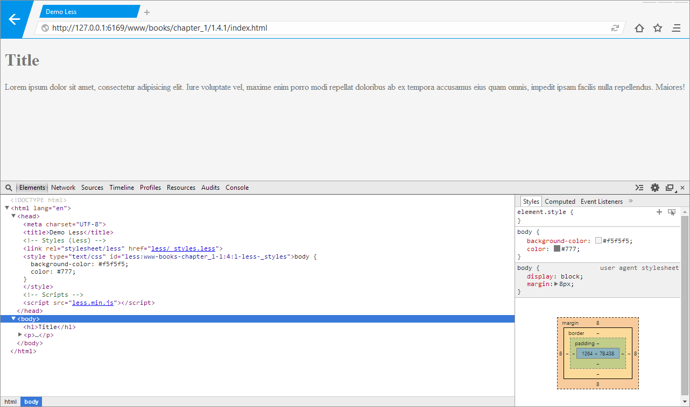
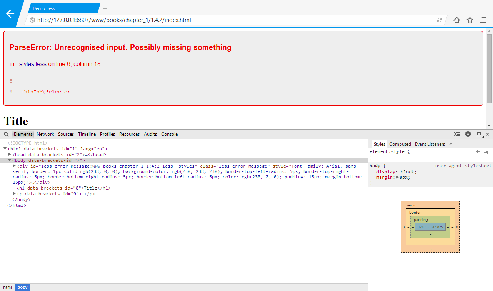

# Компиляция

Если вы помните, то препроцессоры предлагают нам свой вариант синтаксиса для некоторых или всех конструкций языка, надстройкой над которым они являются. И CSS-препроцессоры не исключение.

Для того, чтобы браузер понимал код, написанный с использованием синтаксических конструкций препроцессора, его нужно компилировать в понятный для него язык. Таким языком для браузера, как не сложно догадаться, является CSS.

Существует несколько вариантов того, как можно перейти от Less к CSS.

## Компиляция в браузере (less.js)

Наиболее простой способ использования CSS-препроцессора, но в тоже время малопопулярный. Альтернативные решения удобнее и предоставляют наиболее интересный функционал. Применяется на этапе разработки или отладки проекта, когда важен результат компиляции, а не её скорость.

Основан на идее подключения стилей с расширением `.less` к документу, используя стандартный тег `<link>`, но с изменённым атрибутом `rel`. А также осуществляется подключение файла библиотеки.

```html
<link rel="stylesheet/less" href="..." />
<script src="less.min.js"></script>
```

После компиляции скрипт проводит инъекцию полученного CSS-кода в секцию `head` документа посредством тега `<style>`.

Способ не желателен к применению на так называемом «продакшене» в виду того, что имеет серьёзные проблемы со скоростью и сильно зависит от производительности устройства, а также скорости интернет-соединения. Помимо этого увеличивается объем загружаемых данных, так как браузеру пользователя приходится загружать less-файлы и файл библиотеки. Только после полной загрузки необходимых ресурсов начинается процесс компиляции less-кода в CSS.

### Пример 1.4.1

Пример демонстрирует использование CSS-препроцессора Less прямиком в браузере, без предварительной компиляции CSS.



На изображении показана структура документа, подключённые файлы стилей, файл библиотеки, а также произведённая инъекция стилей в секцию `head`.

Разметка страницы:

```html
<!DOCTYPE html>
<html lang="en">
  <head>
    <meta charset="UTF-8" />
    <title>Demo Less</title>

    <!-- Styles (Less) -->
    <link rel="stylesheet/less" href="less/_styles.less" />

    <!-- Scripts -->
    <script src="less.min.js"></script>
  </head>
  <body>
    <h1>Title</h1>
    <p>...</p>
  </body>
</html>
```

Содержимое файла `_styles.less`:

```less
body {
  background-color: #f5f5f5;
  color: #777;
}
```

### Пример 1.4.2

Если в файле стилей допущена ошибка, то компилятор отобразит сообщение, в котором будет присутствовать следующая информация:

- Код ошибки;
- Описание ошибки;
- Название файла, в котором обнаружена ошибка;
- Номер строки и столбца, где допущена ошибка;
- Код, порождающий ошибку;

Такой подробный отчёт позволит разработчику в удобной форме получить полную информацию о допущенной ошибке и в максимально короткие сроки приступить к её устранению.



### Пример 1.4.3

При необходимости доступны некоторые настройки для управления преобразованиями, происходящими в препроцессоре и, как следствие, получаемыми данными на выходе. Причём настройки можно менять, используя JavaScript, так и с помощью атрибутов `data` у тега `link`.

В этом примере добавляется возможность автообновления страницы при изменении подключённого файла стилей. Для активации механизма слежения за изменением ресурсов, необходимо добавить к адресу страницы маркер `#!watch`. Теперь, когда вы будете изменять less-файлы в проекте, которые подключены к активной странице, будет происходить автоматическая компиляция этого файла.

```html
...
<head>
  ...
  <!-- Scripts -->
  <script>
    less = {
      env: 'development',
    }
  </script>
  <script src="less.min.js"></script>
  <script>
    less.watch()
  </script>
</head>
...
```

Другие параметры настроек можно посмотреть в документации. Так как этот метод находится в статусе «не рекомендуется», то и подробно рассматривать его нет смысла.

## Компиляция из командной строки (lessc)

Как мы уже хорошо знаем, препроцессор Less написан на JavaScript. А ещё лучше мы знаем, что лучший друг JavaScript теперь — Node.js. Отсюда вытекают новые возможности для работы в командной строке. И Less предлагает нам такой инструмент для работы в ней.

Работа из командной строки предполагает наличие установленного Node.js. Помимо этого, необходимо глобально установить пакет `less` — это можно сделать командой:

```
npm install -g less
```

Рассмотрим синтаксис команд npm:

- `npm` - пакетный менеджер;
- `i` - сокращение от `install`, то есть «установить»;
- `-g` - флаг, который указывает на то, что пакет будет установлен глобально;
- `less` - имя устанавливаемого пакета;

Общение с консолью осуществляется на примитивном уровне. Бегло ознакомимся с основными доступными командами:

**Компилирование файла с именем `_styles.less` без сохранения результата:**

```
lessc _styles.less
```

**Компилирование файла `_styles.less` с сохранением результата в файл `_main.css`:**

```
lessc _styles.less > _main.css
```

Помимо двух базовых команд можно передавать параметры скрипту, в зависимости от которых будет выполняться то или иное действие с вашим кодом. Например, ниже показана передача параметра `x`, который говорит скрипту (компилятору), что на выходе пользователь ожидает увидеть минифицированный файл.

```
lessc -x _styles.less
```

И здесь наступает один важный момент, который может вызвать недопонимание. Если вы компилируете файл без сохранения результатов, то можно использовать параметр `x`. Но если вы собираетесь сохранить скомпилированный CSS-код, то будьте добры использовать плагины для его минификации. Проще говоря, при таком раскладе параметр `x` не работает.

Как вы уже поняли, для Less доступно некоторое множество плагинов, которые добавляют различный функционал препроцессору. Включением и выключением этих плагинов, а также их управлением, можно заниматься и с помощью консольных команд.

Допустим, что у пользователя установлен пакет для минификации css-файлов `less-plugin-clean-css`. Тогда пользователю будет доступен новый параметр `--clean-css` для передачи скрипту. Более детально о доступных плагинах и возможности их применения мы поговорим позднее.

Но и это ещё не все. Пользователю также доступна типичная для консольных утилит команда `--help`, которая расскажет обо всех доступных к использованию параметрах.

```
lessc --help
lessc --h
```

В случае, как и с компиляцией в браузере, этот метод не особо популярен, так как существуют другие, более интересные по возможностям.

> Если вас заинтересовал именно этот способ, то обязательно посетите документацию препроцессора. Кроме тех параметров, что были озвучены здесь, там вы сможете найти около двух десятков различных других специфических параметров, благодаря которым ваша работа с препроцессором в командной строке станет куда гибче.

## Компиляция, используя системы сборки

Настал тот момент, когда все скучные способы компиляции пройдены, а впереди есть ещё, которые выглядят куда интереснее всех остальных, включая и этот. Но я не могу обойти стороной самый популярный и гибкий способ.

Сейчас, если вы пишете Open Source проект, то хорошим тоном будет автоматизировать всё, что возможно и имеет смысл. Это делается для того, чтобы другие разработчики могли использовать ваши наработки и не мучиться с подготовкой проекта к «употреблению». Помимо этого, автоматизация действий, будь то банальное переименование файла или компиляция файлов препроцессора, экономит время не только других разработчиков, но и ваше.

**Система сборки** — это инструмент для автоматической, гибкой и удобной сборки проектов из командной строки с использованием ранее обозначенных инструкций (задач).

Если попытаться упростить эту формулировку, то получится следующее:

_Система сборки_ — это инструмент, который автоматически преобразует проект в соответствии с заранее написанными правилами.

Первым популярным сборщиком был Grunt, позднее появился Gulp и самыми молодыми сейчас являются Brunch и Broccoli. Так повелось, что Grunt и Gulp воюют на одном универсальном поприще, покрывая своим функционалом и доступными плагинами почти весь спектр задач. А вот Brunch сразу же обозначил себя как сборщик для фронтенда и слегка намекает, что первые двое ему не родня, да и он не такой, как они.

Для Grunt и Gulp доступно большое количество различных пакетов, которыми можно выполнять практически любые задачи: от простейшего переименования файлов до сборки крупных приложений. Причём у Grunt их намного больше. А вот Brunch и Broccoli таким похвастаться не могут, но все основные пакеты для фронтенд разработки доступны уже сейчас. Практически любой недостающий функционал можно добавить, написав свой пакет, и делается это довольно просто.

К счастью, настройка систем сборки — это не основная тема книги. Поэтому конкретно рассматривать каждый из сборщиков я не буду, а предложу посмотреть уже готовые конфигурационные файлы для компиляции Less в архиве, идущем вместе с книгой.

## Приложения для компиляции

Вот он, **самый простой и удобный способ** для проектов, использующих препроцессоры, причём не только CSS-препроцессоры, но и JS и HTML.

Существуют такие приложения, которые позволяют управлять проектами без написания кода, использования командной строки и систем сборок. Они написаны для людей, желающих делать своё дело и не вникать в некоторые тонкости, хотя бы на начальном этапе своей карьеры.

Такие приложения имеют довольно обширный функционал и, как правило, умеют:

- Компилировать файлы различных препроцессоров (Less, Stylus, Jade, CoffeeScript и т. д.);
- Проверять файлы на ошибки и соответствие правилам (общим или проекта);
- Обрабатывать файлы (минификация, расстановка префиксов в CSS и т. д.);
- Автоматизировать некоторые часто используемые действия;
- Локальный сервер для тестирования проектов на этапе разработки;

Среди всех подобных приложений можно выделить следующие решения:

- Prepros
- CodeKit (только OS X)
- Mixture
- Koala

Ранее я использовал Prepros для своих локальных проектов, так как он предлагает наиболее интересный для меня функционал. Остальные решения также хороши, но мне больше всего приглянулся именно он.

> Проекты Koala и Mixture более не обновляются и представлены здесь лишь в дань уважения.

Если вы не хотите писать конфигурационные файлы для Grunt, Gulp и им подобным системам сборки, то это ваш выбор.

## Альтернативные методы

Существуют решения для отдельно взятых сред (редакторов, IDE и т.д.), позволяющие использовать CSS-препроцессоры. В некоторых IDE есть встроенные средства для использования препроцессоров, а в тех, где нет, в общем случае, можно установить необходимые плагины, добавляющие такую возможность. По [этой ссылке](http://lesscss.org/usage/#editors-and-plugins) приведён обширный список таких плагинов.

Если для использования препроцессора Less на сервере, построенном с применением Node.js, требуется лишь официальный пакет доступный в npm, то на других платформах необходимы специальные библиотеки, а иногда и несколько (привет Java). Такой подход обеспечивает обмен переменными между Less и использующим его языком, что позволяет добиться компиляции файлов, в зависимости от контекста действий пользователя в приложении.

## Отладка

**Отладка** — это процесс обнаружения, локализации и исправления возникающих ошибок в работе приложения. В случае с CSS-препроцессором, приложением будут являться препроцессорные файлы, так как именно в них могут возникать ошибки или «неточности». И если с ошибками бороться нам поможет сам компилятор, то исправлять «неточности» будет сложнее, из-за некоторых особенностей препроцессоров.

### Карта кода (Source Maps)

Во время разработки и после неё, скомпилированные файлы стилей и исходные файлы могут сильно различаться. Происходит это из-за компиляции и обработки файлов. Если в процессе компиляции происходит раскрытие конструкций, написанных на препроцессорном языке в «чистый» CSS-код, то на выходе получается, как правило, большее количество строк кода. Выражается это в том, что в инспекторе браузера у тега стилей элемента указан один номер строки, а на самом деле он совсем другой.

#### Пример 1.4.4

В этом примере представлен препроцессорный и скомпилированный файлы. Обратите внимание лишь на отличающееся количество строк, работу препроцессора и её результат на выходе.

**Файл препроцессора:**

```less
// Variables
@header-background: #181e21;
@header-color: #fff;

.global-header {
  position: relative;
  background-color: @header-background;
  color: @header-color;

  h1 {
    font-size: 44px;
    line-height: 50px;

    small {
      font-size: 24px;
      line-height: 36px;
    }
  }
}
```

**Скомпилированный файл:**

```css
.global-header {
  position: relative;
  background-color: #181e21;
  color: #ffffff;
}
.global-header h1 {
  font-size: 44px;
  line-height: 50px;
}
.global-header h1 small {
  font-size: 24px;
  line-height: 36px;
}
```

Замечательно, с физикой проблемы разобрались. Для её решения на помощь спешит так называемая «карта кода». Явление это не уникальное и встретить его можно, например в Visual Studio 2012, правда там карта действительно похожа на карту, а тут информация, ориентированная лишь на браузер. Когда я говорю, что файл предназначен для браузера, то имею в виду, что понять его человеку будет практически невозможно:

```JSON
{
  "version": 3,
  "sources": [
    "_styles.less"
  ],
  "names": [],
  "mappings": "AAIA;EACE,kBAAA;EACA,yBAAA;EACA,cAAA;;AAHF,cAKE;EACE,eAAA;EACA,iBAAA;;AAPJ,cAKE,GAIE;EACE,eAAA;EACA,iBAAA",
  "file": "undefined"
}
```

Получить такую карту кода можно, добавив параметр `--source-map` при компиляции, выбрав соответствующие пакеты для системы сборки или изменив настройки программы.

Теперь обратите внимание на изображение окна браузера, в котором слева показан скомпилированный файл без карты кода, а справа — с ней.


В первом случае видно, что селектор объявлен на 6 строке CSS-файла, но так как мы работаем с исходниками в формате Less, то нам эта цифра ни о чём не говорит — у нас на 6-ой строке находится другой код.

Во втором случае, когда применяется карта кода, все становится на свои места и указывается не только правильный номер строки объявления селектора, но и файл её содержащий. Название файла будет полезно тогда, когда я расскажу вам про подключение файлов друг к другу.
